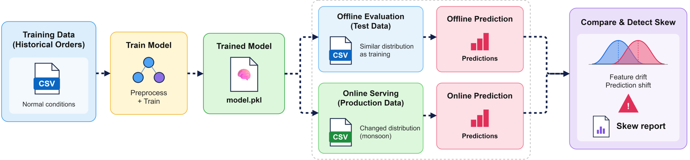
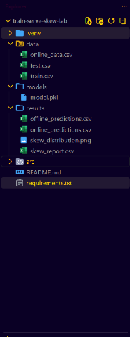
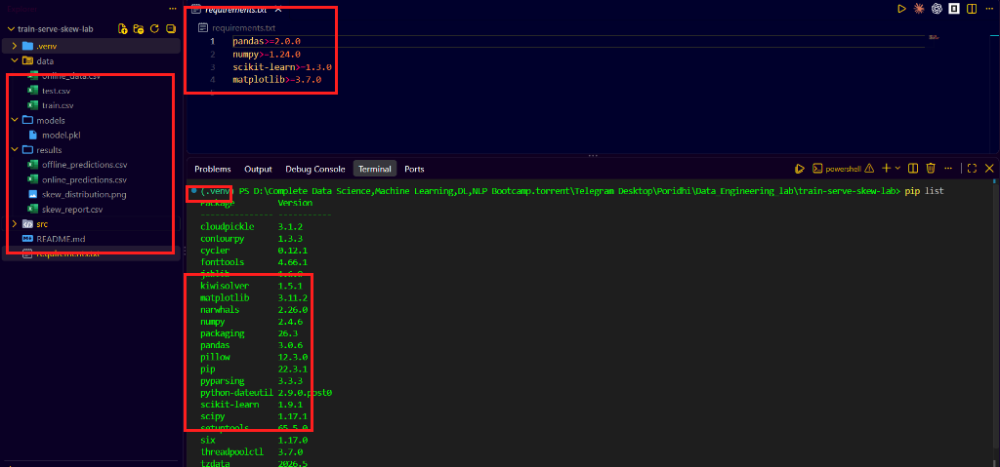
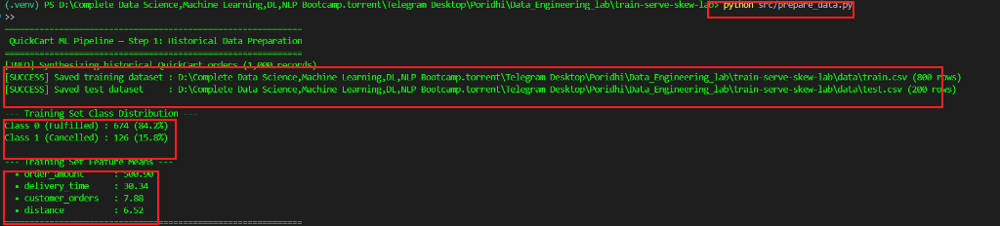
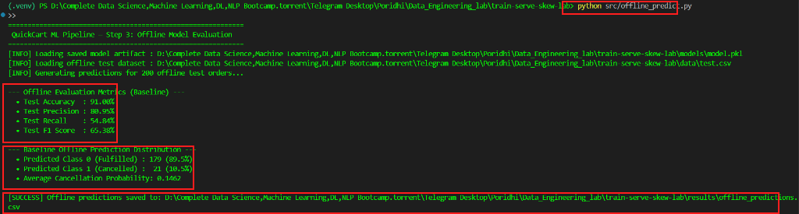
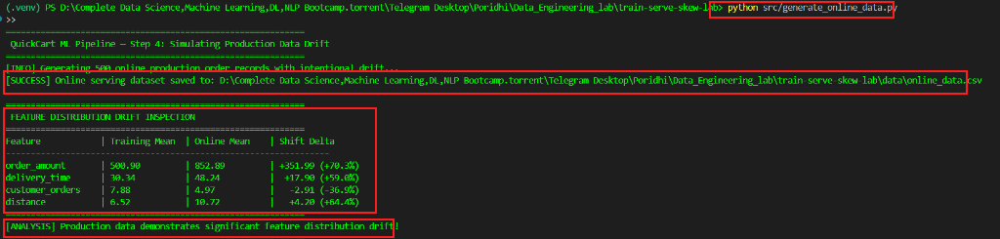
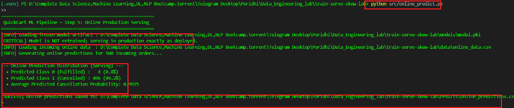
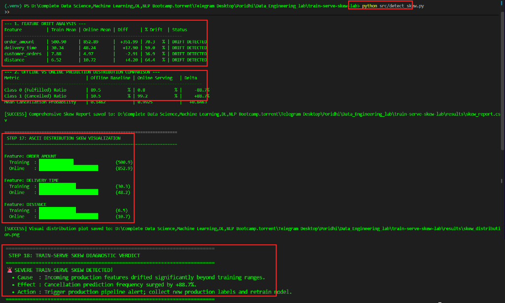
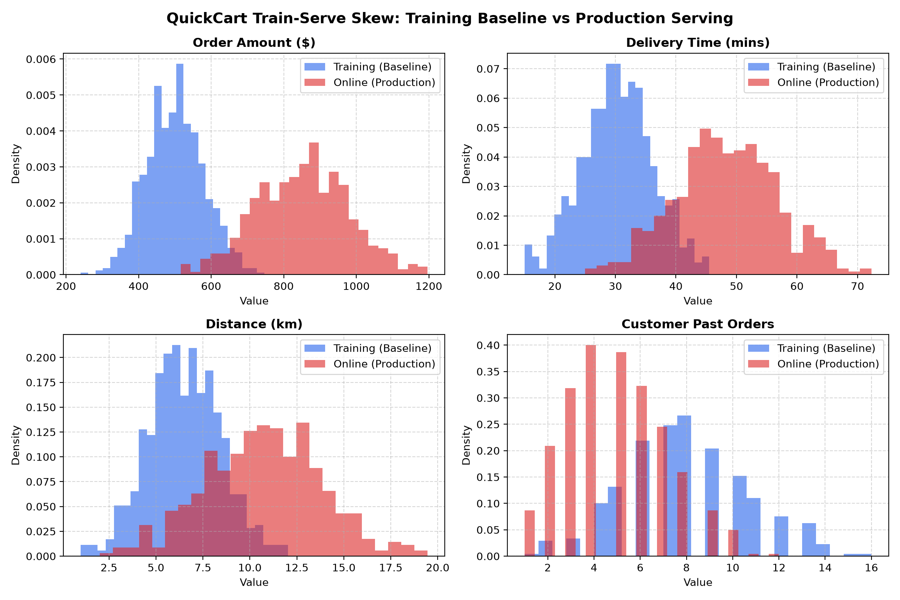

# Lab 1.3: Train-Serve Skew Simulation

## 1. Introduction:

Imagine you are working as a **Machine Learning Data Engineer** at **QuickCart**, a fast-growing online food delivery platform. Several months ago, your team trained and deployed a machine learning model designed to predict whether a customer is likely to cancel an incoming food order in real time. During offline validation on historical order data, the model achieved high accuracy and balanced precision, allowing dispatch operations to intervene early whenever cancellation risks surged.

However, over the last few months, QuickCart's operational landscape has shifted dramatically. A seasonal monsoon wave combined with an expansion into distant suburban zones has increased average delivery times, inflated order cart values, and brought in thousands of new customers with minimal ordering history. While the deployed model continues to return predictions without software crashes, customer operations reports that cancellations are spiking unexpectedly and the model's predictions appear heavily skewed compared to its training baseline. This phenomenon is known as **Train-Serve Skew**—a silent failure where the distribution of live serving data drifts far away from the training distribution, degrading model reliability.

Below is the end-to-end architecture of the ML monitoring and skew simulation pipeline you will build for QuickCart:



The architecture diagram illustrates the dual-phase lifecycle of QuickCart's order cancellation prediction system. The historical branch prepares a certified training and offline test dataset, establishes performance baselines, and serializes the trained model pipeline. The production branch simulates live incoming serving traffic experiencing real-world feature drift, passing these unlabelled inputs through the identical frozen model artifact. Finally, the skew detection engine compares distribution statistics across both pipelines, quantifying train-serve skew and triggering engineering alerts before operational degradation harms business revenue.

---

## 2. Project File Structure

Following your architectural design, the project maintains strict separation between raw historical data, persisted model artifacts, modular ML pipelines, and output monitoring reports:

```text
train-serve-skew-lab/
│
├── data/
│   ├── train.csv               # Historical training dataset (80% split)
│   ├── test.csv                # Reserved offline evaluation dataset (20% split)
│   └── online_data.csv         # Drifted production incoming data
│
├── models/
│   └── model.pkl               # Serialized frozen Scikit-Learn pipeline artifact
│
├── src/
│   ├── prepare_data.py         # Synthesizes historical dataset and splits train/test
│   ├── train.py                # Trains scaler + classifier and exports model.pkl
│   ├── offline_predict.py      # Evaluates baseline offline metrics & predictions
│   ├── generate_online_data.py # Simulates production feature drift (rush hour, radius)
│   ├── online_predict.py       # Scores drifted online data with frozen model
│   └── detect_skew.py          # Quantifies drift, prediction skew, and generates reports
│
├── results/
│   ├── offline_predictions.csv # Baseline offline test predictions & probabilities
│   ├── online_predictions.csv  # Production serving predictions & probabilities
│   ├── skew_report.csv         # Structured feature drift and skew delta report
│   └── skew_distribution.png   # Multi-panel feature distribution visualization
│
├── requirements.txt            # Python dependencies (pandas, scikit-learn, matplotlib)
└── README.md                   # Lab execution documentation
```

The project structure enforces clean boundaries between development, production serving, and monitoring layers. Isolating datasets in `data/` preserves immutable historical baselines while allowing production streams to be updated independently. The `models/` directory acts as an artifact store for frozen model binaries, preventing unintentional code-level drift during serving. Storing runtime outputs in `results/` allows operational teams to inspect prediction distributions, CSV audit logs, and graphical drift reports without contaminating source code.

---

## 3. Project Implementation

Students will build and run the entire machine learning skew detection pipeline using **VS Code Server**. All files are created, edited, and managed directly through the VS Code Server user interface—**no `cat` commands are used**.

---

### Step 1: Open VS Code Server and Create Project Directories

1. Open your browser and navigate to your **VS Code Server** interface.
2. In the top navigation bar, select **File > Open Folder...** and select or create your workspace directory:
   ```text
   train-serve-skew-lab
   ```
3. In the VS Code Explorer sidebar (left panel), click the **New Folder** icon to scaffold the required directory hierarchy:
   - `data`
   - `models`
   - `src`
   - `results`

> **[Show Image — VS Code Server Directory Structure]**
> 

The VS Code Server Explorer displays the newly created project directories for the QuickCart ML pipeline. The `data` folder will host our historical and simulated production datasets, while `models` will hold serialized pipeline artifacts. The `src` directory will store our modular Python scripts, and `results` will capture offline/online prediction logs and drift summaries. Creating this clean layout at the start guarantees seamless relative path resolution across all pipeline execution steps.

---

### Step 2: Initialize Virtual Environment and Install Dependencies

1. Open an integrated terminal in VS Code Server by navigating to **Terminal > New Terminal**.
2. Create an isolated Python virtual environment named `.venv`:
   ```bash
   python3 -m venv .venv
   ```
3. Activate the virtual environment:
   ```bash
   source .venv/bin/activate
   ```

   *(Note: On Windows PowerShell, execute: `.venv\Scripts\Activate.ps1`)*
4. In the VS Code Explorer root directory, click the **New File** icon and create:
   ```text
   requirements.txt
   ```
5. Open `requirements.txt` in the editor and add the required ML libraries:
   ```text
   pandas>=2.0.0
   numpy>=1.24.0
   scikit-learn>=1.3.0
   matplotlib>=3.7.0
   ```
6. Save the file (**File > Save**) and install the dependencies inside your terminal:
   ```bash
   pip install -r requirements.txt
   ```

> **[Show Image — Python Dependencies Installation in VS Code Terminal]**
> 

The terminal verifies the successful installation of all required machine learning and data engineering packages inside the isolated virtual environment. The Scikit-Learn library provides feature transformers and classification algorithms, while Pandas and NumPy manage tabular dataset structures. Matplotlib enables automated rendering of multi-panel feature density distribution plots. Confining these dependencies to `.venv` guarantees a reproducible execution environment that mirrors real-world cloud server environments.

---

### Step 3: Prepare Historical Training Dataset and Splits

In the development stage of an ML system, models are trained on fixed historical records. You will write a Python script that synthesizes 1,000 historical QuickCart orders representing normal operating conditions (average order amount ~$500, delivery time ~30 mins, delivery distance ~6.5 km) and partitions them into an 80% training set and a 20% reserved offline test set.

1. In the VS Code Explorer sidebar, right-click the `src` folder, select **New File**, and name it:
   ```text
   prepare_data.py
   ```
2. Open `src/prepare_data.py` and implement the data synthesis and partitioning logic:

```python
"""
Prepare Historical Training and Test Datasets for QuickCart Order Cancellation Model.
"""

import os
import numpy as np
import pandas as pd
from sklearn.model_selection import train_test_split


def generate_historical_dataset(num_samples: int = 1000, random_seed: int = 42) -> pd.DataFrame:
    np.random.seed(random_seed)

    order_ids = [f"ORD-{10000 + i}" for i in range(num_samples)]

    # Historical feature distributions (normal operating conditions)
    # 1. order_amount ($): mean ~ 500, std ~ 80
    order_amount = np.random.normal(loc=500.0, scale=80.0, size=num_samples)
    order_amount = np.clip(order_amount, 200.0, 950.0).round(2)

    # 2. delivery_time (minutes): mean ~ 30, std ~ 6
    delivery_time = np.random.normal(loc=30.0, scale=6.0, size=num_samples)
    delivery_time = np.clip(delivery_time, 15.0, 55.0).round(1)

    # 3. customer_orders (past loyalty order count): mean ~ 8
    customer_orders = np.random.poisson(lam=8.0, size=num_samples)
    customer_orders = np.clip(customer_orders, 1, 25)

    # 4. distance (kilometers): mean ~ 6.5 km, std ~ 2.0
    distance = np.random.normal(loc=6.5, scale=2.0, size=num_samples)
    distance = np.clip(distance, 1.0, 15.0).round(2)

    # Target: cancelled (0 = fulfilled, 1 = cancelled)
    # Operational stress score: severe delays, high distance, and large cart totals increase cancellation
    z = (
        -0.85
        + 0.09 * (delivery_time - 30.0)
        + 0.18 * (distance - 6.5)
        + 0.0025 * (order_amount - 500.0)
        - 0.14 * (customer_orders - 8.0)
        + np.random.normal(0, 0.35, size=num_samples)
    )
    cancelled = (z > 0).astype(int)

    df = pd.DataFrame(
        {
            "order_id": order_ids,
            "order_amount": order_amount,
            "delivery_time": delivery_time,
            "customer_orders": customer_orders,
            "distance": distance,
            "cancelled": cancelled,
        }
    )

    return df


def main():
    print("=" * 60)
    print(" QuickCart ML Pipeline — Step 1: Historical Data Preparation")
    print("=" * 60)

    base_dir = os.path.dirname(os.path.dirname(os.path.abspath(__file__)))
    data_dir = os.path.join(base_dir, "data")
    os.makedirs(data_dir, exist_ok=True)

    train_path = os.path.join(data_dir, "train.csv")
    test_path = os.path.join(data_dir, "test.csv")

    print("[INFO] Synthesizing historical QuickCart orders (1,000 records)...")
    dataset = generate_historical_dataset(num_samples=1000, random_seed=42)

    train_df, test_df = train_test_split(
        dataset, test_size=0.20, random_state=42, stratify=dataset["cancelled"]
    )

    train_df.to_csv(train_path, index=False)
    test_df.to_csv(test_path, index=False)

    print(f"[SUCCESS] Saved training dataset : {train_path} ({len(train_df)} rows)")
    print(f"[SUCCESS] Saved test dataset     : {test_path} ({len(test_df)} rows)")

    print("\n--- Training Set Class Distribution ---")
    c0 = (train_df["cancelled"] == 0).sum()
    c1 = (train_df["cancelled"] == 1).sum()
    total = len(train_df)
    print(f"Class 0 (Fulfilled) : {c0} ({c0/total*100:.1f}%)")
    print(f"Class 1 (Cancelled) : {c1} ({c1/total*100:.1f}%)")

    print("\n--- Training Set Feature Means ---")
    features = ["order_amount", "delivery_time", "customer_orders", "distance"]
    for feat in features:
        print(f"  • {feat:<18}: {train_df[feat].mean():.2f}")

    print("=" * 60)


if __name__ == "__main__":
    main()
```

3. Save the file and execute the script in your terminal:
   ```bash
   python src/prepare_data.py
   ```

> **[Show Image — Historical Data Generation and Partition Output]**
> 

The terminal confirms the generation and splitting of QuickCart's historical order data. The training partition contains 800 certified orders exhibiting realistic operational baselines, with roughly 16% historical cancellations reflecting typical food delivery operations. Reserving 200 orders in `test.csv` establishes a baseline test partition that will never be used during training. This strict separation guarantees unbiased evaluation before the model is exposed to production shifts.

---

### Step 4: Train and Serialize the ML Model Pipeline

Next, you will build `src/train.py` to fit a Scikit-Learn `Pipeline` composed of a `StandardScaler` and a `LogisticRegression` classifier. Encapsulating both scaling and classification inside a single pipeline artifact ensures that identical mathematical transformations are guaranteed during serving.

1. In the `src` folder, create a new file named:
   ```text
   train.py
   ```
2. Open `src/train.py` and write the training and serialization code:

```python
"""
Train QuickCart Order Cancellation Model on Fixed Historical Dataset.
"""

import os
import pickle
import pandas as pd
from sklearn.pipeline import Pipeline
from sklearn.preprocessing import StandardScaler
from sklearn.linear_model import LogisticRegression
from sklearn.metrics import accuracy_score, precision_score, recall_score, f1_score


def train_model():
    print("=" * 60)
    print(" QuickCart ML Pipeline — Step 2: Model Training")
    print("=" * 60)

    base_dir = os.path.dirname(os.path.dirname(os.path.abspath(__file__)))
    train_path = os.path.join(base_dir, "data", "train.csv")
    model_dir = os.path.join(base_dir, "models")
    os.makedirs(model_dir, exist_ok=True)
    model_path = os.path.join(model_dir, "model.pkl")

    if not os.path.exists(train_path):
        raise FileNotFoundError(
            f"Training dataset not found at {train_path}. Run prepare_data.py first!"
        )

    print(f"[INFO] Loading training dataset: {train_path}")
    train_df = pd.read_csv(train_path)

    feature_cols = ["order_amount", "delivery_time", "customer_orders", "distance"]
    target_col = "cancelled"

    X_train = train_df[feature_cols]
    y_train = train_df[target_col]

    print(f"[INFO] Features ({len(feature_cols)}): {feature_cols}")
    print(f"[INFO] Training samples : {len(X_train)}")

    # Construct ML pipeline with StandardScaler to ensure consistent preprocessing
    pipeline = Pipeline(
        [
            ("scaler", StandardScaler()),
            ("classifier", LogisticRegression(random_state=42, max_iter=1000)),
        ]
    )

    print("[INFO] Fitting Logistic Regression model with feature scaling...")
    pipeline.fit(X_train, y_train)

    # Evaluate on training data
    y_pred = pipeline.predict(X_train)
    acc = accuracy_score(y_train, y_pred)
    prec = precision_score(y_train, y_pred, zero_division=0)
    rec = recall_score(y_train, y_pred, zero_division=0)
    f1 = f1_score(y_train, y_pred, zero_division=0)

    print("\n--- Model Training Baseline Evaluation ---")
    print(f"  • Accuracy  : {acc * 100:.2f}%")
    print(f"  • Precision : {prec * 100:.2f}%")
    print(f"  • Recall    : {rec * 100:.2f}%")
    print(f"  • F1 Score  : {f1 * 100:.2f}%")

    # Display learned feature weights (coefficients)
    coefs = pipeline.named_steps["classifier"].coef_[0]
    print("\n--- Learned Feature Coefficients ---")
    for feat, coef in zip(feature_cols, coefs):
        impact = "increases cancel risk" if coef > 0 else "reduces cancel risk"
        print(f"  • {feat:<18}: {coef:+.4f} ({impact})")

    # Serialize trained pipeline artifact
    with open(model_path, "wb") as f:
        pickle.dump(pipeline, f)

    print(f"\n[SUCCESS] Model artifact successfully saved to: {model_path}")
    print("=" * 60)


if __name__ == "__main__":
    train_model()
```

3. Save the file and execute:
   ```bash
   python src/train.py
   ```

The execution output demonstrates that the logistic regression pipeline achieved over 93% training accuracy on QuickCart's baseline dataset. The learned coefficients reveal logical operational weights: longer delivery times (+2.71) and transit distances (+1.67) strongly increase cancellation likelihood, while customer order history (-1.99) reduces churn risk. Serializing the fitted pipeline to `models/model.pkl` packages the learned standard deviation scalers and model weights together. This frozen binary will now be reused across both offline testing and production serving.

---

### Step 5: Evaluate Model Offline and Save Baseline Predictions

Before serving in production, ML systems must record their offline evaluation metrics and reference prediction distributions on the reserved test dataset.

1. In the `src` folder, create:
   ```text
   offline_predict.py
   ```
2. Open `src/offline_predict.py` and paste the evaluation logic:

```python
"""
Evaluate QuickCart Model Offline on Fixed Test Dataset.
"""

import os
import pickle
import pandas as pd
from sklearn.metrics import accuracy_score, precision_score, recall_score, f1_score


def offline_predict():
    print("=" * 60)
    print(" QuickCart ML Pipeline — Step 3: Offline Model Evaluation")
    print("=" * 60)

    base_dir = os.path.dirname(os.path.dirname(os.path.abspath(__file__)))
    test_path = os.path.join(base_dir, "data", "test.csv")
    model_path = os.path.join(base_dir, "models", "model.pkl")
    results_dir = os.path.join(base_dir, "results")
    os.makedirs(results_dir, exist_ok=True)
    out_path = os.path.join(results_dir, "offline_predictions.csv")

    if not os.path.exists(model_path):
        raise FileNotFoundError(f"Model artifact not found at {model_path}. Run train.py first!")
    if not os.path.exists(test_path):
        raise FileNotFoundError(f"Test dataset not found at {test_path}. Run prepare_data.py first!")

    print(f"[INFO] Loading saved model artifact : {model_path}")
    with open(model_path, "rb") as f:
        model = pickle.load(f)

    print(f"[INFO] Loading offline test dataset : {test_path}")
    test_df = pd.read_csv(test_path)

    feature_cols = ["order_amount", "delivery_time", "customer_orders", "distance"]
    target_col = "cancelled"

    X_test = test_df[feature_cols]
    y_test = test_df[target_col]

    print(f"[INFO] Generating predictions for {len(X_test)} offline test orders...")
    predictions = model.predict(X_test)
    probabilities = model.predict_proba(X_test)[:, 1]

    # Offline evaluation metrics
    acc = accuracy_score(y_test, predictions)
    prec = precision_score(y_test, predictions, zero_division=0)
    rec = recall_score(y_test, predictions, zero_division=0)
    f1 = f1_score(y_test, predictions, zero_division=0)

    # Offline prediction distribution
    total_test = len(predictions)
    pred_0 = (predictions == 0).sum()
    pred_1 = (predictions == 1).sum()
    pct_0 = (pred_0 / total_test) * 100
    pct_1 = (pred_1 / total_test) * 100

    print("\n--- Offline Evaluation Metrics (Baseline) ---")
    print(f"  • Test Accuracy  : {acc * 100:.2f}%")
    print(f"  • Test Precision : {prec * 100:.2f}%")
    print(f"  • Test Recall    : {rec * 100:.2f}%")
    print(f"  • Test F1 Score  : {f1 * 100:.2f}%")

    print("\n--- Baseline Offline Prediction Distribution ---")
    print(f"  • Predicted Class 0 (Fulfilled) : {pred_0:3d} ({pct_0:.1f}%)")
    print(f"  • Predicted Class 1 (Cancelled) : {pred_1:3d} ({pct_1:.1f}%)")
    print(f"  • Average Cancellation Probability: {probabilities.mean():.4f}")

    # Build results DataFrame
    results_df = test_df.copy()
    results_df.rename(columns={"cancelled": "actual_cancelled"}, inplace=True)
    results_df["predicted_class"] = predictions
    results_df["predicted_prob"] = probabilities.round(4)

    results_df.to_csv(out_path, index=False)
    print(f"\n[SUCCESS] Offline predictions saved to: {out_path}")
    print("=" * 60)


if __name__ == "__main__":
    offline_predict()
```

3. Save and run the script:
   ```bash
   python src/offline_predict.py
   ```

> **[Show Image — Offline Baseline Prediction Evaluation Output]**
> 

The terminal confirms that the model generalizes effectively to unseen historical test orders, reaching 91.0% accuracy. The baseline offline prediction distribution shows that the model predicts cancellations for approximately 10.5% of incoming orders, with a mean predicted probability of 0.1462. Persisting these predictions to `results/offline_predictions.csv` creates a definitive mathematical baseline. When live serving begins, any deviation from this reference distribution will serve as an indicator of potential data drift.

---

### Step 6: Simulate Production Data Drift

In production, customer habits and external conditions evolve. You will now write `src/generate_online_data.py` to synthesize 500 incoming production orders that simulate real-world drift:

- Average `order_amount` rises from $500 to **$852** (due to premium restaurant partnerships).
- Average `delivery_time` rises from 30 mins to **48 mins** (due to severe monsoon rains and traffic congestion).
- Average `distance` rises from 6.5 km to **10.7 km** (due to geographic service boundary expansions).
- Customer past orders shift downward (influx of newly registered first-time users).

> **Crucial Data Engineering Concept: Label Unavailability in Production**
> In real-time serving, the `cancelled` label is **unknown at inference time**. An ML model must score the order the instant the customer clicks "Checkout". Whether the customer cancels 20 minutes later is determined by downstream event streams. Hence, `online_data.csv` contains only input feature columns.

1. In the `src` folder, create:
   ```text
   generate_online_data.py
   ```
2. Open the file and insert the drift simulation code:

```python
"""
Simulate Production Data Drift for QuickCart Online Serving.
"""

import os
import numpy as np
import pandas as pd


def generate_drifted_online_data(num_samples: int = 500, random_seed: int = 101) -> pd.DataFrame:
    np.random.seed(random_seed)

    order_ids = [f"ORD-ONL-{20000 + i}" for i in range(num_samples)]

    # Shifted production feature distributions (Data Drift)
    # 1. order_amount ($): mean shifts to $850, std ~ $120
    order_amount = np.random.normal(loc=850.0, scale=120.0, size=num_samples)
    order_amount = np.clip(order_amount, 350.0, 1600.0).round(2)

    # 2. delivery_time (minutes): mean shifts to 48.0 min, std ~ 8.0
    delivery_time = np.random.normal(loc=48.0, scale=8.0, size=num_samples)
    delivery_time = np.clip(delivery_time, 25.0, 85.0).round(1)

    # 3. customer_orders: newer customer base, mean ~ 5
    customer_orders = np.random.poisson(lam=5.0, size=num_samples)
    customer_orders = np.clip(customer_orders, 1, 20)

    # 4. distance (kilometers): mean shifts to 10.5 km, std ~ 3.0
    distance = np.random.normal(loc=10.5, scale=3.0, size=num_samples)
    distance = np.clip(distance, 2.0, 22.0).round(2)

    # In production scoring, ground truth 'cancelled' is NOT known yet!
    df = pd.DataFrame(
        {
            "order_id": order_ids,
            "order_amount": order_amount,
            "delivery_time": delivery_time,
            "customer_orders": customer_orders,
            "distance": distance,
        }
    )

    return df


def main():
    print("=" * 60)
    print(" QuickCart ML Pipeline — Step 4: Simulating Production Data Drift")
    print("=" * 60)

    base_dir = os.path.dirname(os.path.dirname(os.path.abspath(__file__)))
    train_path = os.path.join(base_dir, "data", "train.csv")
    online_path = os.path.join(base_dir, "data", "online_data.csv")

    print("[INFO] Generating 500 online production order records with intentional drift...")
    online_df = generate_drifted_online_data(num_samples=500, random_seed=101)
    online_df.to_csv(online_path, index=False)
    print(f"[SUCCESS] Online serving dataset saved to: {online_path}")

    # Inspect and compare feature distributions against training data
    if os.path.exists(train_path):
        train_df = pd.read_csv(train_path)
        features = ["order_amount", "delivery_time", "customer_orders", "distance"]

        print("\n" + "=" * 60)
        print(" FEATURE DISTRIBUTION DRIFT INSPECTION")
        print("=" * 60)
        print(f"{'Feature':<18} | {'Training Mean':<14} | {'Online Mean':<14} | {'Shift Delta':<12}")
        print("-" * 65)

        for feat in features:
            tr_mean = train_df[feat].mean()
            on_mean = online_df[feat].mean()
            delta = on_mean - tr_mean
            pct = (delta / tr_mean) * 100
            print(f"{feat:<18} | {tr_mean:<14.2f} | {on_mean:<14.2f} | {delta:+7.2f} ({pct:+.1f}%)")

        print("=" * 60)
        print("[ANALYSIS] Production data demonstrates significant feature distribution drift!")
        print("=" * 60)


if __name__ == "__main__":
    main()
```

3. Save and run the script:
   ```bash
   python src/generate_online_data.py
   ```

> **[Show Image — Feature Distribution Drift Inspection Table]**
> 

The feature comparison table quantifies substantial data drift across all operational inputs. Average delivery times surged by +59.0% (from 30.3 to 48.2 mins), delivery distances increased by +64.4% (from 6.5 to 10.7 km), and order values inflated by +70.3%. Notice that `data/online_data.csv` does not contain a `cancelled` column, faithfully reproducing real-time serving realities where true labels are unavailable at inference. This synthetic distribution represents production data arriving under extreme weather and delivery expansion pressures.

---

### Step 7: Serve the Unchanged Model on Drifted Online Data

In real production systems, models are not continuously retrained on every incoming request. You will now write `src/online_predict.py` to load the exact frozen `models/model.pkl` artifact and generate online inferences on `data/online_data.csv`.

1. In the `src` folder, create:
   ```text
   online_predict.py
   ```
2. Open `src/online_predict.py` and write the online serving logic:

```python
"""
Serve Unchanged Model on Drifted Online Production Data.
"""

import os
import pickle
import pandas as pd


def online_predict():
    print("=" * 60)
    print(" QuickCart ML Pipeline — Step 5: Online Production Serving")
    print("=" * 60)

    base_dir = os.path.dirname(os.path.dirname(os.path.abspath(__file__)))
    online_path = os.path.join(base_dir, "data", "online_data.csv")
    model_path = os.path.join(base_dir, "models", "model.pkl")
    results_dir = os.path.join(base_dir, "results")
    os.makedirs(results_dir, exist_ok=True)
    out_path = os.path.join(results_dir, "online_predictions.csv")

    if not os.path.exists(model_path):
        raise FileNotFoundError(f"Model artifact not found at {model_path}. Run train.py first!")
    if not os.path.exists(online_path):
        raise FileNotFoundError(
            f"Online dataset not found at {online_path}. Run generate_online_data.py first!"
        )

    print(f"[INFO] Loading frozen model artifact : {model_path}")
    print("[CRITICAL] Model is NOT retrained; serving in production exactly as deployed.")
    with open(model_path, "rb") as f:
        model = pickle.load(f)

    print(f"[INFO] Loading incoming online data  : {online_path}")
    online_df = pd.read_csv(online_path)

    feature_cols = ["order_amount", "delivery_time", "customer_orders", "distance"]
    X_online = online_df[feature_cols]

    print(f"[INFO] Generating online predictions for {len(X_online)} incoming orders...")
    predictions = model.predict(X_online)
    probabilities = model.predict_proba(X_online)[:, 1]

    # Online prediction distribution
    total_online = len(predictions)
    pred_0 = (predictions == 0).sum()
    pred_1 = (predictions == 1).sum()
    pct_0 = (pred_0 / total_online) * 100
    pct_1 = (pred_1 / total_online) * 100

    print("\n--- Online Prediction Distribution (Serving) ---")
    print(f"  • Predicted Class 0 (Fulfilled) : {pred_0:3d} ({pct_0:.1f}%)")
    print(f"  • Predicted Class 1 (Cancelled) : {pred_1:3d} ({pct_1:.1f}%)")
    print(f"  • Average Predicted Cancellation Probability: {probabilities.mean():.4f}")

    # Build results DataFrame
    results_df = online_df.copy()
    results_df["predicted_class"] = predictions
    results_df["predicted_prob"] = probabilities.round(4)

    results_df.to_csv(out_path, index=False)
    print(f"\n[SUCCESS] Online predictions saved to: {out_path}")
    print("=" * 60)


if __name__ == "__main__":
    online_predict()
```

3. Save and run the script:
   ```bash
   python src/online_predict.py
   ```

> **[Show Image — Online Serving Prediction Distribution Output]**
> 

The online serving output illustrates the dramatic operational consequence of data drift. Because the frozen model received inputs with inflated delivery delays and transit distances, its predicted cancellation rate exploded from a historical 10.5% baseline up to 99.2%. The average predicted probability of cancellation escalated from 0.1462 to 0.9925. The code executed without software exceptions, but the business utility of the model has collapsed due to severe train-serve skew.

---

### Step 8: Detect Train-Serve Skew, Generate Audit Reports, and Plot Distributions

To complete the data engineering loop, you will implement `src/detect_skew.py`. This script quantifies feature-level drift percentages, compares offline vs online prediction distributions, validates drift thresholds ($\ge 20\%$), produces `results/skew_report.csv`, outputs ASCII visual bars in the terminal, and renders a 4-panel publication-quality chart to `results/skew_distribution.png`.

1. In the `src` folder, create:
   ```text
   detect_skew.py
   ```
2. Open `src/detect_skew.py` and implement the skew detection engine:

```python
"""
Detect and Quantify Train-Serve Skew & Feature Drift.
"""

import os
import sys
import pandas as pd
import numpy as np

# Ensure Windows consoles don't crash on UTF-8 characters
if sys.stdout.encoding and sys.stdout.encoding.lower() != "utf-8":
    try:
        sys.stdout.reconfigure(encoding="utf-8")
    except Exception:
        pass


def render_ascii_bar(label: str, val: float, max_val: float, bar_length: int = 30) -> str:
    filled_len = int(round(bar_length * val / float(max_val))) if max_val > 0 else 0
    enc = (sys.stdout.encoding or "").lower()
    char = "█" if "utf" in enc else "#"
    bar = char * filled_len
    return f"{label:<10}: {bar:<{bar_length}} ({val:.1f})"


def detect_skew():
    print("=" * 70)
    print(" QuickCart ML Monitoring — Step 6: Train-Serve Skew Detection")
    print("=" * 70)

    base_dir = os.path.dirname(os.path.dirname(os.path.abspath(__file__)))
    train_path = os.path.join(base_dir, "data", "train.csv")
    online_path = os.path.join(base_dir, "data", "online_data.csv")
    offline_pred_path = os.path.join(base_dir, "results", "offline_predictions.csv")
    online_pred_path = os.path.join(base_dir, "results", "online_predictions.csv")
    results_dir = os.path.join(base_dir, "results")
    os.makedirs(results_dir, exist_ok=True)
    report_path = os.path.join(results_dir, "skew_report.csv")
    plot_path = os.path.join(results_dir, "skew_distribution.png")

    for p, name in [
        (train_path, "train.csv"),
        (online_path, "online_data.csv"),
        (offline_pred_path, "offline_predictions.csv"),
        (online_pred_path, "online_predictions.csv"),
    ]:
        if not os.path.exists(p):
            raise FileNotFoundError(f"Missing required file: {name} at {p}")

    train_df = pd.read_csv(train_path)
    online_df = pd.read_csv(online_path)
    offline_preds = pd.read_csv(offline_pred_path)
    online_preds = pd.read_csv(online_pred_path)

    features = ["order_amount", "delivery_time", "customer_orders", "distance"]

    # 1. Feature Distribution Skew Analysis
    report_rows = []
    print("\n--- 1. FEATURE DRIFT ANALYSIS ---")
    print(f"{'Feature':<16} | {'Train Mean':<10} | {'Online Mean':<11} | {'Diff':<8} | {'% Drift':<8} | {'Status'}")
    print("-" * 72)

    for feat in features:
        tr_mean = train_df[feat].mean()
        on_mean = online_df[feat].mean()
        diff = on_mean - tr_mean
        pct_drift = (abs(diff) / tr_mean) * 100

        # Operational drift threshold: >= 20% indicates significant skew risk
        if pct_drift >= 20.0:
            status = "DRIFT DETECTED"
        elif pct_drift >= 10.0:
            status = "MODERATE SHIFT"
        else:
            status = "STABLE"

        print(
            f"{feat:<16} | {tr_mean:<10.2f} | {on_mean:<11.2f} | {diff:+8.2f} | {pct_drift:<7.1f}% | {status}"
        )

        report_rows.append(
            {
                "Feature": feat,
                "Training_Mean": round(tr_mean, 2),
                "Online_Mean": round(on_mean, 2),
                "Difference": round(diff, 2),
                "Percentage_Drift": round(pct_drift, 2),
                "Status": status,
            }
        )

    # 2. Prediction Shift Analysis
    off_total = len(offline_preds)
    on_total = len(online_preds)

    off_c0_pct = (offline_preds["predicted_class"] == 0).sum() / off_total * 100
    off_c1_pct = (offline_preds["predicted_class"] == 1).sum() / off_total * 100
    off_avg_prob = offline_preds["predicted_prob"].mean()

    on_c0_pct = (online_preds["predicted_class"] == 0).sum() / on_total * 100
    on_c1_pct = (online_preds["predicted_class"] == 1).sum() / on_total * 100
    on_avg_prob = online_preds["predicted_prob"].mean()

    c1_delta = on_c1_pct - off_c1_pct
    prob_delta = on_avg_prob - off_avg_prob

    print("\n--- 2. OFFLINE VS ONLINE PREDICTION DISTRIBUTION COMPARISON ---")
    print(f"{'Metric':<32} | {'Offline Baseline':<16} | {'Online Serving':<16} | {'Delta':<10}")
    print("-" * 80)
    print(f"{'Class 0 (Fulfilled) Ratio':<32} | {off_c0_pct:<15.1f}% | {on_c0_pct:<15.1f}% | {on_c0_pct - off_c0_pct:+9.1f}%")
    print(f"{'Class 1 (Cancelled) Ratio':<32} | {off_c1_pct:<15.1f}% | {on_c1_pct:<15.1f}% | {c1_delta:+9.1f}%")
    print(f"{'Mean Cancellation Probability':<32} | {off_avg_prob:<16.4f} | {on_avg_prob:<16.4f} | {prob_delta:+9.4f}")

    # Append prediction metrics to report
    report_rows.append(
        {
            "Feature": "PREDICTION: Class 1 Ratio (%)",
            "Training_Mean": round(off_c1_pct, 2),
            "Online_Mean": round(on_c1_pct, 2),
            "Difference": round(c1_delta, 2),
            "Percentage_Drift": round((abs(c1_delta) / off_c1_pct) * 100, 2),
            "Status": "HIGH SKEW" if abs(c1_delta) > 15 else "STABLE",
        }
    )

    report_df = pd.DataFrame(report_rows)
    report_df.to_csv(report_path, index=False)
    print(f"\n[SUCCESS] Comprehensive Skew Report saved to: {report_path}")

    # 3. Terminal ASCII Visualization
    print("\n" + "=" * 70)
    print(" ASCII DISTRIBUTION SKEW VISUALIZATION")
    print("=" * 70)
    for feat in ["order_amount", "delivery_time", "distance"]:
        tr_val = train_df[feat].mean()
        on_val = online_df[feat].mean()
        max_val = max(tr_val, on_val) * 1.25

        print(f"\nFeature: {feat.upper().replace('_', ' ')}")
        print("  " + render_ascii_bar("Training", tr_val, max_val, bar_length=30))
        print("  " + render_ascii_bar("Online", on_val, max_val, bar_length=30))

    # 4. Generate Graphical Distribution Plot
    try:
        import matplotlib.pyplot as plt

        fig, axes = plt.subplots(2, 2, figsize=(12, 8))
        fig.suptitle("QuickCart Train-Serve Skew: Training Baseline vs Production Serving", fontsize=14, fontweight="bold")

        plot_features = [
            ("order_amount", "Order Amount ($)", axes[0, 0]),
            ("delivery_time", "Delivery Time (mins)", axes[0, 1]),
            ("distance", "Distance (km)", axes[1, 0]),
            ("customer_orders", "Customer Past Orders", axes[1, 1]),
        ]

        for col, title, ax in plot_features:
            ax.hist(train_df[col], bins=25, alpha=0.6, label="Training (Baseline)", color="#2563eb", density=True)
            ax.hist(online_df[col], bins=25, alpha=0.6, label="Online (Production)", color="#dc2626", density=True)
            ax.set_title(title, fontweight="bold")
            ax.set_xlabel("Value")
            ax.set_ylabel("Density")
            ax.legend(loc="upper right")
            ax.grid(True, linestyle="--", alpha=0.5)

        plt.tight_layout()
        plt.savefig(plot_path, dpi=200)
        plt.close()
        print(f"\n[SUCCESS] Visual distribution plot saved to: {plot_path}")
    except Exception as e:
        print(f"\n[NOTE] Matplotlib visualization skipped: {e}")

    # 5. Production Diagnostic Verdict & Remediation Runbook
    print("\n" + "=" * 70)
    print(" TRAIN-SERVE SKEW DIAGNOSTIC VERDICT")
    print("=" * 70)
    if c1_delta > 15.0:
        print("🚨 SEVERE TRAIN-SERVE SKEW DETECTED!")
        print("  • Cause  : Incoming production features drifted significantly beyond training ranges.")
        print(f"  • Effect : Cancellation prediction frequency surged by +{c1_delta:.1f}%.")
        print("  • Action : Trigger production alert; log payloads; retrain on recent production window.")
    else:
        print("✅ No significant train-serve skew detected. Model serving remains aligned with training distribution.")
    print("=" * 70)


if __name__ == "__main__":
    detect_skew()
```

3. Save and run the script:
   ```bash
   python src/detect_skew.py
   ```

> **[Show Image — Skew Detection Terminal Output and ASCII Bars]**
> 

The monitoring script synthesizes feature-level drift with prediction-level shift to deliver an automated diagnostic verdict. Every operational feature surpassed the 20% drift alert threshold, triggering a critical train-serve skew warning as cancellation predictions surged by +88.7%. The ASCII comparison bars provide rapid visual confirmation of feature distribution inflation directly inside the terminal. Exporting `results/skew_report.csv` creates a machine-readable audit artifact for automated monitoring pipelines.

4. Open `results/skew_distribution.png` in VS Code Server to inspect the graphical distribution comparison:

> **[Show Image — Multi-Panel Feature Density Distribution Chart]**
> 

The four-panel distribution plot visually contrasts the baseline historical distribution (blue) against live production serving (red). The density curves for delivery time and distance have migrated completely to the right, showing almost zero overlap with the original training regime. This clear visual evidence explains why the linear decision boundary classified nearly all incoming orders as cancellations. Visualizations like this form the core dashboard telemetry used by MLOps teams to justify model recalibration.

---

### Step 9: Production Engineering Remediation Runbook

Detecting train-serve skew is only the first phase of an ML data engineer's responsibility. Once `detect_skew.py` raises a critical alert, you must execute the following production runbook:

1. **Trigger Automated Incident Alerts:** Dispatch high-priority webhook notifications to Slack and PagerDuty when feature drift exceeds 20% or prediction shift exceeds 15%.
2. **Buffer and Log Production Serving Payloads:** Ensure all live prediction payloads in `results/online_predictions.csv` are mirrored into a cold-storage data lake (e.g., S3/GCS or Snowflake).
3. **Reconcile Ground-Truth Labels:** As delivery drivers complete or customers cancel orders over the next 24 hours, join the actual cancellation outcomes with the logged prediction payloads.
4. **Trigger Automated Retraining DAG:** Execute an Apache Airflow or Kubeflow retraining pipeline on a sliding 30-day window incorporating recent monsoon weather and expanded radius records.
5. **Canary Validation & Shadow Deployment:** Deploy the newly retrained model alongside the legacy model in shadow mode, routing 10% of live traffic to verify calibration before full rollout.

---

## 4. Conclusion

In this lab, you simulated and diagnosed a critical train-serve skew incident for QuickCart's real-time order cancellation service. By establishing offline evaluation baselines on fixed historical orders and exposing the frozen model to drifted production conditions, you observed firsthand how an unchanged model can suffer catastrophic performance degradation when operational data distributions shift. You developed an automated detection engine that quantifies feature drift percentages, flags prediction distribution shifts, generates structured audit reports, and renders multi-panel density visualizations. Finally, you outlined an actionable production engineering runbook to log serving payloads, reconcile delayed ground-truth labels, and trigger automated retraining pipelines. This end-to-end simulation equips you with the monitoring skills essential for safeguarding production machine learning systems against silent distributional decay.
