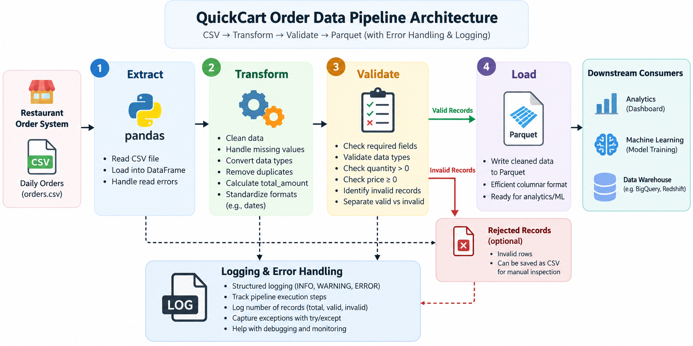

# LAB 1.1 --- Data Pipeline Fundamentals

**Level:** Beginner\
**Type:** Standalone

## Main Objective

Build a Python-based ETL pipeline that:


``` text
CSV Data
   ↓
Extract
   ↓
Transform
   ↓
Validate
   ↓
Load
   ↓
Parquet
```

The pipeline will also implement:

-   Error handling with `try/except`
-   Structured logging
-   Data validation
-   Failed-record handling
-   Parquet output

------------------------------------------------------------------------

# 1. Introduction --- Real-Life Scenario

## 🏢 Scenario: QuickCart's Daily Order Data Problem

Imagine a food-delivery company called **QuickCart**.

Every day, hundreds of restaurants send their order information to
QuickCart as CSV files. For example, an order may contain the customer
ID, restaurant, food item, quantity, price, and order date.

Initially, the data team simply stores these CSV files. But as the
company grows, several problems appear: some rows contain missing
values, prices may be stored as text, duplicate orders can appear, and
processing the CSV files directly becomes inefficient for analytics and
machine-learning workloads.

The company therefore asks you, as a **Junior Data Engineer**, to build
a small automated data pipeline that takes the raw CSV data, cleans and
validates it, calculates useful fields such as total order amount, and
stores the cleaned dataset in **Parquet** format.

Your pipeline should also record what happened during execution. If
something goes wrong, the system should produce a meaningful log instead
of simply crashing without explanation.

------------------------------------------------------------------------

# 2. What Are We Building?

At the end of this lab, QuickCart will have this pipeline:

``` text
                QUICKCART DATA PIPELINE

        Raw Daily Orders
              │
              ▼
       ┌───────────────┐
       │   EXTRACT     │
       │   orders.csv  │
       └───────┬───────┘
               │
               ▼
       ┌───────────────┐
       │  TRANSFORM    │
       │ • Clean data  │
       │ • Fix types   │
       │ • Calculate   │
       │   total_amount│
       └───────┬───────┘
               │
               ▼
       ┌───────────────┐
       │   VALIDATE    │
       │ • Missing IDs │
       │ • Invalid qty │
       │ • Invalid price│
       └───────┬───────┘
               │
          ┌────┴────┐
          │         │
        Valid     Invalid
          │         │
          ▼         ▼
      Parquet    Error Log
       Output    / Rejected
          │
          ▼
     Analytics /
     ML Pipeline
```

> **\[Show Image --- QuickCart ETL Architecture Diagram\]**



*Figure 1: QuickCart Order Data Pipeline Architecture*

The architecture shows a simple ETL pipeline. Raw order data first
enters the extraction stage, where the CSV file is loaded into Python.
The transformation stage cleans the data and creates the `total_amount`
feature, while validation separates usable records from invalid ones.
Finally, valid data is stored in Parquet and execution problems are
recorded through structured logs.

------------------------------------------------------------------------

# 3. Learning Objectives

After completing this lab, students will be able to:

1.  Explain what an ETL pipeline is.
2.  Read raw CSV data using Python.
3.  Transform and clean tabular data using Pandas.
4.  Validate incoming data.
5.  Write processed data to Parquet.
6.  Handle pipeline failures using `try/except`.
7.  Create structured application logs.
8.  Understand why Parquet is useful for data pipelines.

------------------------------------------------------------------------

# 4. Project File Structure

After creating the project, students will work with the following
structure:

``` text
quickcart-data-pipeline/
│
├── data/
│   └── orders.csv
│
├── output/
│   └── orders_clean.parquet
│
├── logs/
│   └── pipeline.log
│
├── src/
│   └── pipeline.py
│
├── requirements.txt
│
└── README.md
```

> **\[Show Image --- Project File Structure in VS Code\]**

The `data` directory contains the raw QuickCart order data, while
`output` stores the processed Parquet file. The `src` directory contains
the actual ETL pipeline code, and `logs` stores information about
pipeline execution and failures. This separation keeps raw data,
generated data, application code, and operational information organized.

------------------------------------------------------------------------

# 5. Project Setup

Students will use **VS Code Server** throughout the lab.

No `cat` command will be used. Files will be created and edited directly
through the VS Code interface.

------------------------------------------------------------------------

## Step 1 --- Create the Project

Create a new folder:

``` text
quickcart-data-pipeline
```

Open this folder in VS Code Server.

Then create:

``` text
data
output
logs
src
```

> **\[Show Image --- Creating Project Folders in VS Code\]**

These folders separate the different responsibilities of the project.
Keeping raw input data separate from generated output prevents
accidental modification of the original dataset. The structure also
resembles how larger data engineering projects organize pipeline
components.

------------------------------------------------------------------------

# 6. Create the Python Environment

Open the VS Code terminal.

Create a virtual environment:

``` bash
python -m venv .venv
```

Activate it.

### Linux

``` bash
source .venv/bin/activate
```

### Windows PowerShell

``` powershell
.venv\Scripts\Activate.ps1
```

You should see something similar to:

``` text
(.venv)
```

in the terminal.

> **\[Show Image --- Activated Python Virtual Environment in VS Code\]**

A virtual environment isolates this project's Python dependencies from
the rest of the system. This is important in data engineering because
different projects may require different library versions. The `.venv`
environment ensures that the QuickCart pipeline uses its own controlled
dependencies.

------------------------------------------------------------------------

# 7. Create `requirements.txt`

Inside VS Code, create:

``` text
requirements.txt
```

Add:

``` text
pandas
pyarrow
```

Then install the dependencies:

``` bash
pip install -r requirements.txt
```

Verify:

``` bash
pip list
```

> **\[Show Image --- Installed Project Dependencies\]**

Pandas will be used to read, transform, and validate the CSV dataset.
PyArrow provides Parquet support for writing the processed data. Keeping
dependencies in `requirements.txt` also makes the project reproducible
on another machine.

------------------------------------------------------------------------

# 8. Create the Raw Dataset

Create:

``` text
data/orders.csv
```

Use this sample QuickCart dataset:

``` csv
order_id,customer_id,restaurant,item,quantity,unit_price,order_date
1001,C001,FoodHub,Burger,2,250,2026-10-01
1002,C002,Spice Kitchen,Biryani,1,180,2026-10-01
1003,C003,FoodHub,Pizza,2,450,2026-10-01
1004,C004,Royal Kitchen,Chicken Curry,3,220,2026-10-01
1005,C005,Spice Kitchen,Naan,4,60,2026-10-01
1006,C006,FoodHub,Pasta,2,300,2026-10-01
1007,C007,Royal Kitchen,Rice Bowl,1,150,2026-10-01
1008,C008,FoodHub,Sandwich,2,180,2026-10-01
```

> **\[Show Image --- Raw `orders.csv` Opened in VS Code\]**

This CSV represents the type of raw data that QuickCart receives from
its operational systems. At this stage, the data is considered raw
because it has not yet gone through the company's validation and
transformation rules. The pipeline will convert this raw dataset into a
cleaner format suitable for analytics and downstream ML systems.

------------------------------------------------------------------------

# 9. Understand the ETL Pipeline

Before writing code, remember:

``` text
E — Extract
↓
Read orders.csv

T — Transform
↓
Clean + convert + calculate

L — Load
↓
Save orders_clean.parquet
```

> **\[Show Image --- ETL Flow Highlighted in the Project\]**

ETL is the fundamental pattern behind this lab. Extraction brings raw
data into the pipeline, transformation changes the data into a useful
and consistent form, and loading stores the processed result in a
destination system. In this project, CSV is our source and Parquet is
our destination.

------------------------------------------------------------------------

# 10. Create the Pipeline

Create:

``` text
src/pipeline.py
```

Add:

``` python
import logging
from pathlib import Path

import pandas as pd


# -----------------------------
# Project paths
# -----------------------------
BASE_DIR = Path(__file__).resolve().parent.parent

INPUT_FILE = BASE_DIR / "data" / "orders.csv"
OUTPUT_FILE = BASE_DIR / "output" / "orders_clean.parquet"
LOG_FILE = BASE_DIR / "logs" / "pipeline.log"


# -----------------------------
# Logging configuration
# -----------------------------
logging.basicConfig(
    filename=LOG_FILE,
    level=logging.INFO,
    format="%(asctime)s | %(levelname)s | %(message)s"
)

logger = logging.getLogger(__name__)


def extract_data():
    """Read raw order data from CSV."""
    logger.info("Starting data extraction")

    df = pd.read_csv(INPUT_FILE)

    logger.info(
        "Data extraction completed | rows=%s",
        len(df)
    )

    return df


def transform_data(df):
    """Clean and transform order data."""
    logger.info("Starting data transformation")

    df = df.copy()

    # Remove unnecessary spaces
    df["restaurant"] = df["restaurant"].str.strip()
    df["item"] = df["item"].str.strip()

    # Convert numeric fields
    df["quantity"] = pd.to_numeric(
        df["quantity"],
        errors="coerce"
    )

    df["unit_price"] = pd.to_numeric(
        df["unit_price"],
        errors="coerce"
    )

    # Convert date
    df["order_date"] = pd.to_datetime(
        df["order_date"],
        errors="coerce"
    )

    # Create derived feature
    df["total_amount"] = (
        df["quantity"] * df["unit_price"]
    )

    logger.info("Data transformation completed")

    return df


def validate_data(df):
    """Validate transformed data."""
    logger.info("Starting data validation")

    required_columns = [
        "order_id",
        "customer_id",
        "quantity",
        "unit_price",
        "order_date"
    ]

    missing_columns = [
        column
        for column in required_columns
        if column not in df.columns
    ]

    if missing_columns:
        raise ValueError(
            f"Missing required columns: {missing_columns}"
        )

    invalid_rows = (
        df["order_id"].isna()
        | df["customer_id"].isna()
        | df["quantity"].isna()
        | (df["quantity"] <= 0)
        | df["unit_price"].isna()
        | (df["unit_price"] < 0)
        | df["order_date"].isna()
    )

    rejected_count = invalid_rows.sum()

    if rejected_count > 0:
        logger.warning(
            "Invalid records detected | count=%s",
            rejected_count
        )

    valid_df = df[~invalid_rows].copy()

    logger.info(
        "Validation completed | valid=%s | rejected=%s",
        len(valid_df),
        rejected_count
    )

    return valid_df


def load_data(df):
    """Write processed data to Parquet."""
    logger.info("Starting data loading")

    OUTPUT_FILE.parent.mkdir(
        parents=True,
        exist_ok=True
    )

    df.to_parquet(
        OUTPUT_FILE,
        index=False
    )

    logger.info(
        "Data loading completed | output=%s | rows=%s",
        OUTPUT_FILE,
        len(df)
    )


def main():
    """Run the complete ETL pipeline."""
    try:
        logger.info("========== Pipeline Started ==========")

        df = extract_data()

        df = transform_data(df)

        df = validate_data(df)

        load_data(df)

        logger.info("========== Pipeline Completed ==========")

    except Exception as error:
        logger.exception(
            "Pipeline failed | error=%s",
            error
        )
        raise


if __name__ == "__main__":
    main()
```

> **\[Show Image --- `pipeline.py` in VS Code\]**

The pipeline is divided into separate functions so that each ETL stage
has a clear responsibility. `extract_data()` reads the raw CSV,
`transform_data()` cleans and enriches it, `validate_data()` checks
whether records are usable, and `load_data()` writes the final dataset
to Parquet. The `main()` function connects these stages and uses
exception handling to capture unexpected failures.

------------------------------------------------------------------------

# 11. Run the Pipeline

From the VS Code terminal:

``` bash
python src/pipeline.py
```

The terminal may remain quiet because the pipeline is using the logging
system instead of printing every operation.

> **\[Show Image --- Successful Pipeline Execution\]**

A successful execution means the complete ETL workflow has finished
without an exception. The important result is not terminal output but
the generated Parquet file and execution log. This approach is closer to
how production pipelines behave, where operational information is
normally captured through logs.

------------------------------------------------------------------------

# 12. Check the Generated Files

After execution, the project should look like:

``` text
quickcart-data-pipeline/
│
├── data/
│   └── orders.csv
│
├── output/
│   └── orders_clean.parquet
│
├── logs/
│   └── pipeline.log
│
├── src/
│   └── pipeline.py
│
├── requirements.txt
│
└── README.md
```

> **\[Show Image --- Generated Parquet and Log Files\]**

The pipeline has now created two important artifacts.
`orders_clean.parquet` contains the processed data that can be consumed
by analytics or ML workloads, while `pipeline.log` provides an
operational record of what happened during execution. This separation
between data output and operational logs is a basic but important data
engineering practice.

------------------------------------------------------------------------

# 13. Inspect the Parquet Output

Create another file:

``` text
src/check_output.py
```

Add:

``` python
from pathlib import Path
import pandas as pd


BASE_DIR = Path(__file__).resolve().parent.parent

OUTPUT_FILE = BASE_DIR / "output" / "orders_clean.parquet"

df = pd.read_parquet(OUTPUT_FILE)

print(df)
print("\nDataset information:")
print(df.info())
```

Run:

``` bash
python src/check_output.py
```

> **\[Show Image --- Clean Parquet Data\]**

The output should now contain the original order information together
with the newly calculated `total_amount` column. Because the data has
been validated before loading, the Parquet dataset contains only records
that satisfy the pipeline's basic quality rules. This demonstrates the
complete flow from raw data to a cleaned analytical dataset.

------------------------------------------------------------------------

# 14. Verify the Transformation

For example:

``` text
quantity = 2
unit_price = 250
```

The pipeline calculates:

``` text
total_amount
= quantity × unit_price
= 2 × 250
= 500
```

> **\[Show Image --- `total_amount` Column in Output\]**

The `total_amount` field is an example of a derived feature created
during the transformation stage. Rather than requiring downstream users
to repeatedly calculate the value, the pipeline produces it once in a
standardized way. In a larger ML system, similar transformations might
create features used directly by machine-learning models.

------------------------------------------------------------------------

# 15. Inspect the Pipeline Log

Open:

``` text
logs/pipeline.log
```

You should see entries similar to:

``` text
2026-10-04 12:30:01 | INFO | ========== Pipeline Started ==========
2026-10-04 12:30:01 | INFO | Starting data extraction
2026-10-04 12:30:01 | INFO | Data extraction completed | rows=8
2026-10-04 12:30:01 | INFO | Starting data transformation
2026-10-04 12:30:01 | INFO | Data transformation completed
2026-10-04 12:30:01 | INFO | Starting data validation
2026-10-04 12:30:01 | INFO | Validation completed | valid=8 | rejected=0
2026-10-04 12:30:01 | INFO | Starting data loading
2026-10-04 12:30:01 | INFO | Data loading completed
2026-10-04 12:30:01 | INFO | ========== Pipeline Completed ==========
```

> **\[Show Image --- `pipeline.log` in VS Code\]**

The log provides a chronological record of the pipeline execution. Each
major stage records what it was doing and, where useful, how many
records were processed. In production systems, these logs help engineers
understand whether a pipeline completed successfully and where a failure
occurred.

------------------------------------------------------------------------

# 16. Test Error Handling

Now we will deliberately create a failure.

In `orders.csv`, change:

``` csv
1003,C003,FoodHub,Pizza,2,450,2026-10-01
```

to:

``` csv
1003,C003,FoodHub,Pizza,-2,450,2026-10-01
```

Here the quantity is `-2`, which is invalid.

Save the file and run:

``` bash
python src/pipeline.py
```

The log should report something similar to:

``` text
WARNING | Invalid records detected | count=1
```

> **\[Show Image --- Invalid Record Detected in Pipeline Log\]**

The pipeline detects that the quantity violates the validation rule
because an order cannot contain a negative quantity. Instead of allowing
the invalid record into the final dataset, the validation stage removes
it from the valid output. The warning is recorded in the log so that the
data engineering team knows that an input-quality problem occurred.

------------------------------------------------------------------------

# 17. Test a Pipeline Failure

Now temporarily rename:

``` text
data/orders.csv
```

to:

``` text
data/orders_backup.csv
```

Then run:

``` bash
python src/pipeline.py
```

The pipeline will fail because the expected input file no longer exists.

Open:

``` text
logs/pipeline.log
```

You should see an error/exception entry.

> **\[Show Image --- Pipeline Failure Recorded in Log\]**

This demonstrates why error handling is necessary in data pipelines.
Instead of failing without any explanation, the pipeline records the
exception and its context in the log. In a real production environment,
such information could be connected to monitoring or alerting systems so
that engineers can respond quickly.

Rename the file back to:

``` text
orders.csv
```

before continuing.

------------------------------------------------------------------------

# 18. Final Pipeline Architecture

At this point, QuickCart's pipeline works as follows:

``` text
                    QUICKCART
                  ORDER SYSTEM
                       │
                       │ CSV
                       ▼
              ┌─────────────────┐
              │     EXTRACT     │
              │   pandas.read   │
              │      _csv()     │
              └────────┬────────┘
                       │
                       ▼
              ┌─────────────────┐
              │    TRANSFORM    │
              │                 │
              │ • Clean strings │
              │ • Convert types │
              │ • Parse dates   │
              │ • Calculate     │
              │   total_amount  │
              └────────┬────────┘
                       │
                       ▼
              ┌─────────────────┐
              │     VALIDATE    │
              │                 │
              │ Required fields │
              │ Valid quantity  │
              │ Valid price     │
              │ Valid date      │
              └────────┬────────┘
                       │
                  ┌────┴────┐
                  │         │
                VALID     INVALID
                  │         │
                  ▼         ▼
             ┌────────┐   LOG
             │Parquet │   WARNING
             └────┬───┘
                  │
                  ▼
           Analytics / ML
```

> **\[Show Image --- Final QuickCart Data Pipeline Architecture\]**

This architecture represents the complete solution developed throughout
the lab. Raw CSV data is extracted, transformed, validated, and finally
stored as Parquet for downstream analytics and machine-learning
workloads. Invalid records and unexpected failures are surfaced through
logging, giving the engineering team visibility into the pipeline's
health.

------------------------------------------------------------------------

# 19. What You Learned

By completing this lab, you have implemented the fundamental components
of a data pipeline:

  Concept             What you implemented
  ------------------- ----------------------------
  Extract             Read CSV using Pandas
  Transform           Clean and modify data
  Feature creation    `total_amount`
  Validation          Check invalid records
  Load                Write Parquet
  Error handling      `try/except`
  Logging             Pipeline execution logs
  Data organization   Structured project folders
  Reproducibility     `requirements.txt`

------------------------------------------------------------------------

# 20. Conclusion

QuickCart's raw order data can now be automatically transformed from CSV
into a validated Parquet dataset through a structured ETL pipeline. The
pipeline separates extraction, transformation, validation, and loading
into clear stages, making the system easier to understand and maintain.
Logging and exception handling provide visibility when invalid data or
unexpected failures occur. This small project demonstrates the core
principles used in larger production data pipelines that feed analytics
and machine-learning systems. In the next lab, this same data-processing
idea will be extended by comparing scheduled batch processing with
real-time streaming using Kafka.
