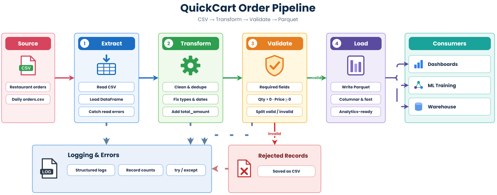
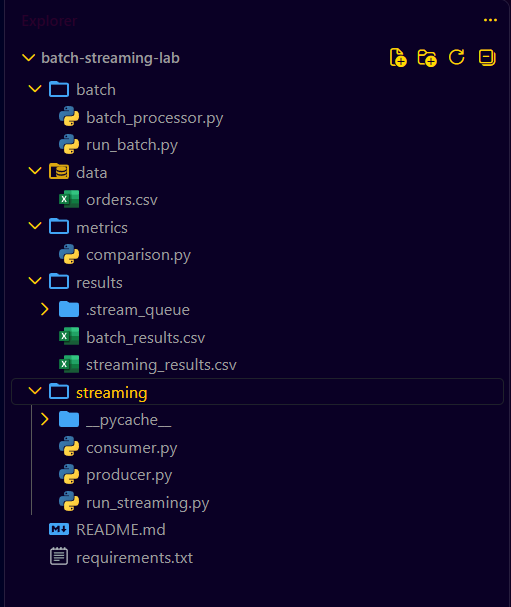
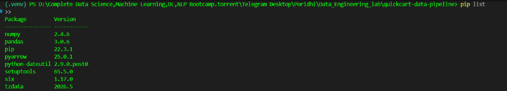
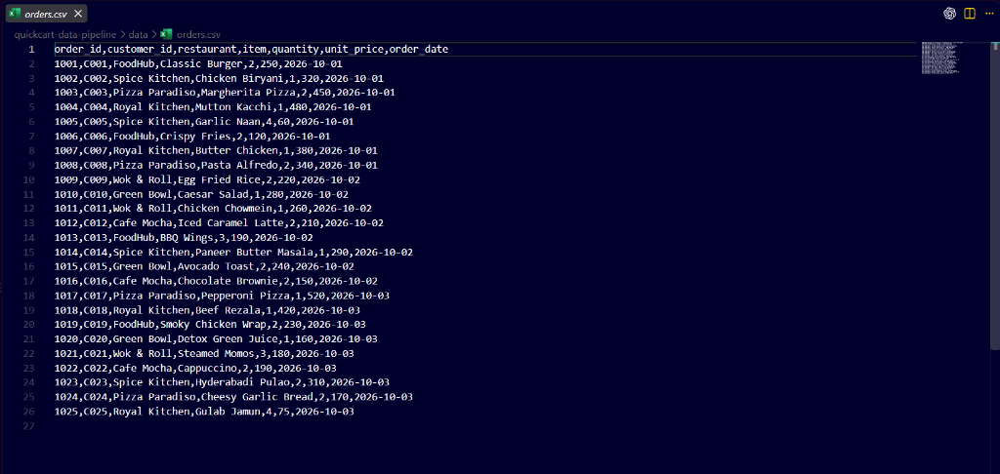
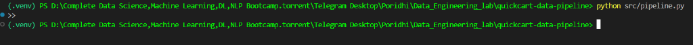
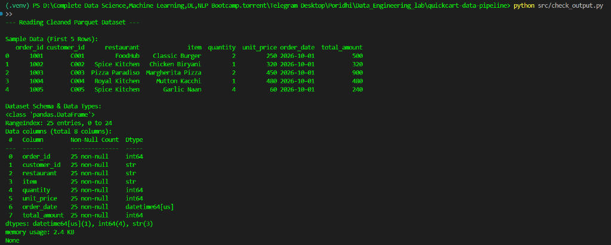
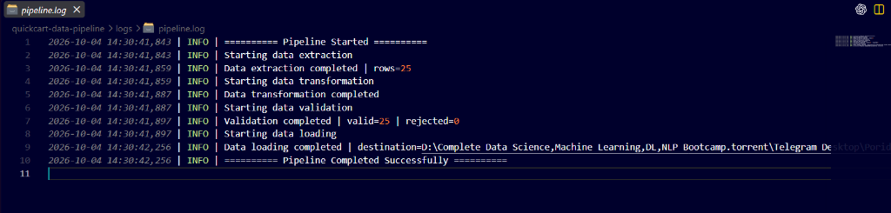
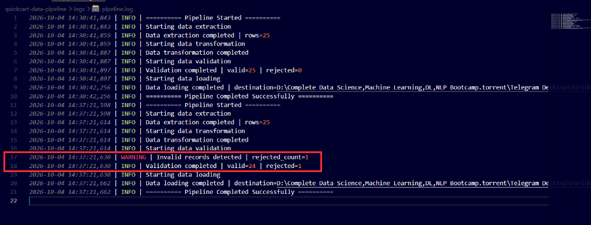
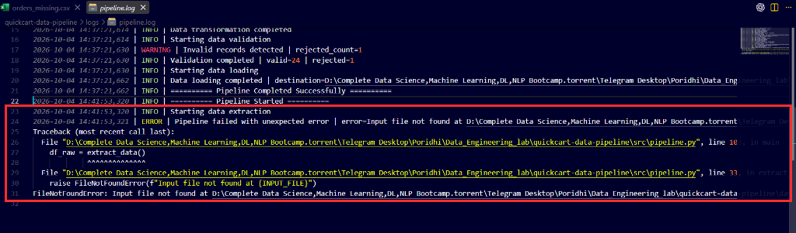

# Lab 1.1: Data Pipeline Fundamentals

## 1. Introduction:

Imagine you have just joined **QuickCart**, a fast-growing online food delivery platform, as a **Junior Data Engineer**. Every evening, partner restaurants upload raw CSV order files, but the data often contains missing IDs, corrupted numbers, negative quantities, and inconsistent text formatting. Manual spreadsheet checks are no longer enough, and analytics dashboards are becoming slow over unindexed CSV data.

Your team lead asks you to build an automated **Extract, Transform, Validate, and Load (ETL)** pipeline. It will read daily order CSV files, clean and validate the records, calculate revenue fields, save trusted data as **Apache Parquet**, and write logs so pipeline failures can be traced.

You will build the following QuickCart order data pipeline:



Raw CSV files are loaded into Pandas, cleaned, validated against business rules, and written to optimized Parquet output. Invalid records trigger structured warning logs, helping downstream analytics and machine learning systems consume reliable data.

---

## 2. Project File Structure

Following your architectural design, the project maintains strict separation between raw inputs, transformed outputs, business logic, and operational logs:

```text
quickcart-data-pipeline/
│
├── data/
│   └── orders.csv              # Incoming raw CSV order data from partner restaurants
│
├── src/
│   ├── pipeline.py             # Main ETL script (Extract, Transform, Validate, Load)
│   └── check_output.py         # Verification script to inspect Parquet data and schema
│
├── output/
│   └── orders_clean.parquet    # Cleaned, validated, and compressed analytical dataset
│
├── logs/
│   └── pipeline.log            # Execution history, runtime metrics, and error logs
│
└── requirements.txt            # Project dependencies (pandas, pyarrow)
```

---

## 3. Project Implementation

### Step 1: Open VS Code Server and Create Project Folders

1. Open your browser and access your **VS Code Server** workspace and create folder
2. ```text
   quickcart-data-pipeline
   ```
3. In the VS Code Explorer sidebar (left panel), click the **New Folder** icon to create the following directories:
   - `data`
   - `src`
   - `output`
   - `logs`



The VS Code Server Explorer displays the newly scaffolded project directories. Each directory represents a dedicated layer in the data processing lifecycle. Establishing this directory skeleton up front prevents runtime path resolution errors during file extraction and loading.

---

### Step 2: Initialize and Activate Python Virtual Environment

1. In VS Code Server, open an integrated terminal by clicking **Terminal > New Terminal**.
2. Create an isolated virtual environment named `.venv`:
   ```bash
   python3 -m venv .venv
   ```
3. Activate the virtual environment:
   ```bash
   source .venv/bin/activate
   ```

   *(Note: If working locally on Windows PowerShell, run: `.venv\Scripts\Activate.ps1`)*
4. Verify that `(.venv)` appears at the beginning of your terminal prompt.


The activated virtual environment provides an isolated runtime sandbox for the QuickCart data pipeline. Sandboxing ensures that specific library versions do not conflict with system-wide Python packages. The `(.venv)` prompt prefix visually confirms that subsequent package installations will reside exclusively inside this workspace.

---

### Step 3: Create `requirements.txt` and Install Dependencies

1. In the VS Code Explorer, click the **New File** icon in the root directory and name it:
   ```text
   requirements.txt
   ```
2. Open `requirements.txt` in the editor and add the required data engineering libraries:
   ```text
   pandas>=2.0.0
   pyarrow>=14.0.0
   ```
3. Save the file by clicking **File > Save**.
4. In your activated terminal, install the dependencies:
   ```bash
   pip install -r requirements.txt
   ```
5. Confirm successful installation:
   ```bash
   pip list
   ```



The package manager successfully installs Pandas for data transformations and PyArrow for Parquet serialization. Defining requirements in a standalone file ensures the pipeline can be deterministically reproduced across different cloud environments. The terminal output confirms that the correct library versions are active in the virtual environment.

---

### Step 4: Create the Incoming Raw Orders Dataset

1. In the VS Code Explorer, expand the `data/` folder.
2. Right-click on `data` and select **New File**, naming it:
   ```text
   orders.csv
   ```
3. Open `data/orders.csv` and paste the following sample batch of QuickCart restaurant orders:
   ```csv
   order_id,customer_id,restaurant,item,quantity,unit_price,order_date
   1001,C001,FoodHub,Classic Burger,2,250,2026-10-01
   1002,C002,Spice Kitchen,Chicken Biryani,1,320,2026-10-01
   1003,C003,Pizza Paradiso,Margherita Pizza,2,450,2026-10-01
   1004,C004,Royal Kitchen,Mutton Kacchi,1,480,2026-10-01
   1005,C005,Spice Kitchen,Garlic Naan,4,60,2026-10-01
   1006,C006,FoodHub,Crispy Fries,2,120,2026-10-01
   1007,C007,Royal Kitchen,Butter Chicken,1,380,2026-10-01
   1008,C008,Pizza Paradiso,Pasta Alfredo,2,340,2026-10-01
   1009,C009,Wok & Roll,Egg Fried Rice,2,220,2026-10-02
   1010,C010,Green Bowl,Caesar Salad,1,280,2026-10-02
   1011,C011,Wok & Roll,Chicken Chowmein,1,260,2026-10-02
   1012,C012,Cafe Mocha,Iced Caramel Latte,2,210,2026-10-02
   1013,C013,FoodHub,BBQ Wings,3,190,2026-10-02
   1014,C014,Spice Kitchen,Paneer Butter Masala,1,290,2026-10-02
   1015,C015,Green Bowl,Avocado Toast,2,240,2026-10-02
   1016,C016,Cafe Mocha,Chocolate Brownie,2,150,2026-10-02
   1017,C017,Pizza Paradiso,Pepperoni Pizza,1,520,2026-10-03
   1018,C018,Royal Kitchen,Beef Rezala,1,420,2026-10-03
   1019,C019,FoodHub,Smoky Chicken Wrap,2,230,2026-10-03
   1020,C020,Green Bowl,Detox Green Juice,1,160,2026-10-03
   1021,C021,Wok & Roll,Steamed Momos,3,180,2026-10-03
   1022,C022,Cafe Mocha,Cappuccino,2,190,2026-10-03
   1023,C023,Spice Kitchen,Hyderabadi Pulao,2,310,2026-10-03
   1024,C024,Pizza Paradiso,Cheesy Garlic Bread,2,170,2026-10-03
   1025,C025,Royal Kitchen,Gulab Jamun,4,75,2026-10-03
   ```
4. Save the file by clicking **File > Save**.



The raw CSV file reflects realistic daily operational data submitted by QuickCart's restaurant partners. It contains vital business fields such as order identifiers, customer IDs, menu items, prices, and timestamps. Creating this sample batch allows us to test transformation rules and validation checks before deploying to production feeds.

---

### Step 5: Implement the ETL Pipeline Script

1. In the VS Code Explorer, right-click the `src/` folder and select **New File**. Name it:
   ```text
   pipeline.py
   ```
2. Open `src/pipeline.py` and write the complete modular ETL implementation:

```python
import logging
from pathlib import Path
import pandas as pd

BASE_DIR = Path(__file__).resolve().parent.parent

INPUT_FILE = BASE_DIR / "data" / "orders.csv"
OUTPUT_FILE = BASE_DIR / "output" / "orders_clean.parquet"
REJECTED_FILE = BASE_DIR / "output" / "rejected_orders.csv"
LOG_FILE = BASE_DIR / "logs" / "pipeline.log"

OUTPUT_FILE.parent.mkdir(parents=True, exist_ok=True)
LOG_FILE.parent.mkdir(parents=True, exist_ok=True)

logging.basicConfig(
    filename=LOG_FILE,
    level=logging.INFO,
    format="%(asctime)s | %(levelname)s | %(message)s"
)
logger = logging.getLogger(__name__)


def extract_data() -> pd.DataFrame:
    logger.info("Starting data extraction")
    if not INPUT_FILE.exists():
        raise FileNotFoundError(f"Input file not found at {INPUT_FILE}")

    df = pd.read_csv(INPUT_FILE)
    logger.info("Data extraction completed | rows=%d", len(df))
    return df


def transform_data(df: pd.DataFrame) -> pd.DataFrame:
    logger.info("Starting data transformation")
    df = df.copy()

    df["restaurant"] = df["restaurant"].astype(str).str.strip()
    df["item"] = df["item"].astype(str).str.strip()

    initial_count = len(df)
    df = df.drop_duplicates(subset=["order_id"])
    if len(df) < initial_count:
        logger.info("Duplicates removed | count=%d", initial_count - len(df))

    df["quantity"] = pd.to_numeric(df["quantity"], errors="coerce")
    df["unit_price"] = pd.to_numeric(df["unit_price"], errors="coerce")

    df["order_date"] = pd.to_datetime(df["order_date"], errors="coerce")

    df["total_amount"] = df["quantity"] * df["unit_price"]

    logger.info("Data transformation completed")
    return df


def validate_data(df: pd.DataFrame) -> pd.DataFrame:
    logger.info("Starting data validation")

    required_columns = ["order_id", "customer_id", "restaurant", "item", "quantity", "unit_price", "order_date"]
    missing_columns = [col for col in required_columns if col not in df.columns]
    if missing_columns:
        raise ValueError(f"Schema validation failed. Missing required columns: {missing_columns}")

    invalid_rows = (
        df["order_id"].isna()
        | df["customer_id"].isna()
        | df["quantity"].isna()
        | (df["quantity"] <= 0)
        | df["unit_price"].isna()
        | (df["unit_price"] < 0)
        | df["order_date"].isna()
    )

    valid_df = df[~invalid_rows].copy()
    rejected_df = df[invalid_rows].copy()
    rejected_count = len(rejected_df)

    if rejected_count > 0:
        logger.warning("Invalid records detected | rejected_count=%d", rejected_count)
        rejected_df.to_csv(REJECTED_FILE, index=False)
        logger.info("Rejected records saved for inspection | destination=%s", REJECTED_FILE)

    logger.info("Validation completed | valid=%d | rejected=%d", len(valid_df), rejected_count)
    return valid_df


def load_data(df: pd.DataFrame) -> None:
    logger.info("Starting data loading")
    df.to_parquet(OUTPUT_FILE, index=False)
    logger.info("Data loading completed | destination=%s | rows=%d", OUTPUT_FILE, len(df))


def main():
    try:
        logger.info("========== Pipeline Started ==========")
        df_raw = extract_data()
        df_transformed = transform_data(df_raw)
        df_valid = validate_data(df_transformed)
        load_data(df_valid)
        logger.info("========== Pipeline Completed Successfully ==========")
    except Exception as error:
        logger.exception("Pipeline failed with unexpected error | error=%s", error)
        raise


if __name__ == "__main__":
    main()
```

3. Save the file by clicking **File > Save**.

The pipeline code organizes the ETL workflow into independent, modular functions. Extraction loads the raw order file, transformation cleans strings and derives the `total_amount` metric, and validation removes corrupted rows. Wrapping the execution in a `try/except` block guarantees that unhandled errors are automatically captured in the operational log.

---

### Step 6: Execute the Pipeline

1. In your VS Code terminal, execute the pipeline script:
   ```bash
   python src/pipeline.py
   ```
2. The terminal executes cleanly without noisy stdout output because all metrics are routed to the structured log file.



The command runs the end-to-end pipeline against the raw order dataset. Because professional data engineering workflows avoid printing raw output directly to the terminal, silence indicates smooth execution. The resulting data and execution traces are written to their respective disk directories.

---

### Step 7: Verify the Generated Parquet Output

1. In the VS Code Explorer, right-click `src/` and create a verification script named:
   ```text
   check_output.py
   ```
2. Add the following inspection code:
   ```python
   from pathlib import Path
   import pandas as pd

   BASE_DIR = Path(__file__).resolve().parent.parent
   OUTPUT_FILE = BASE_DIR / "output" / "orders_clean.parquet"

   print("--- Reading Cleaned Parquet Dataset ---")
   df = pd.read_parquet(OUTPUT_FILE)

   print("\nSample Data (First 5 Rows):")
   print(df.head())

   print("\nDataset Schema & Data Types:")
   print(df.info())

   print(f"\nTotal Valid Records Processed: {len(df)}")
   ```
3. Save the file and run it in the terminal:
   ```bash
   python src/check_output.py
   ```



The inspection script confirms that the Parquet dataset was created with proper data types and schemas. The newly derived `total_amount` column is accurately calculated as `quantity * unit_price` for every record. Downstream analytics queries on this Parquet file will run significantly faster and consume less storage than the original CSV.

---

### Step 8: Inspect the Execution Log

1. In the VS Code Explorer, expand the `logs/` directory.
2. Click on `pipeline.log` to open it in the editor.
3. Review the execution trace:
   ```text
   2026-10-04 12:30:01 | INFO | ========== Pipeline Started ==========
   2026-10-04 12:30:01 | INFO | Starting data extraction
   2026-10-04 12:30:01 | INFO | Data extraction completed | rows=8
   2026-10-04 12:30:01 | INFO | Starting data transformation
   2026-10-04 12:30:01 | INFO | Data transformation completed
   2026-10-04 12:30:01 | INFO | Starting data validation
   2026-10-04 12:30:01 | INFO | Validation completed | valid=8 | rejected=0
   2026-10-04 12:30:01 | INFO | Starting data loading
   2026-10-04 12:30:01 | INFO | Data loading completed | destination=... | rows=8
   2026-10-04 12:30:01 | INFO | ========== Pipeline Completed Successfully ==========
   ```



The structured log file preserves a complete, timestamped history of each ETL milestone. It records incoming batch sizes, transformation progress, and final record counts loaded into storage. In a production setting, centralized log monitoring tools parse these structured logs to trigger alerts if batch sizes drop unexpectedly.

---

### Step 9: Test Data Quality Validation & Record Rejection

1. In the VS Code Explorer, open `data/orders.csv`.
2. Edit line 4 (order `1003`) by changing the quantity from `2` to `-2` (simulating a corrupted cancellation entry):
   ```csv
   1003,C003,Pizza Paradiso,Margherita Pizza,-2,450,2026-10-01
   ```
3. Save the file by clicking **File > Save**.
4. Re-run the pipeline in your terminal:
   ```bash
   python src/pipeline.py
   ```
5. Re-open `logs/pipeline.log` to observe the data quality warning:
   ```text
   WARNING | Invalid records detected | rejected_count=1
   INFO | Validation completed | valid=24 | rejected=1
   ```



The pipeline successfully flags the negative quantity record and prevents it from contaminating analytical reports. The invalid order is quarantined, leaving exactly 24 verified records to be loaded into the Parquet output. The log records a detailed warning indicating how many records were rejected, ensuring full data auditability.

---

### Step 10: Test Pipeline Crash and Error Handling

1. In the VS Code Explorer, right-click `data/orders.csv`, select **Rename**, and change the filename to:
   ```text
   orders_missing.csv
   ```
2. Run the pipeline in the terminal:
   ```bash
   python src/pipeline.py
   ```
3. Open `logs/pipeline.log` and scroll to the bottom. Observe that the `try/except` block captured the fatal `FileNotFoundError` along with the full stack trace:
   ```text
   ERROR | Pipeline failed with unexpected error | error=Input file not found...
   Traceback (most recent call last):
   ...
   FileNotFoundError: Input file not found at .../data/orders.csv
   ```
4. In the Explorer, right-click `data/orders_missing.csv`, select **Rename**, and restore the name to `orders.csv`.
5. Restore the original quantity `2` for order `1003` in `data/orders.csv`, save, and re-run `python src/pipeline.py` to leave the lab in a clean state.



This test proves the pipeline's resilience against sudden environmental failures, such as delayed or missing upstream files. Rather than terminating silently, the script records the exact exception details and traceback in the log file. Data engineering teams rely on these detailed stack traces to quickly diagnose and resolve infrastructure issues.

---

## 4. Conclusion

QuickCart's daily restaurant orders are now seamlessly ingested, validated, and transformed from messy CSV files into high-performance Parquet datasets. By establishing clear modular stages for extraction, transformation, validation, and loading, the pipeline guarantees that only high-quality data reaches downstream business dashboards. The inclusion of structured logging and exception handling provides vital operational visibility whenever corrupted records or system failures arise. This architecture forms the foundational pattern utilized by modern data platforms to power business intelligence and automated machine learning workflows. In the upcoming lab, we will expand this architecture by transitioning from batch-scheduled file processing to real-time event streaming with Apache Kafka.
