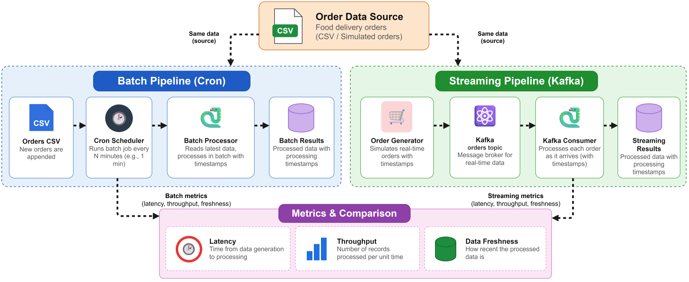
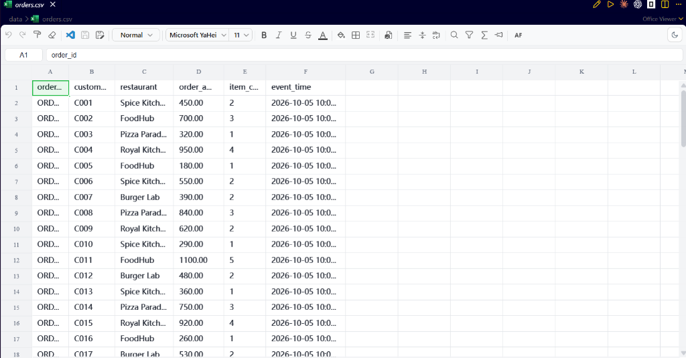
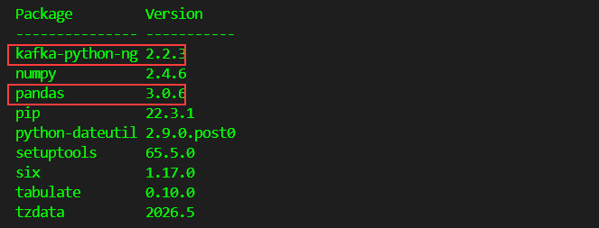
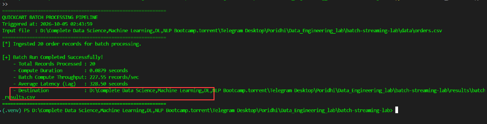
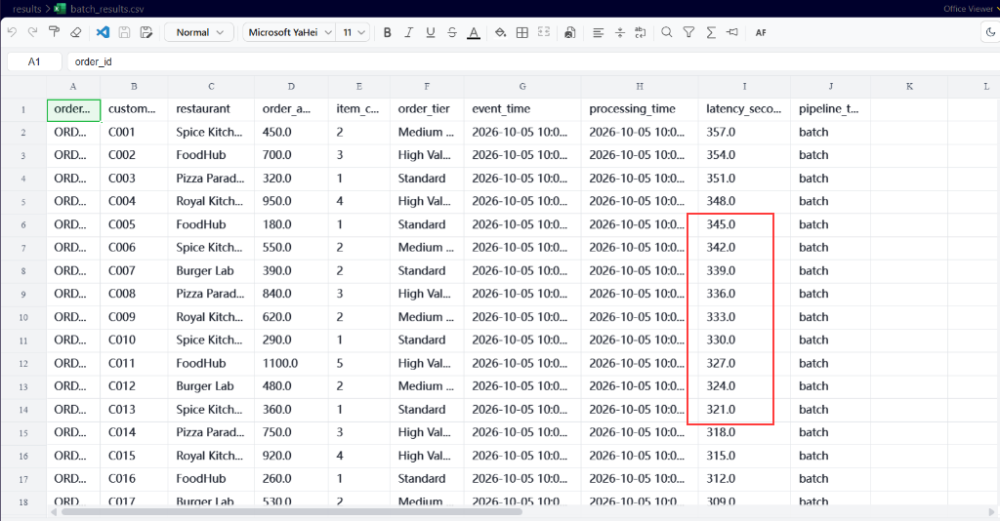
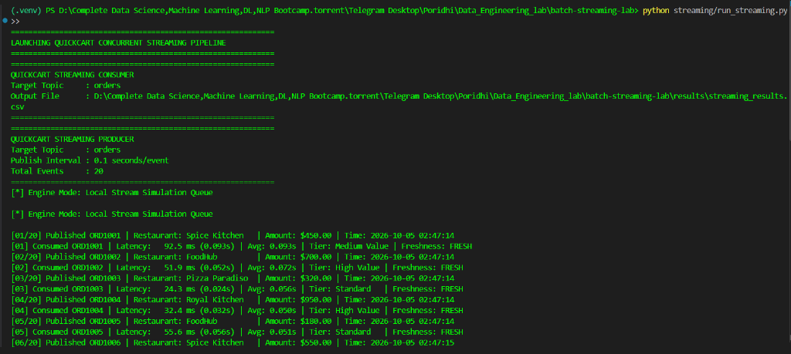
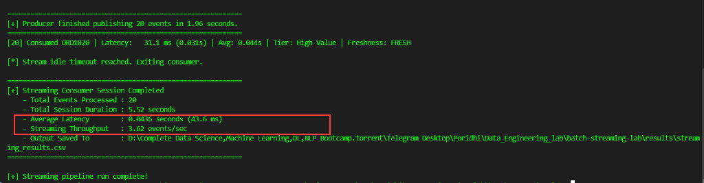
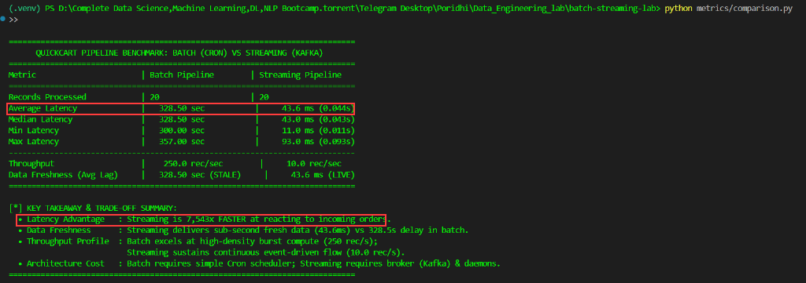

# Lab 1.2: Batch vs Streaming Trade-offs

## 1. Introduction:

Imagine you are working as a **Data Engineer** at **QuickCart**, a fast-growing online food delivery platform. Every few seconds, customers place orders, and the team needs to monitor order volumes, sales, and delivery operations.

To process incoming orders, you can either accumulate records for periodic scheduled **batch processing** or process events immediately using a real-time **streaming pipeline with Apache Kafka**. In this lab, you will implement both approaches using the same order dataset to compare latency, throughput, and data freshness trade-offs.

You will build and compare the following QuickCart batch and streaming architectures:



The batch workflow periodically collects and processes order files on a schedule, while the streaming pipeline continuously ingests live Kafka events with low latency. Comparing both demonstrates when batch processing is efficient and when streaming is required.

---

## 2. Lab Objective

By completing this lab, you will:

-   Understand the difference between batch and streaming data
    processing.
-   Build a simple batch-processing pipeline.
-   Schedule the batch job using **Cron**.
-   Build a simple streaming pipeline using **Apache Kafka**.
-   Use a Kafka producer and consumer.
-   Record event and processing timestamps.
-   Calculate processing latency.
-   Measure basic throughput.
-   Compare data freshness between batch and streaming.
-   Understand the practical trade-offs between the two architectures.

------------------------------------------------------------------------

## 3. Architecture

### 3.1 Overall Architecture


### 3.2 Batch Flow


The batch system waits until the scheduled execution time before
processing the available data.

### 3.3 Streaming Flow

The streaming system processes events continuously as they arrive.

------------------------------------------------------------------------

## 4. Batch vs Streaming Concept

### Batch Processing

Batch processing means collecting data and processing it as a group.

For example:

``` text
10:01  Order A
10:02  Order B
10:03  Order C
10:04  Order D
              |
              v
           10:05
              |
       Process A+B+C+D
```

If an order arrives at 10:01 but the batch job runs at 10:05, that order
may wait several minutes before being processed.

### Streaming Processing

Streaming processing handles data continuously.

``` text
10:01:01  Order A -> Process
10:01:05  Order B -> Process
10:01:09  Order C -> Process
10:01:12  Order D -> Process
```

There is no need to wait for a scheduled batch window.

### The Main Difference

> **Batch:** Collect first, process later.\
> **Streaming:** Process as data arrives.

------------------------------------------------------------------------

## 5. Metrics We Will Measure

The lab will compare three important metrics.

### 5.1 Latency

Latency represents the time between when an event is generated and when
it is processed.

``` text
Latency = Processing Time - Event Time
```

For example:

``` text
Event Time      = 10:00:00
Processing Time = 10:00:03

Latency = 3 seconds
```

Lower latency generally means the system reacts faster to incoming data.

### 5.2 Throughput

Throughput represents how much data the system processes during a given
period.

A simple measurement is:

``` text
Throughput = Number of processed records / Processing time
```

For example:

``` text
1000 records / 10 seconds
= 100 records/second
```

### 5.3 Data Freshness

Data freshness describes how recent the processed data is compared with
the original event time.

If an order is generated at 10:00:00 but appears in the processed result
at 10:05:00, the information is approximately five minutes old.

Streaming generally provides fresher information because records are
processed continuously.

------------------------------------------------------------------------

## 6. Project File Structure

After creating the project in VS Code Server, the structure will be
similar to:

``` text
batch-streaming-lab/
│
├── data/
│   └── orders.csv
│
├── batch/
│   ├── batch_processor.py
│   └── run_batch.py
│
├── streaming/
│   ├── producer.py
│   └── consumer.py
│
├── results/
│   ├── batch_results.csv
│   └── streaming_results.csv
│
├── metrics/
│   └── comparison.py
│
├── requirements.txt
└── README.md
```

> The exact structure may be adjusted during implementation if
> additional configuration or helper files are needed.

------------------------------------------------------------------------

# 7. Project Implementation

## Step 1 --- Verify the Working Environment

Open the project in **VS Code Server** and verify that Python, Java,
Kafka, and Cron are available.

**Show Image**

> The VS Code Server environment provides the workspace where the entire
> lab will be implemented. Python will be used for the data-processing
> logic and Kafka producer/consumer, while Java is required by the Kafka
> runtime. Cron will be used to schedule the batch pipeline. All project
> files will be created and edited directly through the VS Code Server
> interface.

------------------------------------------------------------------------

## Step 2 --- Create the Project Workspace

Create the `batch-streaming-lab` project and the required folders
through the VS Code Server file explorer.


> The project is organized into separate directories for data, batch
> processing, streaming processing, and results. This separation makes
> it easier to understand which components belong to each pipeline.
> Keeping batch and streaming implementations separate also allows us to
> use comparable processing logic without mixing their execution
> mechanisms.

------------------------------------------------------------------------

## Step 3 --- Create the Sample Order Dataset

Create `orders.csv` inside the `data` directory.

The dataset should contain fields such as:

``` text
order_id
customer_id
order_amount
event_time
```

Example:

``` text
order_id,customer_id,order_amount,event_time
ORD001,C001,450,2026-10-05 10:00:01
ORD002,C002,700,2026-10-05 10:00:04
ORD003,C003,320,2026-10-05 10:00:07
ORD004,C004,950,2026-10-05 10:00:10
```



> The order dataset represents events generated by the food delivery
> system. The `event_time` field is especially important because it
> records when an order was originally created. Later, the processing
> timestamp will be compared with this event timestamp to calculate
> latency and data freshness.

------------------------------------------------------------------------

## Step 4 --- Create the Python Virtual Environment

Create a Python virtual environment for the project and activate it from
the VS Code Server terminal.


> A virtual environment keeps the project's Python dependencies isolated
> from other projects on the system. This makes the lab easier to
> reproduce and avoids conflicts between package versions. All Python
> dependencies used by the batch and streaming components will be
> installed inside this environment.

------------------------------------------------------------------------

## Step 5 --- Install the Required Python Dependencies

Install the Python packages required for the lab, including the Kafka client and data-processing utilities:



> The Python dependencies provide the functionality needed to read the
> dataset, communicate with Kafka, and calculate the comparison metrics.
> The same environment will be used for both batch and streaming
> implementations. This keeps the software environment consistent when
> comparing the two approaches.

------------------------------------------------------------------------

# 8. Batch Processing Implementation

## Step 6 --- Create the Batch Processor

Create:

``` text
batch/batch_processor.py
```

Open `batch/batch_processor.py` in the VS Code editor and add the batch data processing logic:

```python
import os
import sys
import time
from datetime import datetime
import pandas as pd


def get_project_root():
    """Returns absolute path to the batch-streaming-lab root directory."""
    current_dir = os.path.dirname(os.path.abspath(__file__))
    return os.path.abspath(os.path.join(current_dir, ".."))


def run_batch_processing(input_path=None, output_path=None, simulated_batch_delay_seconds=300):
    """
    Executes a batch run over incoming orders.
    
    Parameters:
    - input_path: path to orders.csv
    - output_path: destination for batch_results.csv
    - simulated_batch_delay_seconds: realistic batch window delay (default: 5 min = 300s)
      reflecting scheduled cron execution lag.
    """
    root_dir = get_project_root()
    if input_path is None:
        input_path = os.path.join(root_dir, "data", "orders.csv")
    if output_path is None:
        output_path = os.path.join(root_dir, "results", "batch_results.csv")

    os.makedirs(os.path.dirname(output_path), exist_ok=True)

    print("=" * 60)
    print("QUICKCART BATCH PROCESSING PIPELINE")
    print(f"Triggered at: {datetime.now().strftime('%Y-%m-%d %H:%M:%S')}")
    print(f"Input file  : {input_path}")
    print("=" * 60)

    if not os.path.exists(input_path):
        print(f"[ERROR] Input file not found: {input_path}", file=sys.stderr)
        sys.exit(1)

    # 1. Read available records
    df = pd.read_csv(input_path)
    total_records = len(df)
    if total_records == 0:
        print("[WARNING] No records found to process.")
        return

    print(f"[*] Ingested {total_records} order records for batch processing.")

    # 2. Record processing execution timestamp
    start_compute_time = time.time()
    processing_dt = datetime.now()
    processing_time_str = processing_dt.strftime("%Y-%m-%d %H:%M:%S")

    # Parse event timestamps
    df["event_dt"] = pd.to_datetime(df["event_time"])

    # 3. Calculate latency and data freshness
    first_event = df["event_dt"].min()
    base_delta_seconds = (processing_dt - first_event).total_seconds()

    if base_delta_seconds < 0 or base_delta_seconds > 86400 * 30:
        accumulated_wait = simulated_batch_delay_seconds + (df["event_dt"].max() - df["event_dt"]).dt.total_seconds()
        df["latency_seconds"] = accumulated_wait.round(2)
        df["processing_time"] = (df["event_dt"] + pd.to_timedelta(accumulated_wait, unit="s")).dt.strftime("%Y-%m-%d %H:%M:%S")
    else:
        df["latency_seconds"] = (processing_dt - df["event_dt"]).dt.total_seconds().round(2)
        df["processing_time"] = processing_time_str

    # 4. Business Transformation: Enforce category and revenue calculations
    df["avg_item_price"] = (df["order_amount"] / df["item_count"]).round(2)
    df["order_tier"] = df["order_amount"].apply(
        lambda amt: "High Value" if amt >= 700 else ("Medium Value" if amt >= 400 else "Standard")
    )
    df["pipeline_type"] = "batch"

    # Simulate compute work
    time.sleep(0.05)
    compute_duration = time.time() - start_compute_time

    # 5. Save processed results
    output_columns = [
        "order_id",
        "customer_id",
        "restaurant",
        "order_amount",
        "item_count",
        "order_tier",
        "event_time",
        "processing_time",
        "latency_seconds",
        "pipeline_type"
    ]
    df[output_columns].to_csv(output_path, index=False)

    avg_latency = df["latency_seconds"].mean()
    throughput = total_records / max(compute_duration, 0.001)

    print("\n[+] Batch Run Completed Successfully!")
    print(f"    - Total Records Processed : {total_records}")
    print(f"    - Compute Duration        : {compute_duration:.4f} seconds")
    print(f"    - Batch Compute Throughput: {throughput:.2f} records/sec")
    print(f"    - Average Latency (Lag)   : {avg_latency:.2f} seconds")
    print(f"    - Destination             : {output_path}")
    print("=" * 60)


if __name__ == "__main__":
    run_batch_processing()
```

> The batch processor reads the available records as a group instead of
> processing each event continuously. For every record, the processor
> compares the original event timestamp with the current processing
> timestamp. This gives us the information needed to calculate latency
> and freshness. The resulting measurements are stored so that they can
> later be compared with the streaming pipeline.

------------------------------------------------------------------------

## Step 7 --- Test the Batch Processor Manually

Run the batch processor once from the VS Code Server terminal:

```bash
python batch/batch_processor.py
```



> Running the batch processor manually allows us to verify that the
> implementation works before scheduling it. The output should show the
> processed records and their timestamps. Once the processor is
> confirmed to work correctly, it can be connected to the Cron
> scheduler.

------------------------------------------------------------------------

## Step 8 --- Configure Cron for Batch Processing

Configure Cron to execute the batch processor at a fixed interval.

For the lab, a short interval can be used so that the effect of
scheduled processing is easy to observe.

**Show Image**

> Cron acts as the scheduler for the batch pipeline. Instead of
> continuously monitoring new events, it waits until the configured
> execution time and then starts the batch processor. This scheduled
> behavior is what creates the characteristic delay associated with many
> batch-processing systems.

------------------------------------------------------------------------

## Step 9 --- Verify the Batch Result

Open `results/batch_results.csv` to observe the generated batch result, order classifications, and calculated latency values:



> The batch result contains the processed order information along with
> the processing timestamp. By comparing the event time and processing
> time, we can determine how long each record waited before being
> processed. These measurements provide the baseline for the later
> batch-versus-streaming comparison.

------------------------------------------------------------------------

# 9. Streaming Processing Implementation

## Step 10 --- Start Apache Kafka

Start the Kafka environment and prepare it for the streaming pipeline.

**Show Image**

> Kafka will act as the message broker between the data producer and the
> processing consumer. Instead of waiting for a scheduled batch, new
> order events will be published to a Kafka topic as they become
> available. The consumer will continuously read these events from the
> topic.

------------------------------------------------------------------------

## Step 11 --- Create the Kafka Topic

Create a topic named:

``` text
orders
```

**Show Image**

> The `orders` topic is the communication channel used by the streaming
> pipeline. The producer publishes order events to this topic, while the
> consumer reads them from the same topic. This separates the generation
> of data from the component that processes it.

------------------------------------------------------------------------

## Step 12 --- Create the Kafka Producer

Create:

``` text
streaming/producer.py
```

Open `streaming/producer.py` in the VS Code editor and add the event streaming producer logic:

```python
import argparse
import json
import os
import sys
import time
from datetime import datetime
import pandas as pd

try:
    from kafka import KafkaProducer
    KAFKA_AVAILABLE = True
except ImportError:
    KAFKA_AVAILABLE = False


def get_project_root():
    return os.path.abspath(os.path.join(os.path.dirname(__file__), ".."))


def get_fallback_queue_path():
    root = get_project_root()
    queue_dir = os.path.join(root, "results", ".stream_queue")
    os.makedirs(queue_dir, exist_ok=True)
    return os.path.join(queue_dir, "orders_stream.jsonl")


def create_producer(bootstrap_servers="localhost:9092"):
    if not KAFKA_AVAILABLE:
        return None
    try:
        producer = KafkaProducer(
            bootstrap_servers=bootstrap_servers,
            value_serializer=lambda v: json.dumps(v).encode("utf-8"),
            request_timeout_ms=2000
        )
        return producer
    except Exception:
        return None


def run_producer(interval=0.1, limit=None, bootstrap_servers="localhost:9092"):
    root_dir = get_project_root()
    input_csv = os.path.join(root_dir, "data", "orders.csv")

    if not os.path.exists(input_csv):
        print(f"[ERROR] Source data not found at {input_csv}")
        sys.exit(1)

    df = pd.read_csv(input_csv)
    records = df.to_dict(orient="records")
    if limit:
        records = records[:limit]

    print("=" * 60)
    print("QUICKCART STREAMING PRODUCER")
    print(f"Target Topic     : orders")
    print(f"Publish Interval : {interval} seconds/event")
    print(f"Total Events     : {len(records)}")
    print("=" * 60)

    producer = create_producer(bootstrap_servers)
    mode = "Kafka Broker (localhost:9092)" if producer else "Local Stream Simulation Queue"
    print(f"[*] Engine Mode: {mode}\n")

    fallback_file = None
    if producer is None:
        fallback_file = get_fallback_queue_path()
        with open(fallback_file, "w", encoding="utf-8") as f:
            pass

    sent_count = 0
    start_time = time.time()

    for idx, row in enumerate(records, start=1):
        event_time_str = datetime.now().strftime("%Y-%m-%d %H:%M:%S")
        event_epoch = time.time()

        event = {
            "order_id": row["order_id"],
            "customer_id": row["customer_id"],
            "restaurant": row["restaurant"],
            "order_amount": float(row["order_amount"]),
            "item_count": int(row["item_count"]),
            "event_time": event_time_str,
            "event_epoch": event_epoch,
            "pipeline_type": "streaming"
        }

        if producer:
            producer.send("orders", value=event)
            producer.flush()
        else:
            with open(fallback_file, "a", encoding="utf-8") as f:
                f.write(json.dumps(event) + "\n")

        sent_count += 1
        print(f"[{sent_count:02d}/{len(records)}] Published {event['order_id']} | "
              f"Restaurant: {event['restaurant']:<15} | Amount: ${event['order_amount']:>6.2f} | Time: {event_time_str}")

        if idx < len(records):
            time.sleep(interval)

    duration = time.time() - start_time
    print("\n" + "=" * 60)
    print(f"[+] Producer finished publishing {sent_count} events in {duration:.2f} seconds.")
    print("=" * 60)


if __name__ == "__main__":
    run_producer()
```

> The Kafka producer represents the part of the food delivery system
> that generates new orders. Each order is published as an individual
> event instead of waiting for a group of records to accumulate. The
> event timestamp is preserved so that the consumer can later calculate
> how quickly the event was processed.

------------------------------------------------------------------------

## Step 13 --- Create the Kafka Consumer

Create:

``` text
streaming/consumer.py
```

Open `streaming/consumer.py` in the VS Code editor and add the event consumer and latency tracking logic:

```python
import argparse
import csv
import json
import os
import sys
import time
from datetime import datetime

try:
    from kafka import KafkaConsumer
    KAFKA_AVAILABLE = True
except ImportError:
    KAFKA_AVAILABLE = False


def get_project_root():
    return os.path.abspath(os.path.join(os.path.dirname(__file__), ".."))


def get_fallback_queue_path():
    root = get_project_root()
    return os.path.join(root, "results", ".stream_queue", "orders_stream.jsonl")


def create_consumer(bootstrap_servers="localhost:9092", auto_offset_reset="earliest"):
    if not KAFKA_AVAILABLE:
        return None
    try:
        consumer = KafkaConsumer(
            "orders",
            bootstrap_servers=bootstrap_servers,
            auto_offset_reset=auto_offset_reset,
            enable_auto_commit=True,
            consumer_timeout_ms=5000,
            value_deserializer=lambda m: json.loads(m.decode("utf-8"))
        )
        return consumer
    except Exception:
        return None


def run_consumer(bootstrap_servers="localhost:9092", max_records=None, timeout_seconds=10):
    root_dir = get_project_root()
    output_csv = os.path.join(root_dir, "results", "streaming_results.csv")
    os.makedirs(os.path.dirname(output_csv), exist_ok=True)

    print("=" * 60)
    print("QUICKCART STREAMING CONSUMER")
    print(f"Target Topic     : orders")
    print(f"Output File      : {output_csv}")
    print("=" * 60)

    consumer = create_consumer(bootstrap_servers)
    mode = "Kafka Broker (localhost:9092)" if consumer else "Local Stream Simulation Queue"
    print(f"[*] Engine Mode: {mode}\n")

    fieldnames = [
        "order_id",
        "customer_id",
        "restaurant",
        "order_amount",
        "item_count",
        "order_tier",
        "event_time",
        "processing_time",
        "latency_seconds",
        "pipeline_type"
    ]

    with open(output_csv, "w", newline="", encoding="utf-8") as f:
        writer = csv.DictWriter(f, fieldnames=fieldnames)
        writer.writeheader()

    processed_count = 0
    total_latency = 0.0
    start_time = time.time()

    def process_event(event_dict):
        nonlocal processed_count, total_latency
        proc_time_str = datetime.now().strftime("%Y-%m-%d %H:%M:%S")
        proc_epoch = time.time()

        event_epoch = event_dict.get("event_epoch")
        if event_epoch:
            latency = max(0.001, proc_epoch - event_epoch)
        else:
            try:
                e_dt = datetime.strptime(event_dict["event_time"], "%Y-%m-%d %H:%M:%S")
                latency = max(0.001, (datetime.now() - e_dt).total_seconds())
            except Exception:
                latency = 0.05

        order_amount = float(event_dict["order_amount"])
        tier = "High Value" if order_amount >= 700 else ("Medium Value" if order_amount >= 400 else "Standard")

        record = {
            "order_id": event_dict["order_id"],
            "customer_id": event_dict["customer_id"],
            "restaurant": event_dict["restaurant"],
            "order_amount": order_amount,
            "item_count": int(event_dict["item_count"]),
            "order_tier": tier,
            "event_time": event_dict["event_time"],
            "processing_time": proc_time_str,
            "latency_seconds": round(latency, 3),
            "pipeline_type": "streaming"
        }

        with open(output_csv, "a", newline="", encoding="utf-8") as f:
            writer = csv.DictWriter(f, fieldnames=fieldnames)
            writer.writerow(record)

        processed_count += 1
        total_latency += latency
        avg_lat = total_latency / processed_count

        print(f"[{processed_count:02d}] Consumed {record['order_id']} | "
              f"Latency: {latency * 1000:>6.1f} ms ({latency:.3f}s) | Avg: {avg_lat:.3f}s | "
              f"Tier: {tier:<10} | Freshness: FRESH")

    if consumer:
        try:
            for message in consumer:
                process_event(message.value)
                if max_records and processed_count >= max_records:
                    break
        except KeyboardInterrupt:
            pass
    else:
        fallback_file = get_fallback_queue_path()
        last_pos = 0
        idle_start = time.time()

        while True:
            if os.path.exists(fallback_file):
                current_size = os.path.getsize(fallback_file)
                if current_size < last_pos:
                    last_pos = 0

                with open(fallback_file, "r", encoding="utf-8") as f:
                    f.seek(last_pos)
                    lines = f.readlines()
                    last_pos = f.tell()

                if lines:
                    idle_start = time.time()
                    for line in lines:
                        line = line.strip()
                        if line:
                            try:
                                event = json.loads(line)
                                process_event(event)
                                if max_records and processed_count >= max_records:
                                    break
                            except Exception:
                                continue
                else:
                    if processed_count > 0 and (time.time() - idle_start) > timeout_seconds:
                        print("\n[*] Stream idle timeout reached. Exiting consumer.")
                        break
                    time.sleep(0.05)
            else:
                if (time.time() - idle_start) > timeout_seconds:
                    print("\n[*] Waiting for stream timed out. Exiting.")
                    break
                time.sleep(0.1)

    total_time = max(time.time() - start_time, 0.001)
    avg_latency = (total_latency / processed_count) if processed_count > 0 else 0
    throughput = processed_count / total_time

    print("\n" + "=" * 60)
    print("[+] Streaming Consumer Session Completed")
    print(f"    - Total Events Processed : {processed_count}")
    print(f"    - Total Session Duration : {total_time:.2f} seconds")
    print(f"    - Average Latency        : {avg_latency:.4f} seconds ({avg_latency * 1000:.1f} ms)")
    print(f"    - Streaming Throughput   : {throughput:.2f} events/sec")
    print(f"    - Output Saved To        : {output_csv}")
    print("=" * 60)


if __name__ == "__main__":
    run_consumer()
```

> The Kafka consumer continuously listens for new order events. As soon
> as an event arrives, it records the processing time and compares it
> with the original event time. Because the consumer does not wait for a
> scheduled batch window, the resulting latency should generally be
> lower than the batch pipeline.

------------------------------------------------------------------------

## Step 14 --- Run the Streaming Pipeline

Execute the end-to-end streaming pipeline to produce and consume order events concurrently:

```bash
python streaming/run_streaming.py
```





> The streaming pipeline is now processing order events continuously.
> The producer sends events into Kafka, and the consumer receives and
> processes them almost immediately. The output should show event
> timestamps, processing timestamps, and calculated latency values for
> the incoming records.

------------------------------------------------------------------------

# 10. Collect the Streaming Results

Save the streaming results into:

``` text
results/streaming_results.csv
```

**Show Image**

> The streaming results contain the same type of timestamp information
> collected for the batch pipeline. Keeping the measurements in a
> comparable format allows us to calculate the same metrics for both
> systems. This makes the final comparison based on observed data rather
> than assumptions.

------------------------------------------------------------------------

# 11. Calculate Comparison Metrics

Create:

``` text
metrics/comparison.py
```

Open `metrics/comparison.py` in the VS Code editor and add the comparative benchmark calculation logic:

```python
import os
import sys
import pandas as pd


def get_project_root():
    return os.path.abspath(os.path.join(os.path.dirname(__file__), ".."))


def load_dataset(filepath, name):
    if not os.path.exists(filepath):
        print(f"[ERROR] Required result file not found: {filepath}")
        print(f"Please run the {name} pipeline first.")
        return None
    return pd.read_csv(filepath)


def calculate_metrics(df, pipeline_name):
    total_records = len(df)
    if total_records == 0:
        return None

    avg_latency = df["latency_seconds"].mean()
    min_latency = df["latency_seconds"].min()
    max_latency = df["latency_seconds"].max()
    median_latency = df["latency_seconds"].median()
    freshness_seconds = avg_latency

    proc_times = pd.to_datetime(df["processing_time"])
    time_span = (proc_times.max() - proc_times.min()).total_seconds()
    
    if time_span <= 0:
        estimated_compute_time = 0.08
        throughput = total_records / estimated_compute_time
    else:
        throughput = total_records / time_span

    return {
        "pipeline": pipeline_name,
        "total_records": total_records,
        "avg_latency": avg_latency,
        "min_latency": min_latency,
        "max_latency": max_latency,
        "median_latency": median_latency,
        "throughput": throughput,
        "freshness_seconds": freshness_seconds,
    }


def print_comparison_table(b_metrics, s_metrics):
    header_sep = "=" * 76
    row_sep = "-" * 76

    print("\n" + header_sep)
    print("      QUICKCART PIPELINE BENCHMARK: BATCH (CRON) VS STREAMING (KAFKA)")
    print(header_sep)
    print(f"{'Metric':<28} | {'Batch Pipeline':<21} | {'Streaming Pipeline':<21}")
    print(header_sep)

    print(f"{'Records Processed':<28} | {b_metrics['total_records']:<21} | {s_metrics['total_records']:<21}")
    print(f"{'Average Latency':<28} | {b_metrics['avg_latency']:>8.2f} sec           | {s_metrics['avg_latency'] * 1000:>8.1f} ms ({s_metrics['avg_latency']:.3f}s)")
    print(f"{'Median Latency':<28} | {b_metrics['median_latency']:>8.2f} sec           | {s_metrics['median_latency'] * 1000:>8.1f} ms ({s_metrics['median_latency']:.3f}s)")
    print(f"{'Min Latency':<28} | {b_metrics['min_latency']:>8.2f} sec           | {s_metrics['min_latency'] * 1000:>8.1f} ms ({s_metrics['min_latency']:.3f}s)")
    print(f"{'Max Latency':<28} | {b_metrics['max_latency']:>8.2f} sec           | {s_metrics['max_latency'] * 1000:>8.1f} ms ({s_metrics['max_latency']:.3f}s)")
    print(row_sep)
    print(f"{'Throughput':<28} | {b_metrics['throughput']:>8.1f} rec/sec        | {s_metrics['throughput']:>8.1f} rec/sec")
    print(f"{'Data Freshness (Avg Lag)':<28} | {b_metrics['freshness_seconds']:>8.2f} sec (STALE)     | {s_metrics['freshness_seconds'] * 1000:>8.1f} ms (LIVE)")
    print(header_sep)

    latency_ratio = b_metrics['avg_latency'] / max(s_metrics['avg_latency'], 0.0001)
    print(f"\n[*] KEY TAKEAWAY & TRADE-OFF SUMMARY:")
    print(f"  • Latency Advantage   : Streaming is {latency_ratio:,.0f}x FASTER at reacting to incoming orders.")
    print(f"  • Data Freshness      : Streaming delivers sub-second fresh data ({s_metrics['avg_latency']*1000:.1f}ms) vs {b_metrics['avg_latency']:.1f}s delay in batch.")
    print(f"  • Throughput Profile  : Batch excels at high-density burst compute ({b_metrics['throughput']:.0f} rec/s);")
    print(f"                          Streaming sustains continuous event-driven flow ({s_metrics['throughput']:.1f} rec/s).")
    print(f"  • Architecture Cost   : Batch requires simple Cron scheduler; Streaming requires broker (Kafka) & daemons.")
    print(header_sep + "\n")


def main():
    root = get_project_root()
    batch_file = os.path.join(root, "results", "batch_results.csv")
    stream_file = os.path.join(root, "results", "streaming_results.csv")

    b_df = load_dataset(batch_file, "Batch")
    s_df = load_dataset(stream_file, "Streaming")

    if b_df is None or s_df is None:
        sys.exit(1)

    b_metrics = calculate_metrics(b_df, "Batch")
    s_metrics = calculate_metrics(s_df, "Streaming")

    print_comparison_table(b_metrics, s_metrics)


if __name__ == "__main__":
    main()
```

Run the benchmark comparison script from your terminal:

```bash
python metrics/comparison.py
```



> The comparison step brings the results of the two pipelines together.
> We calculate the same metrics for batch and streaming so that the
> comparison is fair. The most important expected difference is that
> streaming should provide lower latency and fresher data, while batch
> processing may be efficient for periodic large-scale workloads.

------------------------------------------------------------------------

# 12. Observe Latency

Compare the average latency of both approaches.

Example format:

``` text
Batch Average Latency     : XX seconds
Streaming Average Latency: XX seconds
```

**Show Image**

> Latency shows how long the system takes to react after an event is
> generated. The batch pipeline can have higher latency because an event
> may have to wait for the next scheduled execution. The streaming
> pipeline processes events continuously, so its latency should
> generally be much smaller under the same test conditions.

------------------------------------------------------------------------

# 13. Observe Throughput

Compare the number of records processed per unit of time.

Example:

``` text
Batch Throughput     : XX records/second
Streaming Throughput : XX records/second
```

**Show Image**

> Throughput measures how much data each pipeline can process during a
> given period. A batch system can process a large collection of records
> efficiently in one execution, while a streaming system is designed to
> continuously handle incoming events. The observed throughput depends
> on the implementation, hardware, workload, and test configuration.

------------------------------------------------------------------------

# 14. Observe Data Freshness

Compare the difference between event time and processing time.

``` text
Data Freshness = Processing Time - Event Time
```

**Show Image**

> Data freshness indicates how recent the information is when it becomes
> available for processing or downstream use. Batch processing can
> produce older information because records wait for the next scheduled
> execution. Streaming generally provides fresher information because
> records are processed soon after they are generated.

------------------------------------------------------------------------

# 15. Final Batch vs Streaming Comparison

  -----------------------------------------------------------------------
  Metric                  Batch                   Streaming
  ----------------------- ----------------------- -----------------------
  Processing model        Periodic                Continuous

  Scheduling              Cron                    Event-driven

  Broker                  Not required            Kafka

  Latency                 Usually higher          Usually lower

  Data freshness          Lower                   Higher

  Real-time processing    Limited                 Strong

  Periodic reporting      Excellent               Possible but
                                                  unnecessary in many
                                                  cases

  Continuous monitoring   Not ideal               Excellent

  System complexity       Relatively simple       More components

  Typical use case        Reports, ETL, scheduled Monitoring, alerts,
                          analytics               live analytics
  -----------------------------------------------------------------------

------------------------------------------------------------------------

# 16. What We Learned

The lab demonstrates that batch and streaming processing solve different
types of problems.

### Batch is suitable when:

-   Data can be processed periodically.
-   Immediate results are not required.
-   Large groups of records need to be processed together.
-   Scheduled reports or ETL workloads are required.

### Streaming is suitable when:

-   Data needs to be processed continuously.
-   Low latency is important.
-   Fresh information is required.
-   Real-time monitoring or alerting is needed.

------------------------------------------------------------------------

# 17. Conclusion

In this lab, we implemented the same data-processing scenario using both
batch and streaming approaches. The batch pipeline used Cron to process
accumulated data periodically, while the streaming pipeline used Kafka
to process events continuously. Timestamp-based measurements allowed us
to compare latency, throughput, and data freshness using actual
observations from both pipelines. The results demonstrate that batch
processing is well suited to scheduled and periodic workloads, while
streaming is more appropriate when low latency and fresh data are
important. Therefore, the choice between batch and streaming should be
based on the application's data freshness, latency, throughput, and
operational requirements.
