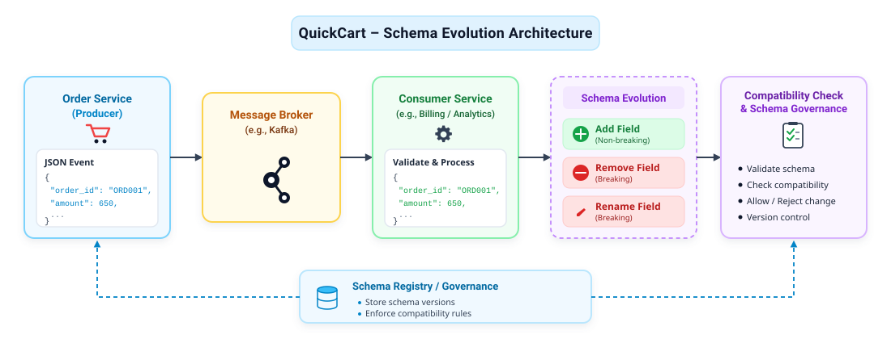
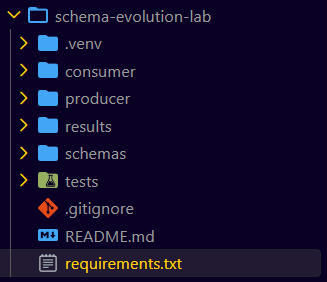
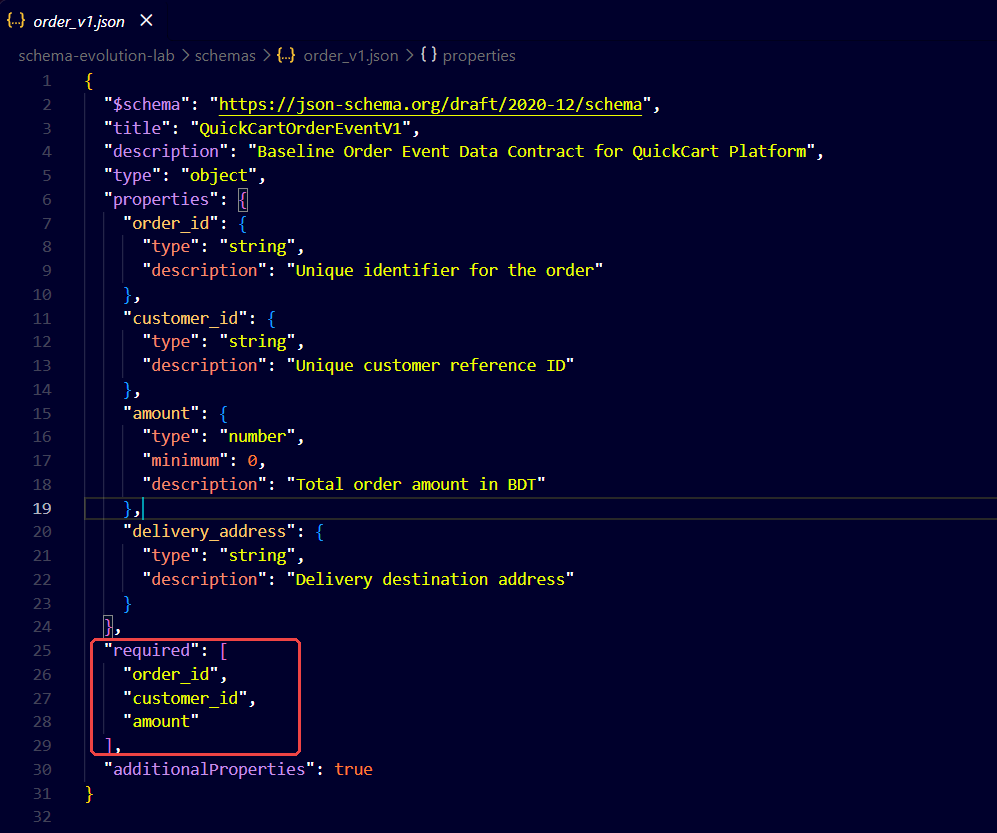
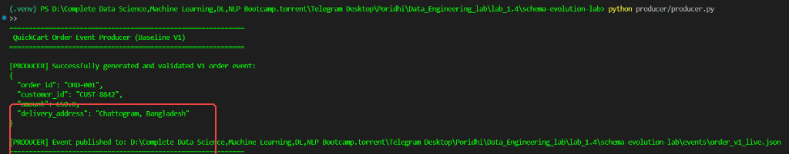
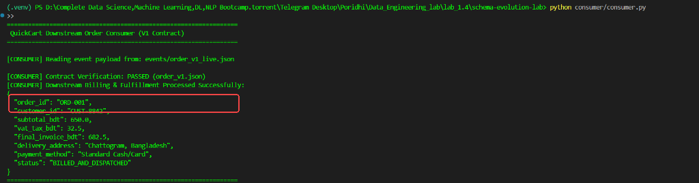
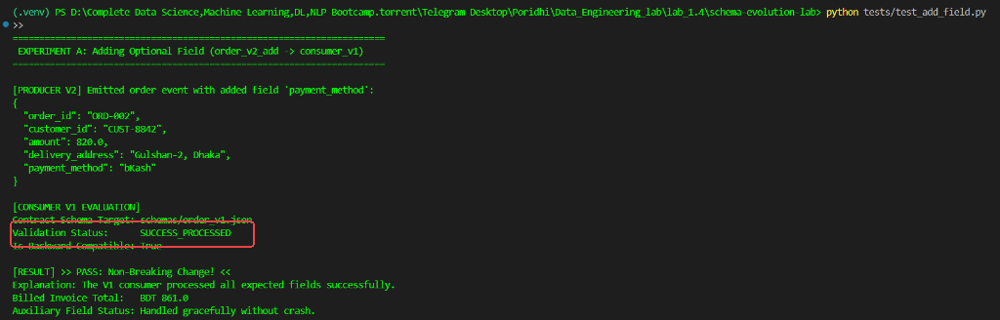
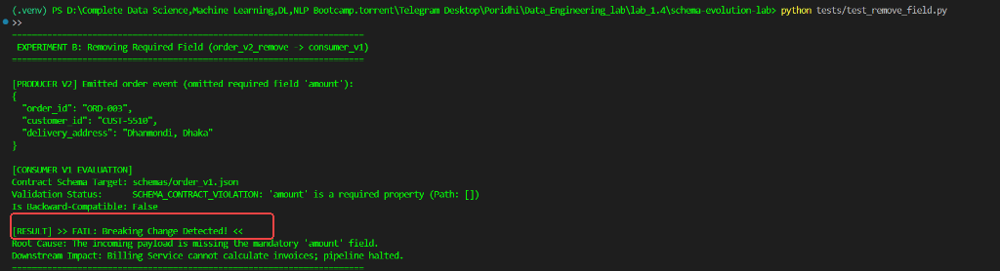
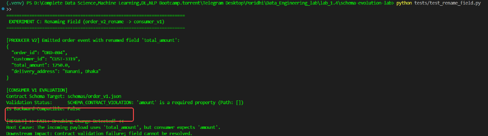
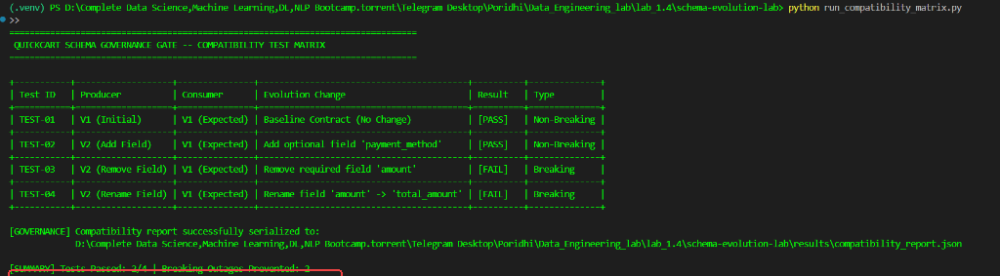

# Lab 1.4: Schema Evolution & Governance

---

## 1. Introduction

Imagine you are a data engineer at **QuickCart**, a rapidly expanding online food delivery platform. Every time a customer places an order on the mobile app, the primary Ordering Service emits a structured JSON event to downstream microservices, including billing, delivery dispatch, real-time analytics, and customer notifications. Initially, the order event contains standard fields such as `order_id`, `customer_id`, `amount`, and `delivery_address`. As business requirements grow, engineering teams frequently need to introduce new payment metadata, remove legacy attributes, or rename fields to conform to company-wide naming standards. However, if an upstream service modifies a shared event contract without coordination, older downstream consumers can crash due to missing required keys or unexpected data structures.

Below is the end-to-end architecture of the schema evolution and governance pipeline you will build for QuickCart:



This architecture illustrates how the QuickCart Order Service acts as a producer that publishes JSON order events into an asynchronous message broker. Downstream consumer services, such as Billing and Analytics, ingest these events and validate them against an agreed-upon data contract stored in the Schema Registry. When schema changes occur—such as adding optional fields, deleting required properties, or renaming attributes—the automated Compatibility Check and Schema Governance gate evaluates the modifications to determine whether they are non-breaking or breaking. Safe changes are allowed into production, while breaking changes are blocked before they cause downstream pipeline outages.

---

## 2. Project File Structure

Before implementing the pipeline, organize your project in VS Code Server using the following modular structure:

```text
schema-evolution-lab/
├── schemas/
│   ├── order_v1.json            # Baseline V1 Order Event Schema Contract
│   ├── order_v2_add.json        # V2: Non-breaking optional field addition (payment_method)
│   ├── order_v2_remove.json     # V2: Breaking required field removal (amount)
│   └── order_v2_rename.json     # V2: Breaking field rename (amount -> total_amount)
├── producer/
│   └── producer.py              # Order event producer supporting multiple schema versions
├── consumer/
│   └── consumer.py              # Order event consumer validating against V1 schema contract
├── tests/
│   ├── test_add_field.py        # Automated test for Scenario A (Add Field)
│   ├── test_remove_field.py     # Automated test for Scenario B (Remove Field)
│   └── test_rename_field.py     # Automated test for Scenario C (Rename Field)
├── results/
│   └── compatibility_report.json # Serialized governance evaluation report
├── requirements.txt             # Python dependencies (jsonschema, pytest, tabulate)
├── run_compatibility_matrix.py # Automated compatibility matrix and governance runner
└── README.md                    # Project overview and quickstart instructions
```

---

## 3. Project Implementation

### Step 1 — Verify the Working Environment & Project Structure

1. Open your workspace in **VS Code Server**.
2. Open an integrated terminal by clicking **Terminal > New Terminal**.
3. Navigate to the project root directory:
   ```bash
   cd lab_1.4/schema-evolution-lab
   ```
4. Create an isolated Python virtual environment named `.venv`:
   ```bash
   python3 -m venv .venv
   ```
   *(On Windows PowerShell, run: `python -m venv .venv`)*
5. Activate the virtual environment:
   ```bash
   source .venv/bin/activate
   ```
   *(On Windows PowerShell, run: `.venv\Scripts\Activate.ps1`)*
6. In the VS Code Explorer, click the **New File** icon to create `requirements.txt`, open it in the editor, and add:
   ```text
   jsonschema>=4.20.0
   pytest>=7.4.0
   tabulate>=0.9.0
   ```
7. Save the file (**File > Save**) and install the dependencies:
   ```bash
   pip install -r requirements.txt
   ```
8. Using the VS Code Explorer, create the subdirectories: `schemas`, `producer`, `consumer`, `tests`, and `results`.

> **[Show Image — Project Directory Structure in VS Code Explorer]**


*Figure 1: The schema-evolution-lab directory tree in VS Code Server Explorer.*

The VS Code Server Explorer displays the newly created `schema-evolution-lab` workspace alongside its isolated `.venv` virtual environment and modular subfolders. Isolating Python dependencies within `.venv` ensures that our JSON Schema validation engine operates without interference from system-level packages. Establishing distinct subdirectories decouples schema contract definitions from runtime execution scripts and automated test suites. This clean baseline structure guarantees reproducibility for all subsequent schema evolution experiments.

---

### Step 2 — Create the Baseline Schema Contract (`order_v1.json`)

1. In the VS Code Explorer, navigate to the `schemas/` directory.
2. Right-click the `schemas/` folder, select **New File**, and name it:
   ```text
   order_v1.json
   ```
3. Open `order_v1.json` in the editor and define QuickCart's initial baseline data contract:
   ```json
   {
     "$schema": "https://json-schema.org/draft/2020-12/schema",
     "title": "QuickCartOrderEventV1",
     "description": "Baseline Order Event Data Contract for QuickCart Platform",
     "type": "object",
     "properties": {
       "order_id": {
         "type": "string",
         "description": "Unique identifier for the order"
       },
       "customer_id": {
         "type": "string",
         "description": "Unique customer reference ID"
       },
       "amount": {
         "type": "number",
         "minimum": 0,
         "description": "Total order amount in BDT"
       },
       "delivery_address": {
         "type": "string",
         "description": "Delivery destination address"
       }
     },
     "required": [
       "order_id",
       "customer_id",
       "amount"
     ],
     "additionalProperties": true
   }
   ```
4. Save the file (**File > Save**).

> **[Show Image — Baseline Order Schema in VS Code Editor]**


*Figure 2: The baseline JSON Schema contract (order_v1.json) in VS Code editor highlighting required fields in red.*

The VS Code editor displays the formal data contract `schemas/order_v1.json` defining the schema types and validation constraints for QuickCart order events. The red bounding box highlights the `required` array, which explicitly dictates that `order_id`, `customer_id`, and `amount` must be present in every emitted event. Setting `"additionalProperties": true` establishes an open-content model that allows producers to attach optional auxiliary fields without violating baseline contract integrity. This contract serves as the single source of truth for both producer generation and downstream consumer validation.

---

### Step 3 — Implement & Execute the Order Event Producer (`producer.py`)

1. In the VS Code Explorer, expand the `producer/` folder.
2. Create a new file named:
   ```text
   producer.py
   ```
3. Open `producer.py` in the editor and implement the event generation and contract validation logic:
   ```python
   """
   QuickCart Order Event Producer
   Emits JSON order events according to specified schema contract versions.
   """

   import os
   import json
   from pathlib import Path
   from typing import Dict, Any
   import jsonschema

   BASE_DIR = Path(__file__).resolve().parent.parent
   SCHEMAS_DIR = BASE_DIR / "schemas"
   EVENTS_DIR = BASE_DIR / "events"


   def load_schema(schema_filename: str) -> Dict[str, Any]:
       schema_path = SCHEMAS_DIR / schema_filename
       if not schema_path.exists():
           raise FileNotFoundError(f"Schema not found at: {schema_path}")
       with open(schema_path, "r", encoding="utf-8") as f:
           return json.load(f)


   def create_order_event_v1(
       order_id: str = "ORD-001",
       customer_id: str = "CUST-8842",
       amount: float = 650.0,
       delivery_address: str = "Chattogram, Bangladesh"
   ) -> Dict[str, Any]:
       event = {
           "order_id": order_id,
           "customer_id": customer_id,
           "amount": amount,
           "delivery_address": delivery_address
       }
       schema = load_schema("order_v1.json")
       jsonschema.validate(instance=event, schema=schema)
       return event


   def create_order_event_v2_add(
       order_id: str = "ORD-002",
       customer_id: str = "CUST-8842",
       amount: float = 820.0,
       delivery_address: str = "Gulshan-2, Dhaka",
       payment_method: str = "bKash"
   ) -> Dict[str, Any]:
       event = {
           "order_id": order_id,
           "customer_id": customer_id,
           "amount": amount,
           "delivery_address": delivery_address,
           "payment_method": payment_method
       }
       schema_file = "order_v2_add.json" if (SCHEMAS_DIR / "order_v2_add.json").exists() else "order_v1.json"
       schema = load_schema(schema_file)
       jsonschema.validate(instance=event, schema=schema)
       return event


   def create_order_event_v2_remove(
       order_id: str = "ORD-003",
       customer_id: str = "CUST-5510",
       delivery_address: str = "Dhanmondi, Dhaka"
   ) -> Dict[str, Any]:
       return {
           "order_id": order_id,
           "customer_id": customer_id,
           "delivery_address": delivery_address
       }


   def create_order_event_v2_rename(
       order_id: str = "ORD-004",
       customer_id: str = "CUST-3319",
       total_amount: float = 1250.0,
       delivery_address: str = "Banani, Dhaka"
   ) -> Dict[str, Any]:
       return {
           "order_id": order_id,
           "customer_id": customer_id,
           "total_amount": total_amount,
           "delivery_address": delivery_address
       }


   def emit_event(event: Dict[str, Any], filename: str = "order_event.json") -> Path:
       EVENTS_DIR.mkdir(parents=True, exist_ok=True)
       out_path = EVENTS_DIR / filename
       with open(out_path, "w", encoding="utf-8") as f:
           json.dump(event, f, indent=2)
       return out_path


   if __name__ == "__main__":
       print("=" * 60)
       print(" QuickCart Order Event Producer (Baseline V1)")
       print("=" * 60)
       
       event_v1 = create_order_event_v1()
       saved_path = emit_event(event_v1, "order_v1_live.json")
       
       print("\n[PRODUCER] Successfully generated and validated V1 order event:")
       print(json.dumps(event_v1, indent=2))
       print(f"\n[PRODUCER] Event published to: {saved_path}")
       print("=" * 60)
   ```
4. Save the file (**File > Save**).
5. In your integrated terminal, execute the producer:
   ```bash
   python producer/producer.py
   ```

> **[Show Image — Order Producer Terminal Execution]**


*Figure 3: Output of producer/producer.py in the integrated terminal highlighting the validated V1 JSON event.*

The integrated terminal displays the execution of `producer/producer.py`, which instantiates a baseline order event for customer `CUST-8842` amounting to `650.0 BDT`. Before emitting the message, the script verifies the dictionary against `schemas/order_v1.json`, guaranteeing contract compliance at the boundary. The highlighted red box confirms the presence of all required fields (`order_id`, `customer_id`, `amount`, and `delivery_address`). Finally, the producer persists the event to `events/order_v1_live.json`, establishing a verifiable payload for downstream consumers to ingest.

---

### Step 4 — Implement & Verify the Downstream Consumer (`consumer.py`)

1. In the VS Code Explorer, expand the `consumer/` directory.
2. Create a new file named:
   ```text
   consumer.py
   ```
3. Open `consumer.py` in the editor and add the consumer verification and billing calculations:
   ```python
   """
   QuickCart Order Event Consumer
   Validates incoming events against baseline V1 schema contract and executes downstream processing.
   """

   import os
   import json
   from pathlib import Path
   from typing import Dict, Any, Tuple
   import jsonschema

   BASE_DIR = Path(__file__).resolve().parent.parent
   SCHEMAS_DIR = BASE_DIR / "schemas"
   EVENTS_DIR = BASE_DIR / "events"


   def load_consumer_contract(schema_filename: str = "order_v1.json") -> Dict[str, Any]:
       schema_path = SCHEMAS_DIR / schema_filename
       if not schema_path.exists():
           raise FileNotFoundError(f"Consumer contract schema not found at: {schema_path}")
       with open(schema_path, "r", encoding="utf-8") as f:
           return json.load(f)


   def validate_and_process_event(
       event: Dict[str, Any],
       contract_schema: Dict[str, Any] = None
   ) -> Tuple[bool, str, Dict[str, Any]]:
       if contract_schema is None:
           contract_schema = load_consumer_contract("order_v1.json")

       # Contract Schema Validation
       try:
           jsonschema.validate(instance=event, schema=contract_schema)
       except jsonschema.ValidationError as err:
           return False, f"SCHEMA_CONTRACT_VIOLATION: {err.message} (Path: {list(err.path)})", {}
       except Exception as err:
           return False, f"VALIDATION_ERROR: {str(err)}", {}

       # Application Logic: Field Extraction & Invoice Calculation
       try:
           order_id = event["order_id"]
           customer_id = event["customer_id"]
           amount = event["amount"]
           delivery_address = event.get("delivery_address", "Pickup Station")
           payment_method = event.get("payment_method", "Standard Cash/Card")

           vat_tax = round(amount * 0.05, 2)
           final_invoice_total = round(amount + vat_tax, 2)

           processed_details = {
               "order_id": order_id,
               "customer_id": customer_id,
               "subtotal_bdt": amount,
               "vat_tax_bdt": vat_tax,
               "final_invoice_bdt": final_invoice_total,
               "delivery_address": delivery_address,
               "payment_method": payment_method,
               "status": "BILLED_AND_DISPATCHED"
           }
           return True, "SUCCESS_PROCESSED", processed_details

       except KeyError as err:
           return False, f"APPLICATION_KEY_ERROR: Missing required field '{err.args[0]}' in payload", {}


   def consume_event_from_file(event_filename: str = "order_v1_live.json") -> Tuple[bool, str, Dict[str, Any]]:
       event_path = EVENTS_DIR / event_filename
       if not event_path.exists():
           raise FileNotFoundError(f"Event file not found at: {event_path}. Run producer first.")
       with open(event_path, "r", encoding="utf-8") as f:
           event = json.load(f)
       return validate_and_process_event(event)


   if __name__ == "__main__":
       print("=" * 65)
       print(" QuickCart Downstream Order Consumer (V1 Contract)")
       print("=" * 65)
       
       event_file = "order_v1_live.json"
       print(f"\n[CONSUMER] Reading event payload from: events/{event_file}")
       
       success, message, result = consume_event_from_file(event_file)
       
       if success:
           print("\n[CONSUMER] Contract Verification: PASSED (order_v1.json)")
           print("[CONSUMER] Downstream Billing & Fulfillment Processed Successfully:")
           print(json.dumps(result, indent=2))
       else:
           print(f"\n[CONSUMER] Processing FAILED: {message}")
       
       print("=" * 65)
   ```
4. Save the file (**File > Save**).
5. In your integrated terminal, run the baseline consumer:
   ```bash
   python consumer/consumer.py
   ```

> **[Show Image — Order Consumer Terminal Output]**


*Figure 4: Output of consumer/consumer.py in the integrated terminal confirming successful contract verification and billing calculations.*

The integrated terminal displays the execution of `consumer/consumer.py`, which reads the order event generated by the upstream producer. The red highlight emphasizes the primary checkpoint: `Contract Verification: PASSED (order_v1.json)`. The consumer successfully decodes all mandatory fields (`order_id`, `customer_id`, `amount`), computes the 5% VAT (32.5 BDT), and calculates the final invoice total (682.5 BDT) without encountering schema violations or `KeyError` exceptions. This successful baseline establishes the benchmark against which all schema evolution changes will be measured.

---

### Step 5 — Test Schema Evolution: Adding an Optional Field (`test_add_field.py`)

1. In the VS Code Explorer, open `schemas/` and create:
   ```text
   order_v2_add.json
   ```
2. Add the evolved contract containing the optional `payment_method` attribute:
   ```json
   {
     "$schema": "https://json-schema.org/draft/2020-12/schema",
     "title": "QuickCartOrderEventV2Add",
     "description": "V2 Schema Evolution: Non-breaking addition of optional payment_method field",
     "type": "object",
     "properties": {
       "order_id": {"type": "string"},
       "customer_id": {"type": "string"},
       "amount": {"type": "number", "minimum": 0},
       "delivery_address": {"type": "string"},
       "payment_method": {
         "type": "string",
         "enum": ["cash_on_delivery", "card", "bKash", "Nagad", "Rocket"],
         "description": "Optional payment method specified by customer"
       }
     },
     "required": ["order_id", "customer_id", "amount"],
     "additionalProperties": true
   }
   ```
3. Save the file (**File > Save**).
4. In the `tests/` folder, create:
   ```text
   test_add_field.py
   ```
5. Implement the compatibility test:
   ```python
   import sys
   import json
   from pathlib import Path

   BASE_DIR = Path(__file__).resolve().parent.parent
   sys.path.insert(0, str(BASE_DIR))

   from producer.producer import create_order_event_v2_add, emit_event
   from consumer.consumer import validate_and_process_event, load_consumer_contract


   def run_add_field_experiment():
       print("=" * 70)
       print(" EXPERIMENT A: Adding Optional Field (order_v2_add -> consumer_v1)")
       print("=" * 70)

       event_v2 = create_order_event_v2_add(
           order_id="ORD-002",
           customer_id="CUST-8842",
           amount=820.0,
           delivery_address="Gulshan-2, Dhaka",
           payment_method="bKash"
       )
       emit_event(event_v2, "order_v2_add.json")

       v1_contract = load_consumer_contract("order_v1.json")
       success, message, result = validate_and_process_event(event_v2, v1_contract)

       print(f"Contract Schema Target: schemas/order_v1.json")
       print(f"Validation Status:      {message}")
       print(f"Is Backward-Compatible: {success}")

       if success:
           print("\n[RESULT] >> PASS: Non-Breaking Change! <<")
           print(f"Billed Invoice Total:   BDT {result.get('final_invoice_bdt')}")
       else:
           print(f"\n[RESULT] >> FAIL: Unexpected rejection: {message} <<")

       print("=" * 70)
       return success


   def test_add_optional_field_is_non_breaking():
       assert run_add_field_experiment() is True


   if __name__ == "__main__":
       sys.exit(0 if run_add_field_experiment() else 1)
   ```
6. Save the file and execute the test:
   ```bash
   python tests/test_add_field.py
   ```

> **[Show Image — Adding Field Compatibility Test Output]**


*Figure 5: Output of tests/test_add_field.py demonstrating backward compatibility when adding an optional field.*

The integrated terminal displays the execution of `tests/test_add_field.py`, validating Experiment A where an upgraded V2 producer emits an event containing the supplementary `payment_method: "bKash"` field. The consumer continues to enforce its original `order_v1.json` contract, which accepts the payload because all mandatory properties (`order_id`, `customer_id`, `amount`) are present and open content is permitted. Downstream billing calculations complete without disruption (final invoice BDT 861.0). The red box highlights the test result `>> PASS: Non-Breaking Change! <<`, demonstrating that adding optional properties enables safe, independent producer deployments.

---

### Step 6 — Test Schema Evolution: Removing a Required Field (`test_remove_field.py`)

1. In the VS Code Explorer, open `schemas/` and create:
   ```text
   order_v2_remove.json
   ```
2. Add the schema where `amount` is omitted:
   ```json
   {
     "$schema": "https://json-schema.org/draft/2020-12/schema",
     "title": "QuickCartOrderEventV2Remove",
     "description": "V2 Schema Evolution: Breaking removal of required 'amount' field",
     "type": "object",
     "properties": {
       "order_id": {"type": "string"},
       "customer_id": {"type": "string"},
       "delivery_address": {"type": "string"}
     },
     "required": ["order_id", "customer_id"],
     "additionalProperties": true
   }
   ```
3. Save the file (**File > Save**).
4. In the `tests/` folder, create:
   ```text
   test_remove_field.py
   ```
5. Implement the test observing contract failure:
   ```python
   import sys
   import json
   from pathlib import Path

   BASE_DIR = Path(__file__).resolve().parent.parent
   sys.path.insert(0, str(BASE_DIR))

   from producer.producer import create_order_event_v2_remove, emit_event
   from consumer.consumer import validate_and_process_event, load_consumer_contract


   def run_remove_field_experiment():
       print("=" * 70)
       print(" EXPERIMENT B: Removing Required Field (order_v2_remove -> consumer_v1)")
       print("=" * 70)

       event_v2 = create_order_event_v2_remove(
           order_id="ORD-003",
           customer_id="CUST-5510",
           delivery_address="Dhanmondi, Dhaka"
       )
       emit_event(event_v2, "order_v2_remove.json")

       v1_contract = load_consumer_contract("order_v1.json")
       success, message, result = validate_and_process_event(event_v2, v1_contract)

       print(f"Contract Schema Target: schemas/order_v1.json")
       print(f"Validation Status:      {message}")
       print(f"Is Backward-Compatible: {success}")

       if not success:
           print("\n[RESULT] >> FAIL: Breaking Change Detected! <<")
           print("Root Cause: The incoming payload is missing the mandatory 'amount' field.")
       else:
           print("\n[RESULT] >> PASS: Unexpectedly accepted incomplete payload! <<")

       print("=" * 70)
       return not success


   def test_remove_required_field_is_breaking():
       assert run_remove_field_experiment() is True


   if __name__ == "__main__":
       sys.exit(0 if run_remove_field_experiment() else 1)
   ```
6. Save the file and run the test in the terminal:
   ```bash
   python tests/test_remove_field.py
   ```

> **[Show Image — Removing Field Breaking Failure Output]**


*Figure 6: Output of tests/test_remove_field.py demonstrating contract failure when a required field is removed.*

The integrated terminal displays the execution of `tests/test_remove_field.py`, simulating Experiment B where an upstream team deployed an event payload missing `amount`. When the V1 consumer validates the incoming JSON against `schemas/order_v1.json`, the validation engine immediately raises `SCHEMA_CONTRACT_VIOLATION: 'amount' is a required property`. Because `amount` is essential for the billing engine to calculate VAT and invoice totals, processing is halted immediately with `Is Backward-Compatible: False`. The highlighted red box shows `>> FAIL: Breaking Change Detected! <<`, proving why deleting mandatory properties from an active contract breaks downstream subscribers.

---

### Step 7 — Test Schema Evolution: Renaming a Required Field (`test_rename_field.py`)

1. In the VS Code Explorer, open `schemas/` and create:
   ```text
   order_v2_rename.json
   ```
2. Add the schema where `amount` is renamed to `total_amount`:
   ```json
   {
     "$schema": "https://json-schema.org/draft/2020-12/schema",
     "title": "QuickCartOrderEventV2Rename",
     "description": "V2 Schema Evolution: Breaking field rename of 'amount' to 'total_amount'",
     "type": "object",
     "properties": {
       "order_id": {"type": "string"},
       "customer_id": {"type": "string"},
       "total_amount": {"type": "number", "minimum": 0},
       "delivery_address": {"type": "string"}
     },
     "required": ["order_id", "customer_id", "total_amount"],
     "additionalProperties": true
   }
   ```
3. Save the file (**File > Save**).
4. In the `tests/` folder, create:
   ```text
   test_rename_field.py
   ```
5. Implement the test verifying field rename failure:
   ```python
   import sys
   import json
   from pathlib import Path

   BASE_DIR = Path(__file__).resolve().parent.parent
   sys.path.insert(0, str(BASE_DIR))

   from producer.producer import create_order_event_v2_rename, emit_event
   from consumer.consumer import validate_and_process_event, load_consumer_contract


   def run_rename_field_experiment():
       print("=" * 70)
       print(" EXPERIMENT C: Renaming Field (order_v2_rename -> consumer_v1)")
       print("=" * 70)

       event_v2 = create_order_event_v2_rename(
           order_id="ORD-004",
           customer_id="CUST-3319",
           total_amount=1250.0,
           delivery_address="Banani, Dhaka"
       )
       emit_event(event_v2, "order_v2_rename.json")

       v1_contract = load_consumer_contract("order_v1.json")
       success, message, result = validate_and_process_event(event_v2, v1_contract)

       print(f"Contract Schema Target: schemas/order_v1.json")
       print(f"Validation Status:      {message}")
       print(f"Is Backward-Compatible: {success}")

       if not success:
           print("\n[RESULT] >> FAIL: Breaking Change Detected! <<")
           print("Root Cause: The incoming payload uses 'total_amount', but consumer expects 'amount'.")
       else:
           print("\n[RESULT] >> PASS: Unexpectedly accepted renamed payload! <<")

       print("=" * 70)
       return not success


   def test_rename_field_is_breaking():
       assert run_rename_field_experiment() is True


   if __name__ == "__main__":
       sys.exit(0 if run_rename_field_experiment() else 1)
   ```
6. Save the file and execute the test:
   ```bash
   python tests/test_rename_field.py
   ```

> **[Show Image — Renaming Field Breaking Failure Output]**


*Figure 7: Output of tests/test_rename_field.py demonstrating contract failure when a required field is renamed.*

The integrated terminal displays the execution of `tests/test_rename_field.py`, representing Experiment C where an upstream developer renamed `amount` to `total_amount`. Although the business semantic remains identical, the consumer contract strictly enforces the key name `amount`. The validation engine fails with `SCHEMA_CONTRACT_VIOLATION: 'amount' is a required property`. The red box highlights `>> FAIL: Breaking Change Detected! <<`, illustrating that field renames without dual-write deprecation windows are breaking changes that disconnect upstream producers from existing consumers.

---

### Step 8 — Execute Compatibility Matrix & Governance Gate (`run_compatibility_matrix.py`)

1. In the VS Code Explorer, open the project root directory `schema-evolution-lab/`.
2. Create a new file named:
   ```text
   run_compatibility_matrix.py
   ```
3. Open `run_compatibility_matrix.py` in the editor and add the complete governance gate implementation:
   ```python
   import sys
   import json
   from pathlib import Path
   from datetime import datetime, timezone
   from tabulate import tabulate

   BASE_DIR = Path(__file__).resolve().parent
   sys.path.insert(0, str(BASE_DIR))

   from producer.producer import (
       create_order_event_v1,
       create_order_event_v2_add,
       create_order_event_v2_remove,
       create_order_event_v2_rename
   )
   from consumer.consumer import validate_and_process_event, load_consumer_contract


   def run_full_compatibility_matrix():
       print("=" * 80)
       print(" QUICKCART SCHEMA GOVERNANCE GATE -- COMPATIBILITY TEST MATRIX")
       print("=" * 80)

       v1_contract = load_consumer_contract("order_v1.json")
       results = []

       # Scenario 1: Baseline V1 -> V1
       event_v1 = create_order_event_v1()
       ok_1, msg_1, res_1 = validate_and_process_event(event_v1, v1_contract)
       results.append({
           "test_id": "TEST-01",
           "change_description": "Baseline Contract (No Change)",
           "producer_version": "V1 (Initial)",
           "consumer_version": "V1 (Expected)",
           "result": "PASS" if ok_1 else "FAIL",
           "classification": "Non-Breaking",
           "reason": "Exact schema contract match across producer and consumer.",
           "invoice_total": res_1.get("final_invoice_bdt", "N/A")
       })

       # Scenario 2: Add Optional Field V2 -> V1
       event_v2_add = create_order_event_v2_add()
       ok_2, msg_2, res_2 = validate_and_process_event(event_v2_add, v1_contract)
       results.append({
           "test_id": "TEST-02",
           "change_description": "Add optional field 'payment_method'",
           "producer_version": "V2 (Add Field)",
           "consumer_version": "V1 (Expected)",
           "result": "PASS" if ok_2 else "FAIL",
           "classification": "Non-Breaking",
           "reason": "V1 contract allows open content; optional property ignored by old consumer.",
           "invoice_total": res_2.get("final_invoice_bdt", "N/A")
       })

       # Scenario 3: Remove Required Field V2 -> V1
       event_v2_remove = create_order_event_v2_remove()
       ok_3, msg_3, res_3 = validate_and_process_event(event_v2_remove, v1_contract)
       results.append({
           "test_id": "TEST-03",
           "change_description": "Remove required field 'amount'",
           "producer_version": "V2 (Remove Field)",
           "consumer_version": "V1 (Expected)",
           "result": "PASS" if ok_3 else "FAIL",
           "classification": "Breaking",
           "reason": "Missing mandatory 'amount' property; violates V1 required array.",
           "invoice_total": "N/A (Halted)"
       })

       # Scenario 4: Rename Required Field V2 -> V1
       event_v2_rename = create_order_event_v2_rename()
       ok_4, msg_4, res_4 = validate_and_process_event(event_v2_rename, v1_contract)
       results.append({
           "test_id": "TEST-04",
           "change_description": "Rename field 'amount' -> 'total_amount'",
           "producer_version": "V2 (Rename Field)",
           "consumer_version": "V1 (Expected)",
           "result": "PASS" if ok_4 else "FAIL",
           "classification": "Breaking",
           "reason": "Consumer cannot locate 'amount'; 'total_amount' not recognized as alias.",
           "invoice_total": "N/A (Halted)"
       })

       table_data = []
       for r in results:
           status_tag = "[PASS]" if r['result'] == "PASS" else "[FAIL]"
           table_data.append([
               r["test_id"],
               r["producer_version"],
               r["consumer_version"],
               r["change_description"],
               status_tag,
               r["classification"]
           ])

       headers = ["Test ID", "Producer", "Consumer", "Evolution Change", "Result", "Type"]
       print("\n" + tabulate(table_data, headers=headers, tablefmt="grid"))

       report_data = {
           "lab": "Lab 1.4 -- Schema Evolution & Governance",
           "timestamp_utc": datetime.now(timezone.utc).isoformat(),
           "platform": "QuickCart Distributed Event Pipeline",
           "governance_policy": {
               "allowed_changes": ["Add optional field with default/open content"],
               "breaking_changes": ["Remove required field", "Rename required field", "Incompatible type change"]
           },
           "summary": {
               "total_tests": len(results),
               "passed": sum(1 for r in results if r["result"] == "PASS"),
               "failed_breaking": sum(1 for r in results if r["result"] == "FAIL")
           },
           "test_matrix": results
       }

       results_dir = BASE_DIR / "results"
       results_dir.mkdir(parents=True, exist_ok=True)
       report_file = results_dir / "compatibility_report.json"

       with open(report_file, "w", encoding="utf-8") as f:
           json.dump(report_data, f, indent=2)

       print(f"\n[GOVERNANCE] Compatibility report successfully serialized to:")
       print(f"             {report_file}")
       print(f"\n[SUMMARY] Tests Passed: {report_data['summary']['passed']}/{report_data['summary']['total_tests']} | "
             f"Breaking Outages Prevented: {report_data['summary']['failed_breaking']}")
       print("=" * 80)
       return report_file


   if __name__ == "__main__":
       run_full_compatibility_matrix()
   ```
4. Save the file (**File > Save**).
5. In your integrated terminal, execute the automated runner:
   ```bash
   python run_compatibility_matrix.py
   ```

> **[Show Image — Schema Compatibility Matrix Terminal Output]**


*Figure 8: Output of run_compatibility_matrix.py highlighting the 4-test compatibility matrix and summary counts.*

The integrated terminal displays the comprehensive output from `run_compatibility_matrix.py`, consolidating all four schema evolution scenarios into a unified evaluation grid. Scenarios `TEST-01` (baseline V1) and `TEST-02` (adding optional `payment_method`) evaluate to `[PASS]`, confirming backward compatibility. In contrast, scenarios `TEST-03` (removing `amount`) and `TEST-04` (renaming `amount` to `total_amount`) evaluate to `[FAIL]`, flagging breaking changes before code deployment. The red highlighted box confirms that 2 potential downstream production outages were successfully detected and prevented by the automated governance gate.

---

## 4. Conclusion

In this lab, you successfully designed and evaluated a versioned data contract for QuickCart's mission-critical order event pipeline. By deploying producer and consumer services across multiple schema revisions, you proved that adding optional fields allows independent service upgrades without breaking downstream subscribers. Conversely, your experiments confirmed that removing or renaming required fields causes immediate contract violations and halts billing calculations. Implementing the automated compatibility matrix provided QuickCart with a reliable governance gate that catches breaking changes before deployment. As QuickCart's microservices ecosystem expands, enforcing these schema governance rules ensures that distributed teams can innovate rapidly while maintaining uninterrupted platform reliability.
