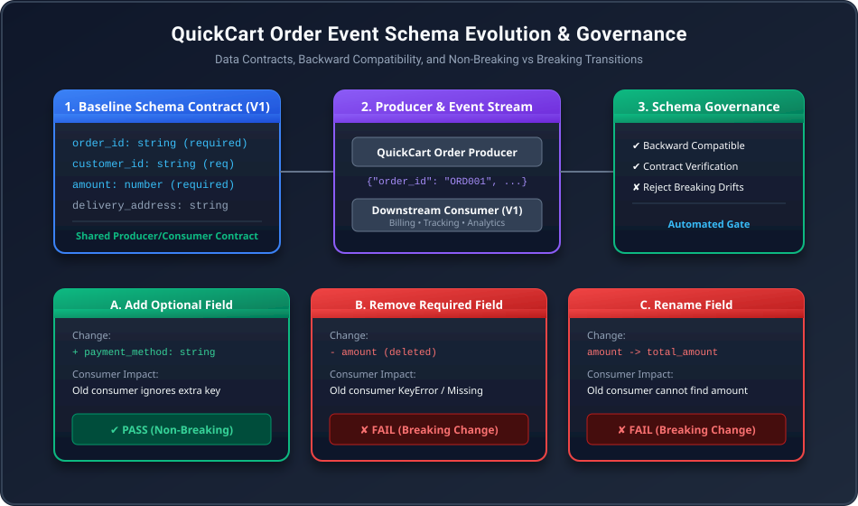

# Lab 1.4: Schema Evolution & Governance

---

## 1. Introduction

In modern event-driven architectures and distributed microservices, services rarely operate in isolation. Instead, independent applications continuously exchange structured business messages across data pipelines, message brokers, and storage layers. At the heart of this exchange is the **data contract**—a formal schema definition that dictates the names, data types, and presence requirements of every field in an event payload.

As business needs evolve, data contracts inevitably undergo changes: new features require additional telemetry, legacy fields become deprecated, and internal names get refactored. Managing these transitions without disrupting downstream consumers is called **schema evolution**. Without strict **schema governance** and compatibility rules, seemingly harmless schema adjustments made by an upstream producer can trigger catastrophic downstream outages, data corruption, and silent pipeline failures.

---

## 2. Real-Life Storytelling Scenario

You are a data engineer at **QuickCart**, a hyper-growth online food delivery platform. In QuickCart's microservices ecosystem, whenever a customer places an order via the mobile application, the core **Ordering Service** emits a JSON order event.

This event is consumed simultaneously by several mission-critical downstream services:
- **Billing Service**: Invoices the customer, verifies transaction totals, and initiates payment gateway reconciliations.
- **Delivery Tracking Service**: Assigns couriers and tracks delivery fulfillment progress based on customer coordinates.
- **Analytics & BI Pipeline**: Ingests order volume in real time to calculate regional order volume and gross merchandise value (GMV).
- **Notifications Service**: Dispatches real-time SMS and push alerts confirming order acceptance.

Initially, QuickCart's order event consists of a straightforward structure: `order_id`, `customer_id`, `amount`, and `delivery_address`. However, as the product evolves, the development team needs to introduce payment method metadata (`payment_method`), deprecate old pricing structures, or rename fields (such as changing `amount` to `total_amount`). 

If the Ordering Service deploys a schema change that renames or removes a required field while the downstream Billing and Analytics services are still running earlier software versions expecting the original structure, the entire order processing pipeline can crash. In this lab, you will build and evaluate QuickCart's schema evolution framework, testing non-breaking and breaking transitions under simulated production conditions.

---

## 3. Problem Statement

QuickCart's rapid product iteration has created a critical engineering dilemma:
1. **Producer Autonomy vs. Consumer Reliability**: Upstream teams need the agility to introduce new fields and refactor events without waiting for dozens of downstream consumer teams to deploy coordinated code releases.
2. **Silent Contract Violations**: In loosely typed JSON payloads, missing or renamed keys do not immediately trigger compile-time errors. Instead, they manifest during peak production hours as unhandled `KeyError` exceptions or missing values in analytics models.
3. **Absence of Automated Verification**: Developers lack an automated mechanism to verify whether a proposed schema modification is **backward-compatible** before deploying the change to production.

To resolve these risks, QuickCart requires an explicit schema evolution standard, an automated compatibility testing matrix, and a governance policy to classify changes as either **non-breaking** (safe to deploy) or **breaking** (prohibited without coordinated version migration).

---

## 4. Architecture Diagram

Below is the end-to-end architecture of QuickCart's order event schema evolution and governance pipeline:



---

## 5. Explanation of Architecture

The architecture diagram highlights the flow of events and contract enforcement across QuickCart's order processing lifecycle:

1. **Baseline Contract (V1)**: The foundation of the system is `order_v1.json`, which defines the mandatory baseline properties (`order_id`, `customer_id`, and `amount`) alongside optional attributes. Both the producer and downstream consumers adhere strictly to this shared specification.
2. **Producer & Consumer Runtime**: The **Order Producer** generates JSON payloads representing customer transactions. The downstream **Order Consumer** validates each incoming payload against the registered schema contract before extracting fields for billing and fulfillment logic.
3. **Evolution Scenarios**:
   - **Scenario A (Add Optional Field)**: Adding `payment_method` to the event payload. Existing V1 consumers ignore unknown optional keys and continue processing smoothly (Non-Breaking).
   - **Scenario B (Remove Required Field)**: Removing `amount`. Existing consumers fail schema validation and encounter missing key errors when calculating invoices (Breaking).
   - **Scenario C (Rename Field)**: Renaming `amount` to `total_amount`. The consumer fails because the required key `amount` no longer exists in the incoming payload (Breaking).
4. **Schema Governance Engine**: An automated gate tests proposed schema changes against existing consumer contracts, compiling a comprehensive compatibility report (`results/compatibility_report.json`) to prevent breaking changes from reaching production.

---

## 6. Project File Structure

The project is organized in a modular structure within `schema-evolution-lab/`:

```text
schema-evolution-lab/
├── schemas/
│   ├── order_v1.json            # Baseline V1 Order Event Schema
│   ├── order_v2_add.json        # V2: Non-breaking optional field addition (payment_method)
│   ├── order_v2_remove.json     # V2: Breaking required field removal (amount)
│   └── order_v2_rename.json     # V2: Breaking field rename (amount -> total_amount)
├── producer/
│   └── producer.py              # Order event producer supporting multiple schema versions
├── consumer/
│   └── consumer.py              # Order event consumer validating against V1 schema contract
├── tests/
│   ├── test_add_field.py        # Validates non-breaking evolution (V2 add -> V1 consumer)
│   ├── test_remove_field.py     # Validates breaking evolution (V2 remove -> V1 consumer)
│   └── test_rename_field.py     # Validates breaking evolution (V2 rename -> V1 consumer)
├── results/
│   └── compatibility_report.json # Automated compatibility evaluation report
├── requirements.txt             # Python dependencies (jsonschema, pytest, tabulate)
├── run_compatibility_matrix.py # Automated compatibility matrix and governance runner
└── README.md                    # Project overview and quickstart guide
```

---

## 7. Prerequisites

Before beginning this lab, ensure you have:
- Access to **VS Code Server** with an integrated terminal.
- **Python 3.10+** installed in your development environment.
- Fundamental familiarity with JSON syntax, Python data structures (dictionaries), and virtual environment usage.

---

## 8. Environment Setup

### Step 1 — Verify the Working Environment & Project Structure

#### What we are doing
We initialize the project environment in VS Code Server, create an isolated Python virtual environment (`.venv`), install `jsonschema` along with companion testing libraries, and create the core directory structure.

#### Screenshot

*Figure 1: The schema-evolution-lab directory tree in VS Code Server Explorer showing the virtual environment and modular subdirectories.*

#### Explanation
The VS Code Server Explorer displays the newly created `schema-evolution-lab` workspace alongside its isolated `.venv` virtual environment and modular subfolders (`schemas`, `producer`, `consumer`, `tests`, `results`). Isolating Python dependencies within `.venv` ensures that our `jsonschema` engine operates without conflicts against system-wide packages. Establishing clean subdirectories decouples data contract definitions from application runtimes and test suites, reflecting production data engineering practices. This clean baseline structure guarantees reproducibility for all downstream schema evolution experiments.

---

## 9. Implementation

### Step 2 — Create the Baseline Schema Contract (`order_v1.json`)

#### What we are doing
We establish the foundational data contract (`schemas/order_v1.json`) using JSON Schema Draft 2020-12 specifications. This contract mandates `order_id`, `customer_id`, and `amount` as required fields, establishing the baseline expectation for all QuickCart order events.

#### Screenshot

*Figure 2: The baseline JSON Schema contract (order_v1.json) in VS Code editor highlighting required fields in red.*

#### Explanation
The VS Code editor displays the formal data contract `schemas/order_v1.json` defining the schema types and validation constraints for QuickCart order events. The red bounding box highlights the `required` array, which explicitly dictates that `order_id`, `customer_id`, and `amount` must be present in every emitted event. Setting `"additionalProperties": true` establishes an open-content model that allows producers to attach optional auxiliary fields without violating baseline contract integrity. This contract serves as the single source of truth for both producer generation and downstream consumer validation.

---

### Step 3 — Create and Execute the Order Event Producer (`producer.py`)

#### What we are doing
We develop `producer/producer.py` to simulate QuickCart's Ordering Service. The producer constructs order event payloads, validates them against the baseline schema contract using `jsonschema.validate()`, and emits the event payload.

#### Screenshot

*Figure 3: Output of producer/producer.py in the integrated terminal highlighting the validated V1 JSON event.*

#### Explanation
The integrated terminal displays the execution of `producer/producer.py`, which instantiates a baseline order event for customer `CUST-8842` amounting to `650.0 BDT`. Before emitting the message, the script verifies the dictionary against `schemas/order_v1.json`, guaranteeing contract compliance at the boundary. The highlighted red box confirms the presence of all required fields (`order_id`, `customer_id`, `amount`, and `delivery_address`). Finally, the producer persists the event to `events/order_v1_live.json`, establishing a verifiable payload for downstream consumers to ingest.

---

### Step 4 — Create the Consumer & Run the Baseline Verification (`consumer.py`)

#### What we are doing
We implement `consumer/consumer.py` to represent downstream billing and delivery tracking services. The consumer ingests the live V1 order event, validates it against `order_v1.json`, and executes downstream billing calculations (5% VAT and total invoice).

#### Screenshot

*Figure 4: Output of consumer/consumer.py in the integrated terminal confirming successful contract verification and billing calculations.*

#### Explanation
The integrated terminal displays the execution of `consumer/consumer.py`, which reads the order event generated by the upstream producer. The red highlight emphasizes the primary checkpoint: `Contract Verification: PASSED (order_v1.json)`. The consumer successfully decodes all mandatory fields (`order_id`, `customer_id`, `amount`), computes the 5% VAT (32.5 BDT), and calculates the final invoice total (682.5 BDT) without encountering schema violations or `KeyError` exceptions. This successful baseline establishes the benchmark against which all schema evolution changes will be measured.

---

## 10. Validation & Testing

### Step 5 — Add an Optional Field & Test Compatibility (`order_v2_add.json`)

#### What we are doing
We evolve the schema contract by introducing an optional `payment_method` field in `schemas/order_v2_add.json`. We then execute `tests/test_add_field.py` to verify that an upgraded producer sending this new field remains fully compatible with existing V1 consumers.

#### Screenshot

*Figure 5: Output of tests/test_add_field.py demonstrating backward compatibility when adding an optional field.*

#### Explanation
The integrated terminal displays the execution of `tests/test_add_field.py`, validating Experiment A where an upgraded V2 producer emits an event containing the supplementary `payment_method: "bKash"` field. The consumer continues to enforce its original `order_v1.json` contract, which accepts the payload because all mandatory properties (`order_id`, `customer_id`, `amount`) are present and open content is permitted. Downstream billing calculations complete without disruption (final invoice BDT 861.0). The red box highlights the test result `>> PASS: Non-Breaking Change! <<`, demonstrating that adding optional properties enables safe, independent producer deployments.

---

### Step 6 — Remove a Required Field & Observe Breaking Failure (`order_v2_remove.json`)

#### What we are doing
We define `schemas/order_v2_remove.json` where the upstream team omits the `amount` field. We execute `tests/test_remove_field.py` to observe how removing a required field breaks the contract with downstream V1 consumers.

#### Screenshot

*Figure 6: Output of tests/test_remove_field.py demonstrating contract failure when a required field is removed.*

#### Explanation
The integrated terminal displays the execution of `tests/test_remove_field.py`, simulating Experiment B where an upstream team deployed an event payload missing `amount`. When the V1 consumer validates the incoming JSON against `schemas/order_v1.json`, the validation engine immediately raises `SCHEMA_CONTRACT_VIOLATION: 'amount' is a required property`. Because `amount` is essential for the billing engine to calculate VAT and invoice totals, processing is halted immediately with `Is Backward-Compatible: False`. The highlighted red box shows `>> FAIL: Breaking Change Detected! <<`, proving why deleting mandatory properties from an active contract breaks downstream subscribers.

---

### Step 7 — Rename a Required Field & Observe Breaking Failure (`order_v2_rename.json`)

#### What we are doing
We define `schemas/order_v2_rename.json` where the field `amount` is renamed to `total_amount`. We execute `tests/test_rename_field.py` to demonstrate that renaming a required property without backward-compatible aliasing breaks existing consumer contracts.

#### Screenshot

*Figure 7: Output of tests/test_rename_field.py demonstrating contract failure when a required field is renamed.*

#### Explanation
The integrated terminal displays the execution of `tests/test_rename_field.py`, representing Experiment C where an upstream developer renamed `amount` to `total_amount`. Although the business semantic remains identical, the consumer contract strictly enforces the key name `amount`. The validation engine fails with `SCHEMA_CONTRACT_VIOLATION: 'amount' is a required property`. The red box highlights `>> FAIL: Breaking Change Detected! <<`, illustrating that field renames without dual-write deprecation windows are breaking changes that disconnect upstream producers from existing consumers.

---

### Step 8 — Execute the Compatibility Test Matrix & Generate Governance Report (`run_compatibility_matrix.py`)

#### What we are doing
We execute `run_compatibility_matrix.py` to test all producer-consumer combinations against QuickCart's automated schema governance policy. The runner outputs an ASCII summary matrix and serializes the formal governance report to `results/compatibility_report.json`.

#### Screenshot

*Figure 8: Output of run_compatibility_matrix.py highlighting the 4-test compatibility matrix and summary counts.*

#### Explanation
The integrated terminal displays the comprehensive output from `run_compatibility_matrix.py`, consolidating all four schema evolution scenarios into a unified evaluation grid. Scenarios `TEST-01` (baseline V1) and `TEST-02` (adding optional `payment_method`) evaluate to `[PASS]`, confirming backward compatibility. In contrast, scenarios `TEST-03` (removing `amount`) and `TEST-04` (renaming `amount` to `total_amount`) evaluate to `[FAIL]`, flagging breaking changes before code deployment. The red highlighted box confirms that 2 potential downstream production outages were successfully detected and prevented by the automated governance gate.

---

## 11. Results

The automated governance gate generated `results/compatibility_report.json` containing complete execution telemetry:

```json
{
  "lab": "Lab 1.4 -- Schema Evolution & Governance",
  "timestamp_utc": "2026-10-05T18:31:15.363988+00:00",
  "platform": "QuickCart Distributed Event Pipeline",
  "governance_policy": {
    "allowed_changes": [
      "Add optional field with default/open content"
    ],
    "breaking_changes": [
      "Remove required field",
      "Rename required field",
      "Incompatible type change"
    ]
  },
  "summary": {
    "total_tests": 4,
    "passed": 2,
    "failed_breaking": 2
  },
  "test_matrix": [
    {
      "test_id": "TEST-01",
      "change_description": "Baseline Contract (No Change)",
      "producer_version": "V1 (Initial)",
      "consumer_version": "V1 (Expected)",
      "result": "PASS",
      "classification": "Non-Breaking",
      "reason": "Exact schema contract match across producer and consumer.",
      "invoice_total": 682.5
    },
    {
      "test_id": "TEST-02",
      "change_description": "Add optional field 'payment_method'",
      "producer_version": "V2 (Add Field)",
      "consumer_version": "V1 (Expected)",
      "result": "PASS",
      "classification": "Non-Breaking",
      "reason": "V1 contract allows open content; optional property ignored by old consumer.",
      "invoice_total": 861.0
    },
    {
      "test_id": "TEST-03",
      "change_description": "Remove required field 'amount'",
      "producer_version": "V2 (Remove Field)",
      "consumer_version": "V1 (Expected)",
      "result": "FAIL",
      "classification": "Breaking",
      "reason": "Missing mandatory 'amount' property; violates V1 required array.",
      "invoice_total": "N/A (Halted)"
    },
    {
      "test_id": "TEST-04",
      "change_description": "Rename field 'amount' -> 'total_amount'",
      "producer_version": "V2 (Rename Field)",
      "consumer_version": "V1 (Expected)",
      "result": "FAIL",
      "classification": "Breaking",
      "reason": "Consumer cannot locate 'amount'; 'total_amount' not recognized as alias.",
      "invoice_total": "N/A (Halted)"
    }
  ]
}
```

---

## 12. Breaking vs Non-Breaking Comparison

The empirical findings from QuickCart's schema evolution experiments are summarized below:

| Schema Change Action | Evolution Scenario | Target Field | Consumer Contract Impact | Classification | Governance Action |
|---|---|---|---|---|---|
| **Add Optional Field** | V1 → V2 Add | `payment_method` | Existing consumer ignores unfamiliar key; required fields remain intact. | **Non-Breaking** | Allowed for immediate deployment |
| **Remove Required Field** | V1 → V2 Remove | `amount` | Consumer validation engine rejects event; billing logic cannot compute VAT/invoices. | **Breaking** | Blocked by governance gate |
| **Rename Field** | V1 → V2 Rename | `amount` → `total_amount` | Consumer searches for old identifier; missing key triggers contract rejection. | **Breaking** | Blocked; requires dual-write deprecation |
| **Data Type Mutation** | Hypothetical | `amount: number` → `"amount": string` | Numeric calculations (`amount * 0.05`) raise `TypeError` at runtime. | **Breaking** | Blocked by governance gate |

---

## 13. Schema Governance

To eliminate ad-hoc contract violations across QuickCart's growing engineering teams, the data engineering platform enforces three foundational governance policies:

### 1. Backward Compatibility Policy (Default)
A new schema version is **backward compatible** if existing consumers can process events written by the new producer without errors.
- **Rule 1**: New fields added to event payloads MUST be optional or specify sensible fallback defaults.
- **Rule 2**: Existing required fields MUST NOT be deleted from active event definitions.
- **Rule 3**: Field data types MUST NOT be modified in ways that prevent narrowing or parsing.

### 2. Dual-Write Deprecation Pattern (Safe Renaming)
Renaming a field in a shared contract cannot be performed as an atomic replacement. Instead, QuickCart implements a three-phase transition:
1. **Expand Phase**: The producer populates both the old field and the new field simultaneously (`amount` and `total_amount`).
2. **Migrate Phase**: Downstream consumers (Billing, Analytics, Notifications) are gradually updated to read `total_amount`, falling back to `amount` if absent.
3. **Contract Phase**: Once telemetry verifies that zero consumers depend on `amount`, the old field is marked deprecated and eventually retired in a major contract release (V3).

### 3. Automated CI/CD Governance Gate
All schema modifications committed to Git trigger an automated pre-merge compatibility pipeline:
- The pull request runs `run_compatibility_matrix.py` against production consumer schemas.
- If any test flags `Breaking`, the deployment pipeline aborts with a non-zero exit code.
- This prevents uncoordinated upstream changes from reaching message topics and production storage.

---

## 14. Troubleshooting

### 1. `ModuleNotFoundError: No module named 'jsonschema'`
- **Cause**: The terminal command was executed without activating the isolated `.venv` environment.
- **Fix**: Run `source .venv/bin/activate` (Linux/macOS) or `.venv\Scripts\Activate.ps1` (Windows PowerShell), then execute `pip install -r requirements.txt`.

### 2. `FileNotFoundError: Schema not found at ...`
- **Cause**: The script was executed from outside the `schema-evolution-lab/` directory.
- **Fix**: Always change directory to `schema-evolution-lab/` before executing python scripts (`cd lab_1.4/schema-evolution-lab`), or ensure paths resolve via `Path(__file__).resolve().parent`.

### 3. UnicodeEncodeError on Windows PowerShell
- **Cause**: Windows command prompts configured with default `cp1252` encoding cannot render non-ASCII border glyphs.
- **Fix**: Standardize on ASCII table borders (`tablefmt="grid"`) and plain text labels (`[PASS]`, `[FAIL]`) as configured in `run_compatibility_matrix.py`.

### 4. Running the Pytest Test Suite
- **Verification**: You can execute all unit compatibility tests simultaneously by running:
  ```bash
  pytest -v
  ```
  Expected output:
  ```text
  tests/test_add_field.py::test_add_optional_field_is_non_breaking PASSED
  tests/test_remove_field.py::test_remove_required_field_is_breaking PASSED
  tests/test_rename_field.py::test_rename_field_is_breaking PASSED
  ============================== 3 passed in 0.32s ==============================
  ```

---

## 15. Conclusion

In this lab, we established a robust, versioned JSON data contract for QuickCart's mission-critical order processing pipeline and simulated real-world schema evolution between upstream producers and downstream consumers. Through systematic experimentation, we demonstrated that adding optional fields allows independent producer releases without disrupting existing consumers. Conversely, removing or renaming required fields directly violates the data contract, halting downstream billing and fulfillment operations. By formalizing a backward compatibility policy and implementing an automated governance gate, data engineering teams can safely iterate on event schemas while ensuring bulletproof reliability across distributed data platforms.
