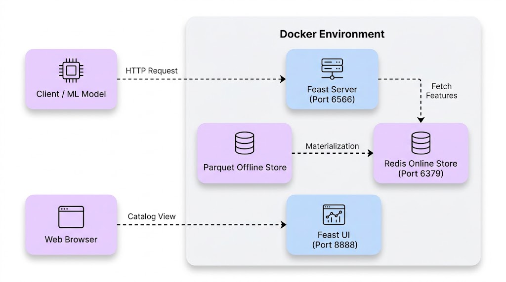
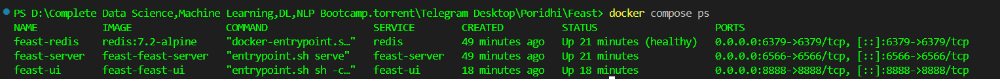
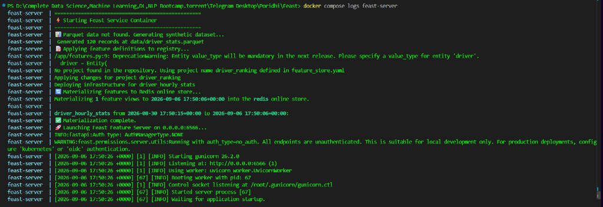
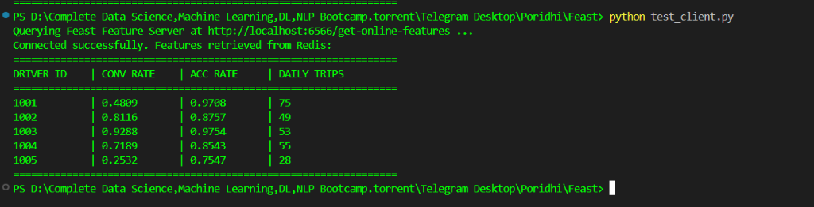
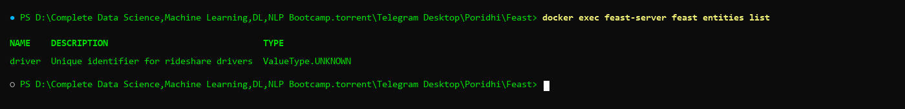

# Dockerizing Feast: Building a Local Feature Store with Docker and Redis

## Introduction

This lab teaches you how to containerize Feast, an open-source feature store, using Docker and Docker Compose. You will construct a local feature store architecture that pairs a file-based Parquet offline store with an in-memory Redis online store, exposing feature vectors through an HTTP REST endpoint and visual catalog.



## Learning Objectives

By the end of this lab, you will be able to:

1. Configure a Feast repository targeting local file storage and containerized Redis instances.
2. Build an immutable Docker runtime image with Feast and required database drivers.
3. Orchestrate multi-container systems using Docker Compose health checks and network definitions.
4. Materialize historical feature data from an offline store to an online store.
5. Retrieve online feature vectors via the Feast HTTP REST API for real-time model inference.
6. Validate feature definitions and metadata through the Feast Web UI dashboard.

**Prerequisites:** Familiarity with Python, Docker containers, and REST API conventions.

## Prologue: The Challenge

You join the machine learning platform team at an on-demand logistics company. The dispatch system matches drivers with delivery requests using machine learning models that require sub-millisecond access to driver metrics, including 24-hour conversion rates and daily trip totals.

Currently, data scientists calculate features in Jupyter notebooks using batch queries against data lakes, while production engineers re-implement feature computation using custom SQL queries on live production databases. This divergence causes training-serving skew, resulting in degraded prediction accuracy when models are deployed to production.

Your task is to build a containerized local feature store using Feast, Parquet, and Redis. This system will serve as a reproducible foundation for feature management across development and production environments.

## Environment Setup

Verify that Docker and Docker Compose are installed on your workstation:

```bash
docker --version
docker compose version
```

Create the directory structure for the project:

```bash
mkdir -p feast-docker-lab/feature_repo/data
cd feast-docker-lab
```

---

## Chapter 1: Storage Backends and Feature Repository Configuration

Feast uses a declarative configuration file, `feature_store.yaml`, to specify metadata registries, offline data stores, and online serving databases.

### 1.1 Project Directory Structure

Before configuring storage backends, review the project layout. The complete directory and file structure for this lab is organized as follows:

```text
feast-docker-lab/
├── docker-compose.yml          # Multi-container orchestration (Redis, Feast Server, Feast UI)
├── Dockerfile                  # Feast custom runtime container definition
├── requirements.txt            # Python package dependencies
├── entrypoint.sh               # Container startup and feature materialization script
├── test_client.py              # Script to query real-time online features from Redis
└── feature_repo/
    ├── feature_store.yaml      # Central Feast storage configuration (Redis + File)
    ├── features.py             # Feature definitions (Entity, FileSource, FeatureView)
    ├── generate_data.py        # Python script to generate sample Parquet data
    └── data/
        ├── driver_stats.parquet # Historical batch dataset (Offline store)
        └── registry.db         # Metadata registry database tracking schemas
```

### 1.2 What You Will Build

You will configure Feast to persist metadata in a SQLite registry, read historical data from local Parquet files, and write online features to a containerized Redis instance.

### 1.3 Think First: Container Network Resolution

When Feast runs in a Docker container alongside a Redis container, what hostname should Feast use to connect to Redis?

<details>
<summary>Click to review</summary>

Containers running in the same Docker bridge network communicate using service names defined in `docker-compose.yml`. Feast must connect to `redis:6379`, not `localhost:6379`, because `localhost` inside a container refers to the container itself.

</details>

### 1.4 Implementation: Configuration File

Create `feature_repo/feature_store.yaml` and complete the missing configuration values:

```yaml
project: driver_ranking
registry: data/registry.db
provider: ___                # Q1: What provider type indicates non-cloud execution?
online_store:
  type: ___                  # Q2: Which key-value store engine are you deploying?
  connection_string: ___:6379 # Q3: Which hostname resolves to the Redis container?
offline_store:
  type: file
entity_key_serialization_version: 3
```

**Hints:**

- Q1: For local filesystem execution without AWS or GCP plugins, use `local`.
- Q2: The target in-memory online store is `redis`.
- Q3: The service name assigned to Redis in Docker Compose will be `redis`.

<details>
<summary>Click to see solution</summary>

```yaml
project: driver_ranking
registry: data/registry.db
provider: local
online_store:
  type: redis
  connection_string: redis:6379
offline_store:
  type: file
entity_key_serialization_version: 3
```

</details>

### 1.5 Understanding the Configuration

Match each configuration property to its purpose:

| Key               | Purpose (A-D) |
| ----------------- | ------------- |
| `registry`      | ___           |
| `provider`      | ___           |
| `online_store`  | ___           |
| `offline_store` | ___           |

**Options:**

- A: Specifies storage for low-latency key-value lookups during live inference.
- B: Specifies location of the central catalog tracking schemas, entities, and feature views.
- C: Specifies infrastructure environment implementation (local, AWS, or GCP).
- D: Specifies storage for historical feature values used in batch training datasets.

<details>
<summary>Click to verify answers</summary>

- `registry`: B
- `provider`: C
- `online_store`: A
- `offline_store`: D

</details>

### 1.6 Checkpoint

**Self-Assessment:**

- [ ] File `feature_repo/feature_store.yaml` is created.
- [ ] The `connection_string` points to `redis:6379`.
- [ ] You can explain why `localhost` will fail inside a containerized setup.

---

## Chapter 2: Data Modeling and Feature Definitions

Feast schemas rely on three core primitives: Entities (primary keys), Data Sources (physical data references), and FeatureViews (schema, properties, and freshness constraints).

### 2.1 What You Will Build

You will write a Python script to generate synthetic historical driver metrics in Parquet format, and define Feast feature objects in `features.py`.

### 2.2 Think First: Feature Freshness

Why must an ML feature store define Time-To-Live (TTL) on feature views?

<details>
<summary>Click to review</summary>

TTL defines the maximum allowable age of a feature value relative to a prediction request timestamp. This prevents inference services from consuming stale data and prevents historical training sets from joining future data.

</details>

### 2.3 Implementation: Synthetic Data Generator

Create `feature_repo/generate_data.py`:

```python
import os
from datetime import datetime, timedelta, timezone
import numpy as np
import pandas as pd

def generate_driver_data():
    now = datetime.now(timezone.utc)
    timestamps = [now - timedelta(hours=i) for i in range(24)]
    driver_ids = [1001, 1002, 1003, 1004, 1005]
    records = []

    np.random.seed(42)

    for driver_id in driver_ids:
        for ts in timestamps:
            records.append({
                "driver_id": driver_id,
                "conv_rate": float(np.random.uniform(0.2, 0.95)),
                "acc_rate": float(np.random.uniform(0.6, 0.99)),
                "avg_daily_trips": int(np.random.randint(15, 85)),
                "event_timestamp": ts,
                "created": now,
            })

    df = pd.DataFrame(records)
    output_dir = "data"
    os.makedirs(output_dir, exist_ok=True)
    file_path = os.path.join(output_dir, "driver_stats.parquet")
    df.to_parquet(file_path, index=False)
    print(f"Generated {len(df)} records at {file_path}")

if __name__ == "__main__":
    generate_driver_data()
```

### 2.4 Implementation: Feature Definitions

Create `feature_repo/features.py` and complete the missing arguments:

```python
from datetime import timedelta
from feast import Entity, FeatureView, Field, FileSource
from feast.types import Float32, Int64

# Define Primary Key
driver = Entity(
    name="driver",
    join_keys=["___"],          # Q1: What column uniquely identifies a driver?
    description="Driver identifier"
)

# Define Offline Data Source
driver_stats_source = FileSource(
    name="driver_stats_source",
    path="data/driver_stats.parquet",
    timestamp_field="___",      # Q2: Which column contains event occurrence time?
    created_timestamp_column="created"
)

# Define Feature View
driver_stats_fv = FeatureView(
    name="driver_hourly_stats",
    entities=[driver],
    ttl=timedelta(days=7),
    schema=[
        Field(name="conv_rate", dtype=Float32),
        Field(name="acc_rate", dtype=Float32),
        Field(name="avg_daily_trips", dtype=Int64),
    ],
    online=___,                 # Q3: Set boolean to enable writing to Redis online store
    source=driver_stats_source
)
```

**Hints:**

- Q1: Matches the ID column in `generate_data.py`: `driver_id`.
- Q2: The event occurrence timestamp column is `event_timestamp`.
- Q3: Set to `True` so Feast materializes this view into Redis.

<details>
<summary>Click to see solution</summary>

```python
from datetime import timedelta
from feast import Entity, FeatureView, Field, FileSource
from feast.types import Float32, Int64

driver = Entity(
    name="driver",
    join_keys=["driver_id"],
    description="Driver identifier"
)

driver_stats_source = FileSource(
    name="driver_stats_source",
    path="data/driver_stats.parquet",
    timestamp_field="event_timestamp",
    created_timestamp_column="created"
)

driver_stats_fv = FeatureView(
    name="driver_hourly_stats",
    entities=[driver],
    ttl=timedelta(days=7),
    schema=[
        Field(name="conv_rate", dtype=Float32),
        Field(name="acc_rate", dtype=Float32),
        Field(name="avg_daily_trips", dtype=Int64),
    ],
    online=True,
    source=driver_stats_source
)
```

</details>

### 2.5 Checkpoint

**Self-Assessment:**

- [ ] `feature_repo/generate_data.py` writes data to `data/driver_stats.parquet`.
- [ ] `feature_repo/features.py` defines the entity, file source, and feature view.
- [ ] The feature view sets `online=True`.

---

## Chapter 3: Containerization and Startup Automation

Containerizing Feast ensures runtime parity across different host machines and automates the registration and materialization lifecycle.

### 3.1 What You Will Build

You will define explicit dependencies in `requirements.txt`, write an `entrypoint.sh` script to manage startup tasks, and create a `Dockerfile`.

### 3.2 Think First: Container Entrypoints

Why should registry updates (`feast apply`) occur inside the container entrypoint rather than during the `docker build` phase?

<details>
<summary>Click to review</summary>

During image build time, external dependencies like the Redis container and mounted volumes are unavailable. Executing `feast apply` and materialization at runtime ensures network connectivity to Redis and access to host-mounted configuration files.

</details>

### 3.3 Implementation: Dependencies

Create `requirements.txt`:

```text
feast[redis]==0.38.0
pandas>=2.0.0
pyarrow>=12.0.0
fastapi>=0.100.0
uvicorn>=0.22.0
requests>=2.31.0
grpcio
grpcio-health-checking
grpcio-reflection
```

### 3.4 Implementation: Entrypoint Script

Create `entrypoint.sh`:

```bash
#!/usr/bin/env bash
set -eo pipefail

cd /app

if [ ! -f "data/driver_stats.parquet" ]; then
    echo "Dataset not found. Generating sample data..."
    python3 generate_data.py
fi

echo "Applying feature definitions to registry..."
feast apply

if [ "${MATERIALIZE:-false}" = "true" ]; then
    echo "Materializing features to Redis online store..."
    feast materialize-incremental "$(date -u +"%Y-%m-%dT%H:%M:%S")"
fi

case "$1" in
    "serve")
        exec feast serve -h 0.0.0.0 -p 6566
        ;;
    "ui")
        exec feast ui -h 0.0.0.0 -p 8888
        ;;
    *)
        exec "$@"
        ;;
esac
```

Make the script executable:

```bash
chmod +x entrypoint.sh
```

### 3.5 Implementation: Dockerfile

Create `Dockerfile`:

```dockerfile
FROM python:3.10-slim

ENV PYTHONDONTWRITEBYTECODE=1 \
    PYTHONUNBUFFERED=1

RUN apt-get update && apt-get install -y --no-install-recommends \
    curl \
    gcc \
    python3-dev \
    dos2unix \
    && rm -rf /var/lib/apt/lists/*

WORKDIR /app

COPY requirements.txt .
RUN pip install --no-cache-dir -r requirements.txt

COPY feature_repo/ /app/
COPY entrypoint.sh /usr/local/bin/entrypoint.sh
RUN dos2unix /usr/local/bin/entrypoint.sh && chmod +x /usr/local/bin/entrypoint.sh

EXPOSE 6566 8888

ENTRYPOINT ["entrypoint.sh"]
```

### 3.6 Checkpoint

**Self-Assessment:**

- [ ] `requirements.txt` specifies `feast[redis]` and required `grpcio` packages.
- [ ] `entrypoint.sh` differentiates between `serve` and `ui` subcommands.
- [ ] `dos2unix` is installed in the Dockerfile to prevent line ending errors on Windows hosts.

---

## Chapter 4: Multi-Service Orchestration with Docker Compose

Running a feature store requires multiple decoupled components: a database for the online store, an API server for inference queries, and an administrative user interface.

### 4.1 What You Will Build

You will construct a `docker-compose.yml` file defining services for `redis`, `feast-server`, and `feast-ui` using shared networks and container health checks.

### 4.2 Think First: Container Dependencies

Why is a simple `depends_on: [redis]` block insufficient for the `feast-server` container?

<details>
<summary>Click to review</summary>

Standard `depends_on` only waits until the target container starts, not until the database process inside is ready to accept connections. Using `condition: service_healthy` ensures Redis is answering PING requests before Feast begins materialization.

</details>

### 4.3 Implementation: Docker Compose Configuration

Create `docker-compose.yml`:

```yaml
services:
  redis:
    image: redis:7.2-alpine
    container_name: feast-redis
    ports:
      - "6379:6379"
    volumes:
      - redis-storage:/data
    networks:
      - feast-net
    healthcheck:
      test: ["CMD", "redis-cli", "ping"]
      interval: 3s
      timeout: 2s
      retries: 5
    restart: unless-stopped

  feast-server:
    build:
      context: .
      dockerfile: Dockerfile
    container_name: feast-server
    command: ["serve"]
    environment:
      - MATERIALIZE=true
    ports:
      - "6566:6566"
    volumes:
      - ./feature_repo:/app
    depends_on:
      redis:
        condition: service_healthy
    networks:
      - feast-net
    restart: unless-stopped

  feast-ui:
    build:
      context: .
      dockerfile: Dockerfile
    container_name: feast-ui
    command: ["sh", "-c", "pip install grpcio grpcio-health-checking grpcio-reflection && /usr/local/bin/entrypoint.sh ui"]
    environment:
      - MATERIALIZE=false
    ports:
      - "8888:8888"
    volumes:
      - ./feature_repo:/app
    depends_on:
      redis:
        condition: service_healthy
    networks:
      - feast-net
    restart: unless-stopped

networks:
  feast-net:
    driver: bridge

volumes:
  redis-storage:
```

### 4.4 Test and Verify

Start all containers in detached mode:

```bash
docker compose up --build -d
```

**Predict:** What status will `docker compose ps` report for the Redis container when healthy?

<details>
<summary>Click to verify</summary>

The status column will display `Up` with `(healthy)`.

</details>

Inspect container statuses:

```bash
docker compose ps
```

**Expected output:**

```text
NAME           IMAGE                         COMMAND                  SERVICE        STATUS                   PORTS
feast-redis    redis:7.2-alpine              "docker-entrypoint.s…"   redis          Up (healthy)             0.0.0.0:6379->6379/tcp
feast-server   feast-docker-lab-feast-server "entrypoint.sh serve"    feast-server   Up                       0.0.0.0:6566->6566/tcp
feast-ui       feast-docker-lab-feast-ui      "entrypoint.sh ui"       feast-ui       Up                       0.0.0.0:8888->8888/tcp
```



Inspect server startup logs:

```bash
docker compose logs feast-server
```



### 4.5 Checkpoint

**Self-Assessment:**

- [ ] All three containers are running without error exits.
- [ ] Ports 6379, 6566, and 8888 are mapped to the host system.
- [ ] Screenshots SS-1 and SS-2 have been gathered.

---

## Chapter 5: Real-Time Feature Ingestion and Serving

With services active and features materialized into Redis, client applications can query feature vectors using the Feast REST API.

### 5.1 What You Will Build

You will query the Feast feature server using `curl`, build a Python test client, and explore the Feast Web UI dashboard.

### 5.2 Think First: Query Payloads

What two payload attributes are mandatory when sending a POST request to `/get-online-features`?

<details>
<summary>Click to review</summary>

1. `features`: A list of feature strings formatted as `feature_view_name:feature_name`.
2. `entities`: A dictionary mapping entity join keys to lists of entity IDs.

</details>

### 5.3 Test with cURL

Send an HTTP request to retrieve feature values for driver IDs `1001` and `1002`:

```bash
curl -X POST http://localhost:6566/get-online-features \
  -H "Content-Type: application/json" \
  -d '{
    "features": [
      "driver_hourly_stats:conv_rate",
      "driver_hourly_stats:acc_rate",
      "driver_hourly_stats:avg_daily_trips"
    ],
    "entities": {
      "driver_id": [1001, 1002]
    }
  }'
```

### 5.4 Test with Python Client

Create `test_client.py`:

```python
import requests

FEAST_URL = "http://localhost:6566/get-online-features"

payload = {
    "features": [
        "driver_hourly_stats:conv_rate",
        "driver_hourly_stats:acc_rate",
        "driver_hourly_stats:avg_daily_trips"
    ],
    "entities": {
        "driver_id": [1001, 1002, 1003, 1004, 1005]
    }
}

response = requests.post(FEAST_URL, json=payload)
data = response.json()

cols = [r["values"] for r in data.get("results", [])]

print("Connected successfully. Features retrieved from Redis:")
print("=" * 65)
print(f"{'DRIVER ID':<12} | {'CONV RATE':<12} | {'ACC RATE':<12} | {'DAILY TRIPS':<12}")
print("=" * 65)

for driver_id, conv_rate, daily_trips, acc_rate in zip(*cols):
    conv_str = f"{conv_rate:<12.4f}" if conv_rate is not None else f"{'None':<12}"
    acc_str = f"{acc_rate:<12.4f}" if acc_rate is not None else f"{'None':<12}"
    trips_str = f"{daily_trips:<12}" if daily_trips is not None else f"{'None':<12}"
    print(f"{driver_id:<12} | {conv_str} | {acc_str} | {trips_str}")

print("=" * 65)
```

Execute the test client:

```bash
python test_client.py
```

**Expected output:**

```text
Querying Feast Feature Server at http://localhost:6566/get-online-features ...
Connected successfully. Features retrieved from Redis:
=================================================================
DRIVER ID    | CONV RATE    | ACC RATE     | DAILY TRIPS 
=================================================================
1001         | 0.4809       | 0.9708       | 75    
1002         | 0.8116       | 0.8757       | 49    
1003         | 0.9288       | 0.9754       | 53    
1004         | 0.7189       | 0.8543       | 55    
1005         | 0.2532       | 0.7547       | 28    
=================================================================
```



### 5.5 Inspect Feature Store Catalog

Open your web browser and navigate to `http://localhost:8888`. Verify that:

1. The `driver` entity is registered.
2. The `driver_hourly_stats` feature view displays properties for `conv_rate`, `acc_rate`, and `avg_daily_trips`.
3. The underlying data source references `data/driver_stats.parquet`.


### 5.6 Experiment: Handling Unseen Entities

Query Feast for an entity ID that does not exist in the offline dataset:

```bash
curl -X POST http://localhost:6566/get-online-features \
  -H "Content-Type: application/json" \
  -d '{"features": ["driver_hourly_stats:conv_rate"], "entities": {"driver_id": [9999]}}'
```

**Observe:** Feast returns the result with status `NOT_FOUND` and null values.

**Question:** How should an inference pipeline handle `NOT_FOUND` statuses in production?

<details>
<summary>Click to review</summary>

Production inference pipelines must implement defensive handling for missing values, such as imputing global feature averages or executing fallback business logic, to prevent downstream model calculation failures.

</details>

---

## Epilogue: The Complete System

Your containerized Feast architecture is running and functional:

| Service          | Port | Endpoint / Role                             | Engine          |
| ---------------- | ---- | ------------------------------------------- | --------------- |
| `feast-server` | 6566 | `POST /get-online-features` (Serving API) | FastAPI / Redis |
| `feast-ui`     | 8888 | `GET /` (Web Catalog Dashboard)           | Feast UI        |
| `redis`        | 6379 | In-memory key-value online store            | Redis 7.2       |

### Complete End-to-End Verification Sequence

```bash
docker compose ps
curl http://localhost:6566/get-online-features -H "Content-Type: application/json" -d '{"features": ["driver_hourly_stats:conv_rate"], "entities": {"driver_id": [1001]}}'
curl -I http://localhost:8888/
```



## The Principles

1. **Decouple Offline Processing from Online Serving:** Use column-oriented storage formats (Parquet) for batch model training and in-memory key-value stores (Redis) for low-latency inference.
2. **Treat Features as Code:** Maintain entity and feature view definitions in version-controlled repositories to prevent training-serving skew.
3. **Synchronize via Deterministic Materialization:** Ingest historical metrics into online storage using explicit timestamps to avoid serving future observations.
4. **Enforce Container Readiness:** Configure Docker health checks to prevent dependent services from starting before backing datastores are ready to accept connections.

## Conclusion

In this lab, you successfully containerized Feast to construct a local, production-grade feature store architecture using Docker and Redis. By decoupling the file-based Parquet offline store from the in-memory Redis online store, you established a dual-tier storage pattern optimized for both batch training datasets and sub-millisecond real-time inference.

Key accomplishments from this implementation include:

- **Unified Feature Definitions:** Declared immutable entities, sources, and feature views as version-controlled Python code, preventing training-serving skew across teams.
- **Multi-Container Orchestration:** Built a custom Docker image and orchestrated services using Docker Compose health checks and automated startup scripts.
- **Deterministic Materialization:** Synchronized historical batch observations from Parquet files into Redis using explicit timestamp watermarks.
- **Low-Latency Feature Serving:** Queried the Feast HTTP REST API to retrieve online feature vectors for live model inference and defensive validation.
- **Metadata Governance:** Inspected registered entities, feature schemas, and storage backends using the interactive Feast Web UI catalog.

This containerized setup provides a reproducible, portable foundation that can be transitioned to cloud-scale MLOps deployments utilizing managed databases, object stores, and Kubernetes clusters.
