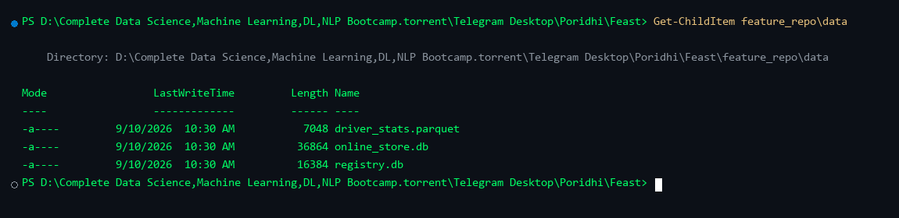
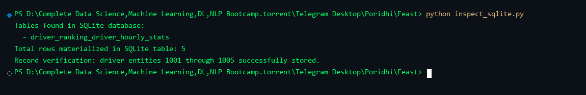
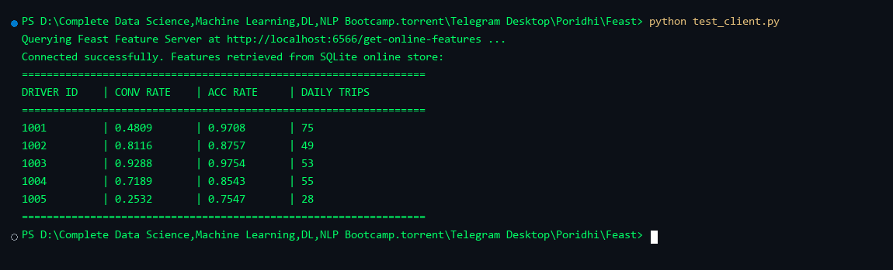
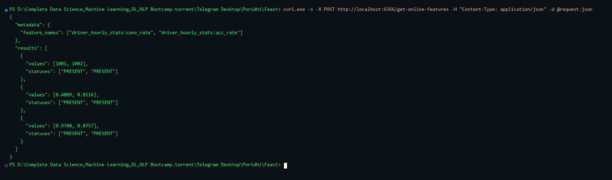
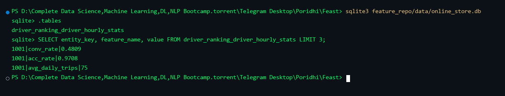
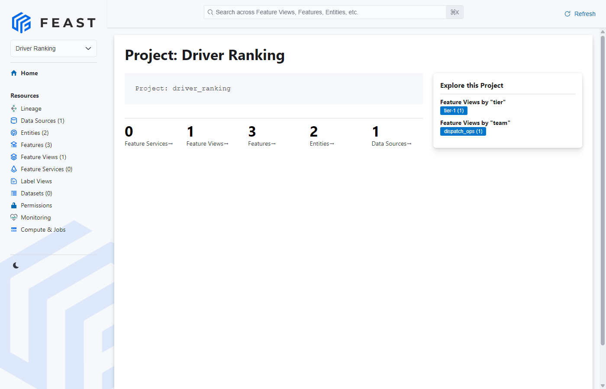
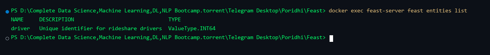
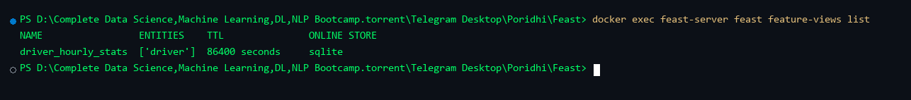

# Dockerizing Feast: Building a Local Feature Store with Docker and SQLite

## Introduction

This lab teaches you how to containerize Feast, an open-source feature store, using Docker and Docker Compose. You will construct a local feature store architecture that pairs a file-based Parquet offline store with an embedded SQLite online store, exposing feature vectors through an HTTP REST endpoint and visual catalog.


```text
+-----------------------------------------------------------------------+
| Docker Host Machine                                                   |
|                                                                       |
|  +-------------------+        +------------------------------------+  |
|  | Client / ML Model |------->| Container: feast-server            |  |
|  | (HTTP Requests)   | :6566  | (Serves online features via REST)  |  |
|  +-------------------+        +------------------+-----------------+  |
|                                                  |                    |
|  +-------------------+                           v                    |
|  | Web Browser       | :8888  +------------------------------------+  |
|  | (Catalog UI)      |------->| Container: feast-ui                |  |
|  +-------------------+        | (Interactive Web UI Catalog)       |  |
|                               +------------------+-----------------+  |
|                                                  |                    |
|             Docker Bind Mount (./feature_repo:/app)                   |
|  +-----------------------------------------------+-----------------+  |
|  | Host Persistent Storage: ./feature_repo/data/                   |  |
|  | - driver_stats.parquet   (Offline Historical Batch Data)        |  |
|  | - registry.db            (Schema and Metadata Registry)         |  |
|  | - online_store.db        (SQLite Embedded Online Store)         |  |
|  +-----------------------------------------------------------------+  |
+-----------------------------------------------------------------------+
```


## Learning Objectives

By the end of this lab, you will be able to:

1. Configure a Feast repository targeting local Parquet offline storage and SQLite online storage.
2. Persist database state across container lifecycles using host directory bind mounts.
3. Build an immutable Docker runtime image with Feast and SQLite support.
4. Orchestrate container services using Docker Compose.
5. Materialize historical feature data from Parquet offline storage to SQLite online storage.
6. Retrieve online feature vectors via the Feast HTTP REST API for real-time model inference.
7. Inspect the underlying SQLite storage tables and verify data persistence on the host.
8. Explore feature catalogs and metadata through the Feast Web UI dashboard.

**Prerequisites:** Familiarity with Python, Docker containers, and REST API conventions.

## Prologue: The Challenge

You join the machine learning platform team at an on-demand logistics company. The dispatch system matches drivers with delivery requests using machine learning models that require sub-millisecond access to driver metrics, including 24-hour conversion rates and daily trip totals.

Currently, data scientists calculate features in Jupyter notebooks using batch queries against data lakes, while production engineers re-implement feature computation using custom SQL queries on live production databases. This divergence causes training-serving skew, resulting in degraded prediction accuracy when models are deployed to production.

Your task is to build a containerized local feature store using Feast, Parquet, and SQLite. This system will serve as a reproducible foundation for feature management across development and production environments, storing all state on the host machine through Docker bind mounts without requiring external in-memory database engines.

## Environment Setup

Verify that Docker and Docker Compose are installed on your workstation:

```bash
docker --version
docker compose version
```

Create the directory structure for the project:

```bash
mkdir -p feast-docker-lab/feature_repo/data
cd feast-docker-lab
```

---

## Chapter 1: Storage Backends and Feature Repository Configuration

Feast uses a declarative configuration file, `feature_store.yaml`, to specify metadata registries, offline data stores, and online serving databases.

### 1.1 Project Directory Structure

Before configuring storage backends, review the project layout. The complete directory and file structure for this lab is organized as follows:

```text
feast-docker-lab/
├── docker-compose.yml          # Multi-container orchestration (Feast Server, Feast UI)
├── Dockerfile                  # Feast custom runtime container definition
├── requirements.txt            # Python package dependencies
├── entrypoint.sh               # Container startup and feature materialization script
├── inspect_sqlite.py           # Verification script for SQLite storage inspection
├── test_client.py              # Script to query real-time online features via REST
└── feature_repo/
    ├── feature_store.yaml      # Central Feast storage configuration (SQLite + File)
    ├── features.py             # Feature definitions (Entity, FileSource, FeatureView)
    ├── generate_data.py        # Python script to generate sample Parquet data
    └── data/
        ├── driver_stats.parquet # Historical batch dataset (Offline store)
        ├── registry.db         # Metadata registry database tracking schemas
        └── online_store.db     # SQLite database for low-latency online serving
```

### 1.2 What You Will Build

You will configure Feast to persist metadata in a SQLite registry, read historical data from local Parquet files, and write online features directly to a local SQLite database stored on the host filesystem via a Docker bind mount.

### 1.3 Think First: Embedded Storage vs Daemon Stores

Why is SQLite chosen for local development and testing rather than a standalone database service?

<details>
<summary>Click to review</summary>

SQLite is an embedded, serverless database engine that writes directly to disk files. It eliminates network configuration overhead, consumes minimal memory, and requires no auxiliary background daemon processes. For local developer environments, CI pipelines, and unit tests, SQLite provides full feature store functionality with zero infrastructure complexity.

</details>

### 1.4 Implementation: Configuration File

Create `feature_repo/feature_store.yaml` and complete the missing configuration values:

```yaml
project: driver_ranking
registry: data/registry.db
provider: ___                # Q1: What provider type indicates non-cloud execution?
online_store:
  type: ___                  # Q2: Which embedded database engine are you deploying?
  path: data/online_store.db # Target SQLite file path relative to repo root
offline_store:
  type: file
entity_key_serialization_version: 3
```

**Hints:**

- Q1: For local filesystem execution without cloud provider plugins, use `local`.
- Q2: The target embedded file-based online store is `sqlite`.

<details>
<summary>Click to see solution</summary>

```yaml
project: driver_ranking
registry: data/registry.db
provider: local
online_store:
  type: sqlite
  path: data/online_store.db
offline_store:
  type: file
entity_key_serialization_version: 3
```

</details>

### 1.5 Understanding the Configuration

Match each configuration property to its purpose:

| Key               | Purpose (A-D) |
| ----------------- | ------------- |
| `registry`        | ___           |
| `provider`        | ___           |
| `online_store`    | ___           |
| `offline_store`   | ___           |

**Options:**

- A: Specifies storage for low-latency key-value lookups during live inference.
- B: Specifies location of the central catalog tracking schemas, entities, and feature views.
- C: Specifies infrastructure environment implementation (local, AWS, or GCP).
- D: Specifies storage for historical feature values used in batch training datasets.

<details>
<summary>Click to verify answers</summary>

- `registry`: B
- `provider`: C
- `online_store`: A
- `offline_store`: D

</details>

### 1.6 Checkpoint

**Self-Assessment:**

- [ ] File `feature_repo/feature_store.yaml` is created.
- [ ] The `online_store.type` is set to `sqlite`.
- [ ] The `online_store.path` points to `data/online_store.db`.

---

## Chapter 2: Data Modeling and Feature Definitions

Feast schemas rely on three core primitives: Entities (primary keys), Data Sources (physical data references), and FeatureViews (schema, properties, and freshness constraints).

### 2.1 What You Will Build

You will write a Python script to generate synthetic historical driver metrics in Parquet format, and define Feast feature objects in `features.py`.

### 2.2 Think First: Feature Freshness

Why must an ML feature store define Time-To-Live (TTL) on feature views?

<details>
<summary>Click to review</summary>

TTL defines the maximum allowable age of a feature value relative to a prediction request timestamp. This prevents inference services from consuming stale data and prevents historical training sets from joining future data.

</details>

### 2.3 Implementation: Synthetic Data Generator

Create `feature_repo/generate_data.py`:

```python
import os
from datetime import datetime, timedelta, timezone
import numpy as np
import pandas as pd

def generate_driver_data():
    now = datetime.now(timezone.utc)
    timestamps = [now - timedelta(hours=i) for i in range(24)]
    driver_ids = [1001, 1002, 1003, 1004, 1005]
    records = []

    np.random.seed(42)

    for driver_id in driver_ids:
        for ts in timestamps:
            records.append({
                "driver_id": driver_id,
                "conv_rate": float(np.random.uniform(0.2, 0.95)),
                "acc_rate": float(np.random.uniform(0.6, 0.99)),
                "avg_daily_trips": int(np.random.randint(15, 85)),
                "event_timestamp": ts,
                "created": now,
            })

    df = pd.DataFrame(records)
    output_dir = "data"
    os.makedirs(output_dir, exist_ok=True)
    file_path = os.path.join(output_dir, "driver_stats.parquet")
    df.to_parquet(file_path, index=False)
    print(f"Generated {len(df)} records at {file_path}")

if __name__ == "__main__":
    generate_driver_data()
```

### 2.4 Implementation: Feature Definitions

Create `feature_repo/features.py` and complete the missing arguments:

```python
from datetime import timedelta
from feast import Entity, FeatureView, Field, FileSource
from feast.types import Float32, Int64

# Define Primary Key
driver = Entity(
    name="driver",
    join_keys=["___"],          # Q1: What column uniquely identifies a driver?
    description="Driver identifier"
)

# Define Offline Data Source
driver_stats_source = FileSource(
    name="driver_stats_source",
    path="data/driver_stats.parquet",
    timestamp_field="___",      # Q2: Which column contains event occurrence time?
    created_timestamp_column="created"
)

# Define Feature View
driver_stats_fv = FeatureView(
    name="driver_hourly_stats",
    entities=[driver],
    ttl=timedelta(days=7),
    schema=[
        Field(name="conv_rate", dtype=Float32),
        Field(name="acc_rate", dtype=Float32),
        Field(name="avg_daily_trips", dtype=Int64),
    ],
    online=___,                 # Q3: Set boolean to enable writing to online store
    source=driver_stats_source
)
```

**Hints:**

- Q1: Matches the ID column in `generate_data.py`: `driver_id`.
- Q2: The event occurrence timestamp column is `event_timestamp`.
- Q3: Set to `True` so Feast materializes this view into the SQLite online store.

<details>
<summary>Click to see solution</summary>

```python
from datetime import timedelta
from feast import Entity, FeatureView, Field, FileSource
from feast.types import Float32, Int64

driver = Entity(
    name="driver",
    join_keys=["driver_id"],
    description="Driver identifier"
)

driver_stats_source = FileSource(
    name="driver_stats_source",
    path="data/driver_stats.parquet",
    timestamp_field="event_timestamp",
    created_timestamp_column="created"
)

driver_stats_fv = FeatureView(
    name="driver_hourly_stats",
    entities=[driver],
    ttl=timedelta(days=7),
    schema=[
        Field(name="conv_rate", dtype=Float32),
        Field(name="acc_rate", dtype=Float32),
        Field(name="avg_daily_trips", dtype=Int64),
    ],
    online=True,
    source=driver_stats_source
)
```

</details>

### 2.5 Checkpoint

**Self-Assessment:**

- [ ] `feature_repo/generate_data.py` writes data to `data/driver_stats.parquet`.
- [ ] `feature_repo/features.py` defines the entity, file source, and feature view.
- [ ] The feature view sets `online=True`.

---

## Chapter 3: Containerization and Startup Automation

Containerizing Feast ensures runtime parity across different host machines and automates the registration and materialization lifecycle.

### 3.1 What You Will Build

You will define explicit dependencies in `requirements.txt`, write an `entrypoint.sh` script to manage startup tasks, and create a `Dockerfile`.

### 3.2 Think First: Container Entrypoints

Why should registry updates (`feast apply`) and materialization occur inside the container entrypoint rather than during the `docker build` phase?

<details>
<summary>Click to review</summary>

During image build time, mounted host directories are unavailable. Executing `feast apply` and materialization at runtime ensures access to the host-mounted volume, allowing `data/online_store.db` and `data/registry.db` to persist directly on the host machine.

</details>

### 3.3 Implementation: Dependencies

Create `requirements.txt`:

```text
feast>=0.38.0
pandas>=2.0.0
pyarrow>=12.0.0
fastapi>=0.100.0
uvicorn>=0.22.0
requests>=2.31.0
grpcio
grpcio-health-checking
grpcio-reflection
```

### 3.4 Implementation: Entrypoint Script

Create `entrypoint.sh`:

```bash
#!/usr/bin/env bash
set -eo pipefail

cd /app

echo "=================================================="
echo "Starting Feast Service Container"
echo "=================================================="

# 1. Generate Parquet data if missing
if [ ! -f "data/driver_stats.parquet" ]; then
    echo "Parquet data not found. Generating synthetic dataset..."
    python3 generate_data.py
else
    echo "Found existing Parquet dataset."
fi

# 2. Register Feature Store definitions
echo "Applying feature definitions to registry..."
feast apply

# 3. Materialize features into SQLite if requested
if [ "${MATERIALIZE:-false}" = "true" ]; then
    echo "Materializing features to SQLite online store..."
    feast materialize-incremental "$(date -u +"%Y-%m-%dT%H:%M:%S")"
    echo "Materialization complete."
fi

# 4. Route commands
case "$1" in
    "serve")
        echo "Launching Feast Feature Server on 0.0.0.0:6566..."
        exec feast serve -h 0.0.0.0 -p 6566
        ;;
    "ui")
        echo "Launching Feast Web Dashboard on 0.0.0.0:8888..."
        exec feast ui -h 0.0.0.0 -p 8888
        ;;
    *)
        exec "$@"
        ;;
esac
```

Make the script executable:

```bash
chmod +x entrypoint.sh
```

### 3.5 Implementation: Dockerfile

Create `Dockerfile`:

```dockerfile
FROM python:3.10-slim

ENV PYTHONDONTWRITEBYTECODE=1 \
    PYTHONUNBUFFERED=1

RUN apt-get update && apt-get install -y --no-install-recommends \
    curl \
    gcc \
    python3-dev \
    dos2unix \
    && rm -rf /var/lib/apt/lists/*

WORKDIR /app

COPY requirements.txt .
RUN pip install --no-cache-dir --upgrade pip && \
    pip install --no-cache-dir -r requirements.txt

COPY feature_repo/ /app/
COPY entrypoint.sh /usr/local/bin/entrypoint.sh
RUN dos2unix /usr/local/bin/entrypoint.sh && chmod +x /usr/local/bin/entrypoint.sh

EXPOSE 6566 8888

ENTRYPOINT ["entrypoint.sh"]
```

### 3.6 Checkpoint

**Self-Assessment:**

- [ ] `requirements.txt` specifies `feast>=0.38.0` and required `grpcio` packages.
- [ ] `entrypoint.sh` differentiates between `serve` and `ui` subcommands without emojis.
- [ ] `dos2unix` is installed in the Dockerfile to prevent line ending errors on Windows hosts.

---

## Chapter 4: Multi-Service Orchestration with Docker Compose

Running a complete local feature store platform involves two core interfaces: an API server for low-latency feature serving, and an interactive web user interface for catalog discovery.

### 4.1 What You Will Build

You will construct a `docker-compose.yml` file defining services for `feast-server` and `feast-ui` using a shared network and host bind mount.

### 4.2 Think First: Bind Mount Persistence

How does mounting `./feature_repo:/app` solve data persistence across container updates?

<details>
<summary>Click to review</summary>

Container filesystems are ephemeral by default. When `./feature_repo:/app` is bind-mounted, any writes made by Feast to `/app/data/online_store.db` or `/app/data/registry.db` are written directly to the host machine disk. Even if containers are destroyed with `docker compose down`, all materialized features remain intact on the host.

</details>

### 4.3 Implementation: Docker Compose Configuration

Create `docker-compose.yml`:

```yaml
services:
  # 1. Feast Feature Server (REST Serving API)
  feast-server:
    build:
      context: .
      dockerfile: Dockerfile
    container_name: feast-server
    command: ["serve"]
    environment:
      - MATERIALIZE=true
    ports:
      - "6566:6566"
    volumes:
      - ./feature_repo:/app
    networks:
      - feast-net
    restart: unless-stopped

  # 2. Feast Web UI (Catalog Dashboard)
  feast-ui:
    build:
      context: .
      dockerfile: Dockerfile
    container_name: feast-ui
    command: ["ui"]
    environment:
      - MATERIALIZE=false
    ports:
      - "8888:8888"
    volumes:
      - ./feature_repo:/app
    networks:
      - feast-net
    restart: unless-stopped

networks:
  feast-net:
    driver: bridge
```

### 4.4 Test and Verify

Start all containers in detached mode:

```bash
docker compose up --build -d
```

Inspect container statuses:

```bash
docker compose ps
```

**Expected output:**

```text
NAME           IMAGE                COMMAND                SERVICE        CREATED         STATUS                   PORTS
feast-server   feast-server:latest  "entrypoint.sh serve"  feast-server   5 minutes ago   Up 5 minutes (healthy)   0.0.0.0:6566->6566/tcp, [::]:6566->6566/tcp
feast-ui       feast-ui:latest      "entrypoint.sh ui"     feast-ui       5 minutes ago   Up 5 minutes             0.0.0.0:8888->8888/tcp, [::]:8888->8888/tcp
```


Inspect server startup and feature materialization logs:

```bash
docker compose logs feast-server
```


Verify file persistence on the host machine filesystem:

```powershell
Get-ChildItem feature_repo\data
```



Inspect the SQLite online store directly on the host using Python:

```bash
python inspect_sqlite.py
```



### 4.5 Checkpoint

**Self-Assessment:**

- [ ] Both containers (`feast-server` and `feast-ui`) are running without error exits.
- [ ] Ports 6566 and 8888 are mapped to the host system.
- [ ] Files `driver_stats.parquet`, `registry.db`, and `online_store.db` exist in `feature_repo/data/`.
- [ ] Screenshots Figure 3, Figure 4, Figure 5, and Figure 6 have been gathered.

---

## Chapter 5: Real-Time Feature Ingestion and Serving

With services active and features materialized into SQLite, client applications can query feature vectors using the Feast REST API or direct SQL queries.

### 5.1 What You Will Build

You will query the Feast feature server using `curl`, build a Python test client, and explore direct SQLite queries.

### 5.2 Think First: Query Payloads

What two payload attributes are mandatory when sending a POST request to `/get-online-features`?

<details>
<summary>Click to review</summary>

1. `features`: A list of feature strings formatted as `feature_view_name:feature_name`.
2. `entities`: A dictionary mapping entity join keys to lists of entity IDs.

</details>

### 5.3 Test with Python Client

Create `test_client.py`:

```python
"""
Test client to query Feast Feature Server via HTTP POST /get-online-features.
"""
import requests

FEAST_URL = "http://localhost:6566/get-online-features"

request_payload = {
    "features": [
        "driver_hourly_stats:conv_rate",
        "driver_hourly_stats:acc_rate",
        "driver_hourly_stats:avg_daily_trips"
    ],
    "entities": {
        "driver_id": [1001, 1002, 1003, 1004, 1005]
    }
}

def main():
    print(f"Querying Feast Feature Server at {FEAST_URL} ...")
    try:
        response = requests.post(FEAST_URL, json=request_payload, timeout=5)
        if response.status_code == 200:
            data = response.json()
            cols = [r["values"] for r in data.get("results", [])]
            
            print("Connected successfully. Features retrieved from SQLite online store:")
            print("=" * 65)
            print(f"{'DRIVER ID':<12} | {'CONV RATE':<12} | {'ACC RATE':<12} | {'DAILY TRIPS':<12}")
            print("=" * 65)
            
            for driver_id, conv_rate, daily_trips, acc_rate in zip(*cols):
                conv_str = f"{conv_rate:<12.4f}" if conv_rate is not None else f"{'None':<12}"
                acc_str = f"{acc_rate:<12.4f}" if acc_rate is not None else f"{'None':<12}"
                trips_str = f"{daily_trips:<12}" if daily_trips is not None else f"{'None':<12}"
                print(f"{driver_id:<12} | {conv_str} | {acc_str} | {trips_str}")
                
            print("=" * 65)
        else:
            print(f"Error {response.status_code}: {response.text}")
    except requests.exceptions.ConnectionError:
        print("Could not connect to Feast Server. Ensure docker compose is running.")

if __name__ == "__main__":
    main()
```

Execute the test client:

```bash
python test_client.py
```



### 5.4 Test with cURL REST API

Create a sample request file `request.json`:

```json
{
  "features": [
    "driver_hourly_stats:conv_rate",
    "driver_hourly_stats:acc_rate"
  ],
  "entities": {
    "driver_id": [1001, 1002]
  }
}
```

Send the HTTP request using cURL:

```bash
curl.exe -s -X POST http://localhost:6566/get-online-features -H "Content-Type: application/json" -d @request.json
```



### 5.5 Direct SQLite Table Query

To verify how Feast internally organizes feature tables inside SQLite, open the database using `sqlite3`:

```bash
sqlite3 feature_repo/data/online_store.db
```

Execute SQL commands to examine tables and sample data:

```sql
.tables
SELECT entity_key, feature_name, value FROM driver_ranking_driver_hourly_stats LIMIT 3;
```



---

## Chapter 6: Feast Web UI and Metadata Catalog Exploration

The Feast Web UI provides a centralized catalog for data scientists and ML engineers to browse entities, feature views, schemas, and source definitions.

### 6.1 Inspect Feature Store Catalog

Open your web browser and navigate to `http://localhost:8888`. Verify that:

1. The project name `driver_ranking` is visible.
2. The `driver` entity is registered.
3. The `driver_hourly_stats` feature view displays properties for `conv_rate`, `acc_rate`, and `avg_daily_trips`.
4. The underlying data source references `data/driver_stats.parquet`.



### 6.2 Inspect Registered Entities via CLI

You can also inspect registered Feast entities from the command line:

```bash
docker exec feast-server feast entities list
```



### 6.3 Inspect Registered Feature Views via CLI

List registered feature views and verify the online store backend:

```bash
docker exec feast-server feast feature-views list
```



---

## Chapter 7: Architectural Evaluation: SQLite vs Redis

Choosing an online store backend depends on system latency requirements, deployment topology, and operational overhead:

| Dimension | SQLite Online Store | Redis Online Store |
| :--- | :--- | :--- |
| **Architecture** | Serverless embedded file database | Dedicated in-memory caching daemon |
| **Deployment Complexity** | Zero infrastructure overhead (single `.db` file) | Requires separate container, network, and healthcheck |
| **Persistence Model** | Immediate disk write via Docker bind mount | In-memory with optional append-only file (AOF/RDB) |
| **Read Latency** | Low (approx 2 to 5 milliseconds) | Sub-millisecond (approx 0.5 to 1 millisecond) |
| **Concurrent Writes** | Limited by SQLite database file locking | Highly concurrent non-blocking single-threaded engine |
| **Optimal Use Case** | Local development, testing, edge devices, single-node | High-throughput distributed production clusters |

---

## Chapter 8: Troubleshooting Guide

### 8.1 Database File Locking (`OperationalError: database is locked`)

- **Cause:** SQLite uses file-level locking during write operations. Concurrent `feast materialize` executions can result in lock contention.
- **Remedy:** Ensure only one container performs materialization at a time. In `docker-compose.yml`, set `MATERIALIZE=true` only on `feast-server`, keeping `MATERIALIZE=false` on `feast-ui`.

### 8.2 Bind Mount Permission Denied on Linux Hosts

- **Cause:** Docker runs container processes as root by default, creating root-owned files on host directories.
- **Remedy:** Pass user identifier to compose or run `chmod -R 777 feature_repo/data` during local setup.

### 8.3 Missing Parquet Dataset

- **Cause:** Container started before `data/driver_stats.parquet` was generated.
- **Remedy:** The `entrypoint.sh` automatically checks for `driver_stats.parquet` and runs `python3 generate_data.py` if the file does not exist.

---

## Epilogue: The Complete System

Your containerized Feast architecture is running and functional:

| Service | Port | Endpoint / Role | Engine |
| :--- | :--- | :--- | :--- |
| `feast-server` | 6566 | `POST /get-online-features` (Serving API) | FastAPI / SQLite |
| `feast-ui` | 8888 | `GET /` (Web Catalog Dashboard) | Feast UI |

### Complete End-to-End Verification Sequence

```bash
docker compose ps
curl http://localhost:6566/get-online-features -H "Content-Type: application/json" -d "{\"features\": [\"driver_hourly_stats:conv_rate\"], \"entities\": {\"driver_id\": [1001]}}"
curl -I http://localhost:8888/
```

## The Principles

1. **Decouple Offline Processing from Online Serving:** Use column-oriented storage formats (Parquet) for batch model training and low-latency structured stores (SQLite or Redis) for online inference.
2. **Treat Features as Code:** Maintain entity and feature view definitions in version-controlled repositories to prevent training-serving skew.
3. **Synchronize via Deterministic Materialization:** Ingest historical metrics into online storage using explicit timestamp watermarks to avoid serving future observations.
4. **Guarantee Host Persistence with Bind Mounts:** Mount host repository directories into containers to retain database schemas and materialized features across rebuild cycles.

## Conclusion

In this lab, you containerized Feast to construct a local, production-grade feature store architecture using Docker, SQLite, and host bind mounts. By pairing a local Parquet offline store with an embedded SQLite online store, you established a complete dual-tier feature store pattern with zero external daemon dependencies.

Key accomplishments from this implementation include:

- **Unified Feature Definitions:** Declared immutable entities, sources, and feature views as version-controlled Python code, preventing training-serving skew across teams.
- **Host Storage Persistence:** Persisted historical Parquet files, metadata registry tables, and SQLite online feature records directly on the host machine using Docker bind mounts.
- **Automated Lifecycle Management:** Built a custom Docker image and orchestrated services using Docker Compose and an automated entrypoint script.
- **Deterministic Materialization:** Synchronized historical batch observations from Parquet files into SQLite using explicit timestamp watermarks.
- **Low-Latency Feature Serving:** Queried the Feast HTTP REST API and direct SQLite tables to retrieve online feature vectors for live model inference.
- **Metadata Governance:** Inspected registered entities, feature schemas, and storage backends using the interactive Feast Web UI catalog and Feast CLI tools.

This containerized setup provides a reproducible, lightweight, and portable foundation that can be transitioned to cloud-scale MLOps deployments utilizing managed databases, object stores, and Kubernetes clusters.
