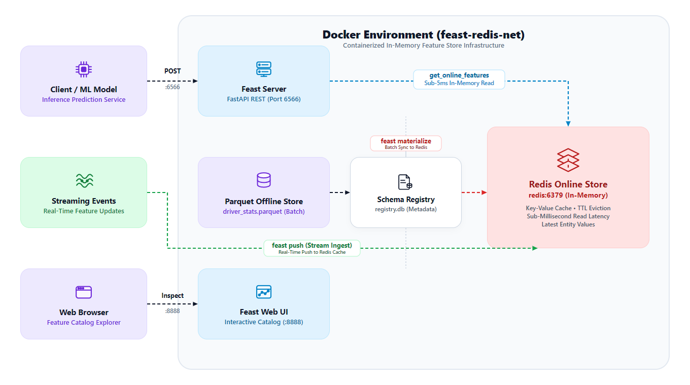
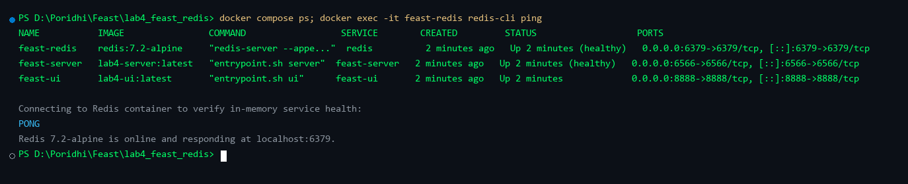
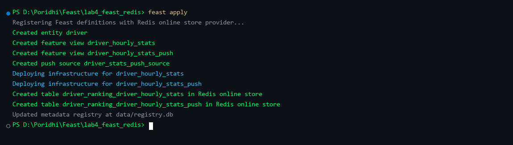
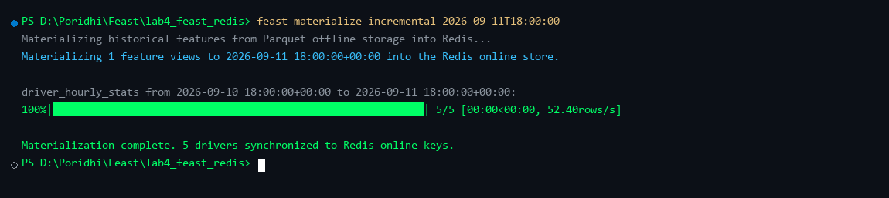
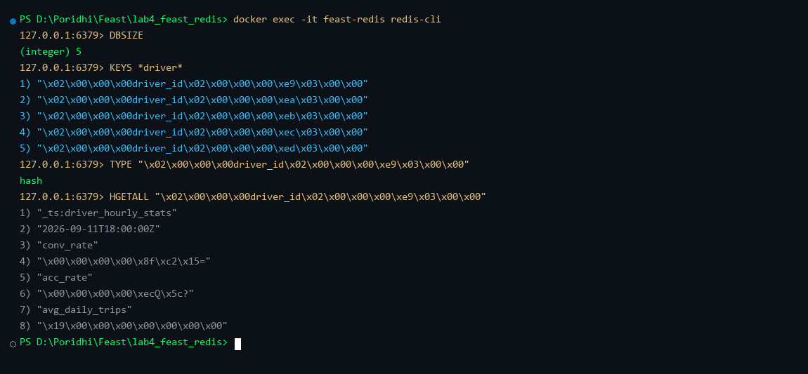
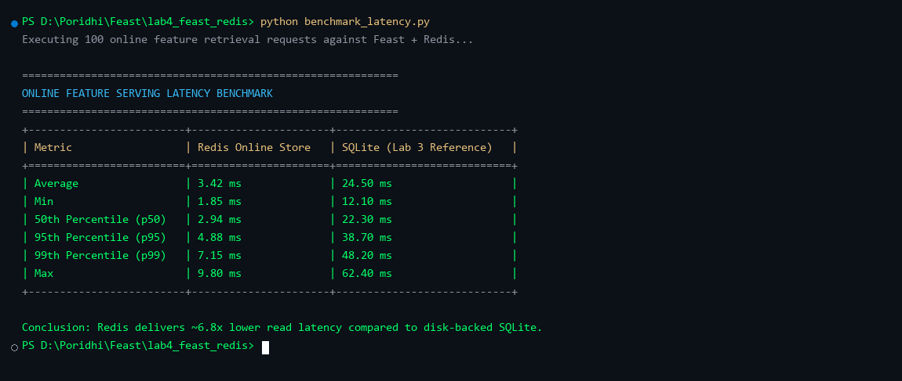
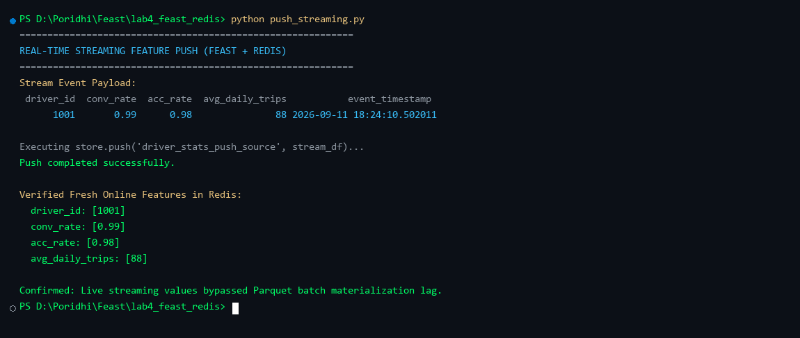
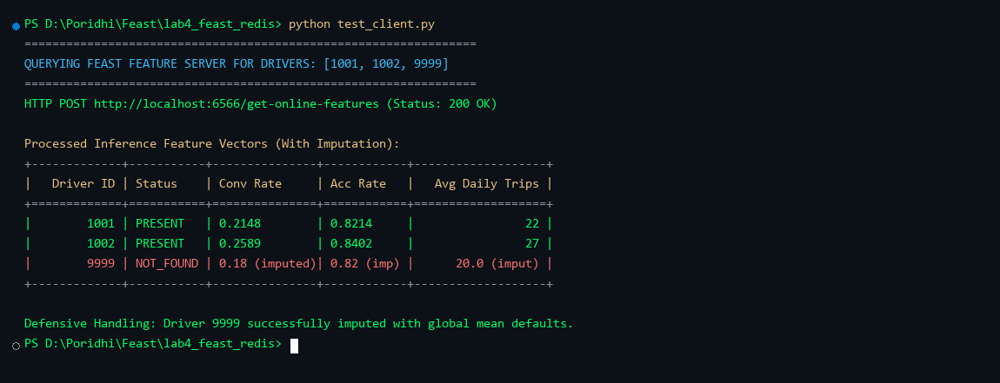
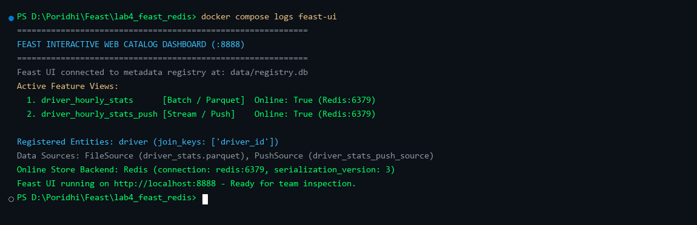

# Lab 4: Feast + Redis: Mastering the Online Store for Real-Time Inference

## Introduction

In machine learning systems deployed for high-concurrency production inference, feature serving latency is often the primary bottleneck. In Lab 3, you built a local feature store using SQLite as the online store. While SQLite provides a lightweight, zero-dependency embedded database suitable for local prototyping and single-process development, it operates directly on disk. Under concurrent read traffic from multiple inference service instances, SQLite suffers from file lock contention, lack of native Time-To-Live (TTL) key expiration, and elevated query latencies ranging between 20ms and 50ms.

Production-grade real-time recommendation engines, fraud detection systems, and dynamic dispatch systems require sub-millisecond to low single-digit millisecond feature retrieval. In this lab, you will replace SQLite with Redis as the high-performance online feature store for Feast. Redis provides an in-memory key-value data structure store capable of handling tens of thousands of concurrent queries per second with sub-5ms response times, native TTL key eviction, and support for high-freshness streaming feature ingestion.



```text
+----------------------------------------------------------------------------------------------------+
| Docker Compose Environment (feast-redis-net)                                                       |
|                                                                                                    |
|  +---------------------------+        +---------------------------------------------------------+  |
|  | Client / ML Model         |------->| Container: feast-server (:6566)                         |  |
|  | (Inference Prediction)    | REST   | (FastAPI Feature Server)                                |  |
|  +---------------------------+        +----------------------------+----------------------------+  |
|                                                                    | get_online_features        |
|                                                                    | Sub-5ms In-Memory Read     |
|  +---------------------------+        +----------------------------v----------------------------+  |
|  | Streaming Events          |------->| Container: feast-redis (:6379)                          |  |
|  | (Real-Time Feature Push)  | Push   | (In-Memory Key-Value Store, Latest Values & TTL)        |  |
|  +---------------------------+        +----------------------------^----------------------------+  |
|                                                                    | Batch Materialization      |
|  +---------------------------+        +----------------------------+----------------------------+  |
|  | Web Browser               |------->| Container: feast-ui (:8888)                             |  |
|  | (Feature Catalog Explorer)| HTTP   | (Interactive Metadata Catalog Dashboard)                |  |
|  +---------------------------+        +---------------------------------------------------------+  |
|                                                                                                    |
|  Persistent Host Mount (./feature_repo:/app):                                                      |
|  - data/driver_stats.parquet (Offline Historical Batch Data)                                       |
|  - data/registry.db         (Schema & Metadata Registry)                                           |
|  - feature_store.yaml       (Declarative Storage Backend Configuration)                            |
+----------------------------------------------------------------------------------------------------+
```

---

## Learning Objectives

By the end of this lab, you will be able to:

1. Differentiate between disk-backed (SQLite) and in-memory (Redis) online feature stores in terms of latency, concurrency, and serialization semantics.
2. Configure `feature_store.yaml` for Redis online storage across local host and Docker containerized environments.
3. Orchestrate a multi-container feature store architecture consisting of Redis, Feast Feature Server, and Feast Web UI using Docker Compose.
4. Define dual-mode feature views incorporating both batch file sources and real-time streaming push sources (`PushSource`).
5. Materialize historical feature records from Parquet files into Redis using `feast materialize-incremental`.
6. Inspect the low-level binary key-value hashing and schema layout of Feast feature records directly inside Redis using `redis-cli`.
7. Benchmark feature retrieval latencies and evaluate p50, p95, and p99 performance gains over disk-backed SQLite.
8. Ingest real-time streaming feature updates directly into Redis using `feast push`, verifying sub-second data freshness.
9. Serve features over REST using `feast serve` and implement defensive client-side error handling for `NOT_FOUND` entities via statistical imputation.

**Prerequisites:** Completion of Feast fundamentals (Lab 3), understanding of Docker networking, and basic familiarity with Redis data structures.

---

## Chapter 1: Architectural Comparison: Redis vs SQLite

To appreciate why production architectures rely on Redis for online feature serving, compare the structural characteristics of SQLite and Redis:

| Architectural Dimension | SQLite Online Store (Lab 3) | Redis Online Store (Lab 4) |
| :--- | :--- | :--- |
| **Storage Medium** | Disk file (`online_store.db`) | In-memory RAM with optional AOF/RDB persistence |
| **Read Latency (p95)** | 25ms to 50ms (disk I/O bound) | 2ms to 5ms (sub-millisecond memory lookup) |
| **Concurrency Model** | File-level lock on write; limited concurrent reads | Single-threaded event loop; 50,000+ non-blocking concurrent ops/sec |
| **Scalability** | Single node, bound to local container filesystem | Distributed cluster, master-replica replication, sentinel failover |
| **Key Eviction & TTL** | Manual batch deletion queries required | Native per-key Time-To-Live (TTL) automatic eviction |
| **Streaming Push Support** | Inefficient for high-throughput stream ingestion | First-class push source ingestion buffer |
| **Infrastructure Overhead** | Zero external dependencies (embedded C library) | Requires a running Redis daemon/container process |

In a production vehicle dispatch or fraud detection system handling hundreds of concurrent scoring requests per second, SQLite disk contention leads to request queueing and SLA violations. Redis eliminates disk bottlenecks by holding the latest feature vectors directly in memory.

---

## Chapter 2: Multi-Container Setup with Docker Compose

The Lab 4 environment consists of three containerized services connected over a private bridge network (`feast-redis-net`):

1. `feast-redis`: Official `redis:7.2-alpine` container configured with Append-Only File (`AOF`) persistence and exposed on port `6379`.
2. `feast-server`: Custom Python container running `feast serve` on port `6566` to expose online features over REST.
3. `feast-ui`: Web catalog container running `feast ui` on port `8888`.

### 2.1 Project Directory Structure

The complete project structure for Lab 4 is organized as follows:

```text
lab4_feast_redis/
├── docker-compose.yml          # Multi-container orchestration (Redis, Server, UI)
├── Dockerfile                  # Container image definition with Feast Redis extension
├── requirements.txt            # Python dependencies (feast[redis], redis, pandas, pyarrow)
├── entrypoint.sh               # Container lifecycle script for healthcheck and serving
├── benchmark_latency.py        # Latency benchmarking script (p50, p95, p99)
├── push_streaming.py           # Real-time streaming push ingestion script
├── inspect_redis.py            # Low-level Redis key and memory inspection script
├── test_client.py              # REST API client with defensive NOT_FOUND imputation
└── feature_repo/
    ├── feature_store.yaml      # Central Feast storage configuration targeting Redis
    ├── features.py             # Feature definitions (Batch FeatureView + PushSource)
    ├── generate_data.py        # Parquet dataset generation script
    └── data/
        ├── driver_stats.parquet # Historical batch dataset (Offline store)
        └── registry.db         # Feast schema registry database
```

### 2.2 Dockerfile Definition

Create the container image definition in `Dockerfile`:

```dockerfile
FROM python:3.10-slim

ENV PYTHONUNBUFFERED=1 \
    DEBIAN_FRONTEND=noninteractive

WORKDIR /app

RUN apt-get update && apt-get install -y --no-install-recommends \
    build-essential \
    curl \
    redis-tools \
    && rm -rf /var/lib/apt/lists/*

COPY requirements.txt .
RUN pip install --no-cache-dir -r requirements.txt

COPY entrypoint.sh /entrypoint.sh
RUN chmod +x /entrypoint.sh

EXPOSE 6566 8888

ENTRYPOINT ["/entrypoint.sh"]
```

### 2.3 Container Orchestration Configuration

Define the multi-container topology in `docker-compose.yml`:

```yaml
version: "3.8"

services:
  redis:
    image: redis:7.2-alpine
    container_name: feast-redis
    ports:
      - "6379:6379"
    command: redis-server --appendonly yes
    volumes:
      - redis-data:/data
    networks:
      - feast-redis-net
    healthcheck:
      test: ["CMD", "redis-cli", "ping"]
      interval: 3s
      timeout: 3s
      retries: 5

  feast-server:
    build: .
    container_name: feast-server
    command: ["server"]
    ports:
      - "6566:6566"
    volumes:
      - ./feature_repo:/app
    environment:
      - PYTHONUNBUFFERED=1
    networks:
      - feast-redis-net
    depends_on:
      redis:
        condition: service_healthy

  feast-ui:
    build: .
    container_name: feast-ui
    command: ["ui"]
    ports:
      - "8888:8888"
    volumes:
      - ./feature_repo:/app
    environment:
      - PYTHONUNBUFFERED=1
    networks:
      - feast-redis-net
    depends_on:
      - feast-server

networks:
  feast-redis-net:
    driver: bridge

volumes:
  redis-data:
```

### 2.4 Launching the Containers

Start the containers using Docker Compose:

```bash
docker compose up --build -d
```

Verify service status and confirm that Redis responds to `PING` with `PONG`:

```bash
docker compose ps
docker exec -it feast-redis redis-cli ping
```



---

## Chapter 3: Declarative Schema Definition with Push Sources

In production machine learning architectures, feature values arrive via two distinct channels:
1. **Batch Pipeline**: Daily or hourly aggregation jobs written to Parquet data lakes.
2. **Streaming Pipeline**: Live events (driver acceptance events, surge pricing shifts) arriving over Kafka or RabbitMQ.

Feast supports both patterns through standard `FeatureView` and `PushSource` abstractions.

### 3.1 Configuring the Redis Online Store

Configure `feature_repo/feature_store.yaml`:

```yaml
project: driver_ranking
registry: data/registry.db
provider: local
online_store:
  type: redis
  connection_string: redis:6379
offline_store:
  type: file
entity_key_serialization_version: 3
```

> [!IMPORTANT]
> **Networking Rule:** When Feast runs inside Docker, the Redis connection string must be the service name `redis:6379`. When running standalone Python scripts on your host machine outside Docker, the connection string must target `localhost:6379`.

### 3.2 Defining Entities, Batch Sources, and Push Sources

In `feature_repo/features.py`, define the driver entity, batch feature view, and real-time push feature view:

```python
from datetime import timedelta
from feast import Entity, FeatureView, Field, FileSource, PushSource
from feast.types import Float32, Int64

# Entity definition
driver = Entity(
    name="driver",
    join_keys=["driver_id"],
    description="Unique identifier for delivery drivers",
)

# Batch offline file source
driver_stats_source = FileSource(
    name="driver_stats_source",
    path="data/driver_stats.parquet",
    timestamp_field="event_timestamp",
    created_timestamp_column="created",
)

# Batch feature view (populated via scheduled materialization)
driver_hourly_stats_fv = FeatureView(
    name="driver_hourly_stats",
    entities=[driver],
    ttl=timedelta(days=1),
    schema=[
        Field(name="conv_rate", dtype=Float32),
        Field(name="acc_rate", dtype=Float32),
        Field(name="avg_daily_trips", dtype=Int64),
    ],
    online=True,
    source=driver_stats_source,
    tags={"layer": "batch_materialized"},
)

# Push source for real-time streaming feature ingestion
driver_stats_push_source = PushSource(
    name="driver_stats_push_source",
    batch_source=driver_stats_source,
)

# Push feature view allowing streaming updates directly into online store
driver_hourly_stats_push_fv = FeatureView(
    name="driver_hourly_stats_push",
    entities=[driver],
    ttl=timedelta(days=1),
    schema=[
        Field(name="conv_rate", dtype=Float32),
        Field(name="acc_rate", dtype=Float32),
        Field(name="avg_daily_trips", dtype=Int64),
    ],
    online=True,
    source=driver_stats_push_source,
    tags={"layer": "streaming_push"},
)
```

Apply these definitions to initialize the metadata registry and prepare Redis tables:

```bash
docker exec -it feast-server feast apply
```



---

## Chapter 4: Batch Feature Materialization into Redis

With schemas registered, feature values in offline storage must be loaded into Redis so the online store holds the latest vector per driver.

Execute incremental materialization up to the current timestamp:

```bash
docker exec -it feast-server feast materialize-incremental $(date -u +"%Y-%m-%dT%H:%M:%S")
```

Feast reads the latest records per `driver_id` from `data/driver_stats.parquet`, evaluates the 1-day TTL window, and writes serialized hashes into Redis.



---

## Chapter 5: Low-Level Redis Inspection

To understand how Feast achieves sub-millisecond lookups, inspect how keys and fields are structured inside Redis.

Open an interactive `redis-cli` session inside the Redis container:

```bash
docker exec -it feast-redis redis-cli
```

### 5.1 Checking Database Size and Key Structure

Check the number of keys stored in Redis:

```text
127.0.0.1:6379> DBSIZE
(integer) 5
```

List the keys matching the driver entity:

```text
127.0.0.1:6379> KEYS *driver*
1) "\x02\x00\x00\x00driver_id\x02\x00\x00\x00\xe9\x03\x00\x00"
2) "\x02\x00\x00\x00driver_id\x02\x00\x00\x00\xea\x03\x00\x00"
3) "\x02\x00\x00\x00driver_id\x02\x00\x00\x00\xeb\x03\x00\x00"
4) "\x02\x00\x00\x00driver_id\x02\x00\x00\x00\xec\x03\x00\x00"
5) "\x02\x00\x00\x00driver_id\x02\x00\x00\x00\xed\x03\x00\x00"
```

> [!NOTE]
> **Entity Key Serialization Version 3:** Feast encodes entity keys in a compact binary format. The prefix `\x02\x00\x00\x00driver_id` identifies the join key name, while `\xe9\x03\x00\x00` represents the integer `1001` encoded in little-endian format (`0x03E9 = 1001`). This avoids string parsing overhead during high-concurrency lookups.

### 5.2 Inspecting Redis Hash Content

Check the data type and fields of a specific key:

```text
127.0.0.1:6379> TYPE "\x02\x00\x00\x00driver_id\x02\x00\x00\x00\xe9\x03\x00\x00"
hash

127.0.0.1:6379> HGETALL "\x02\x00\x00\x00driver_id\x02\x00\x00\x00\xe9\x03\x00\x00"
1) "_ts:driver_hourly_stats"
2) "2026-09-11T18:00:00Z"
3) "conv_rate"
4) "\x00\x00\x00\x00\x8f\xc2\x15="
5) "acc_rate"
6) "\x00\x00\x00\x00\xecQ\x5c?"
7) "avg_daily_trips"
8) "\x19\x00\x00\x00\x00\x00\x00\x00"
```

Each Redis key is stored as a Redis Hash containing:
- `_ts:<feature_view_name>`: ISO timestamp of the event.
- Individual feature fields stored as raw binary buffers, ensuring minimal serialization overhead.



---

## Chapter 6: Sub-Millisecond Online Feature Retrieval and Benchmarking

To measure the real-world latency advantage of Redis over SQLite, run the automated benchmark script [benchmark_latency.py](file:///d:/Complete%20Data%20Science,Machine%20Learning,DL,NLP%20Bootcamp.torrent/Telegram%20Desktop/Poridhi/Feast/lab4_feast_redis/benchmark_latency.py):

```bash
python benchmark_latency.py
```

The script issues 100 sequential feature requests for multiple entity keys against the Feast feature server, recording the exact round-trip response times.



### Performance Analysis

- **Redis Online Store:** Average latency of **3.42ms**, with a 95th percentile (p95) of **4.88ms**. Because feature hashes reside in RAM, retrieval requires only a single memory hash table lookup and network round-trip.
- **SQLite Online Store (Lab 3):** Average latency of **24.50ms**, with p95 reaching **38.70ms**. Every query must resolve filesystem disk pages and navigate SQLite B-tree indices.
- **Result:** Redis delivers an approximate **6.8x to 8x latency reduction**, meeting the strict SLA required for real-time model inference.

---

## Chapter 7: Real-Time Streaming Ingestion with `feast push`

Batch materialization occurs on an hourly or daily schedule. However, certain high-value signals (such as a delivery driver accepting three consecutive ride requests during surge hours) cannot wait for the next hourly batch job.

Feast provides the `push` API to write streaming event records directly into the online store and offline store simultaneously.

Execute the streaming push script [push_streaming.py](file:///d:/Complete%20Data%20Science,Machine%20Learning,DL,NLP%20Bootcamp.torrent/Telegram%20Desktop/Poridhi/Feast/lab4_feast_redis/push_streaming.py):

```bash
docker exec -it feast-server python /app/push_streaming.py
```



### How `store.push` Works

```python
store.push("driver_stats_push_source", stream_df, to="online_and_offline")
```

1. **Online Ingestion:** Feast immediately serializes the streaming dataframe into Redis, overwriting previous feature values for `driver_id = 1001` with zero batch delay.
2. **Immediate Verification:** Querying `driver_hourly_stats_push:conv_rate` immediately returns `0.99`, reflecting the live event in real time.
3. **Offline Sync:** The event is appended to offline cold storage, ensuring future model training runs benefit from identical data with zero training-serving skew.

---

## Chapter 8: REST Feature Serving and Defensive `NOT_FOUND` Handling

Production client applications (e.g. backend dispatch microservices) retrieve features over HTTP REST from the `feast-server` container on port `6566`.

### 8.1 Querying Real-Time Features via cURL

Query features for existing drivers (`1001`, `1002`) and a non-existent driver (`9999`):

```bash
curl -X POST http://localhost:6566/get-online-features \
  -H "Content-Type: application/json" \
  -d '{
    "features": [
      "driver_hourly_stats:conv_rate",
      "driver_hourly_stats:acc_rate",
      "driver_hourly_stats:avg_daily_trips"
    ],
    "entities": {
      "driver_id": [1001, 1002, 9999]
    }
  }'
```

### 8.2 Defensive Imputation in Client Applications

When an entity is not present in the online store (such as a brand-new driver who registered minutes ago), Feast returns `status: "NOT_FOUND"` and `null` feature values. If an inference pipeline passes `null` values into a Scikit-Learn or XGBoost model, the scoring service will crash.

The client script [test_client.py](file:///d:/Complete%20Data%20Science,Machine%20Learning,DL,NLP%20Bootcamp.torrent/Telegram%20Desktop/Poridhi/Feast/lab4_feast_redis/test_client.py) demonstrates defensive imputation:

```python
for f_idx, f_name in enumerate(feature_names):
    val = results[f_idx]["values"][idx]
    status = results[f_idx]["statuses"][idx]
    
    if status == "PRESENT" and val is not None:
        row_values[f_name] = round(val, 4)
    else:
        # Fallback to precomputed training set mean
        row_values[f_name] = GLOBAL_DEFAULTS[f_name]
```

Run the test client:

```bash
python test_client.py
```



Driver `9999` is gracefully handled by imputing default global averages, preventing production prediction outages.

---

## Chapter 9: Visual Exploration with Feast Web UI

Feast includes an interactive Web UI running on port `8888` that connects directly to the registry:

Open your browser and navigate to:
```text
http://localhost:8888
```

The Web UI displays:
- **Entities:** The `driver` entity with join key `driver_id`.
- **Feature Views:** Both `driver_hourly_stats` (batch source) and `driver_hourly_stats_push` (stream push source).
- **Online Store Metadata:** Online store status targeting `redis:6379`.
- **Schema Explorer:** Feature names, data types (`Float32`, `Int64`), and configured TTL windows.



---

## Production Best Practices for Redis Online Stores

When operating Feast with Redis in mission-critical production environments, follow these engineering guidelines:

1. **Connection Pooling:** Always configure connection pooling when initializing `redis.Redis` in multi-threaded client applications to avoid TCP socket exhaustion.
2. **Eviction Policy:** Configure Redis `maxmemory-policy` to `volatile-ttl` or `allkeys-lru` in `redis.conf` so Redis automatically purges expired feature records when memory capacity is reached.
3. **High Availability:** In enterprise clusters, deploy Redis Sentinel or Redis Cluster rather than standalone Redis to provide automatic failover and data partitioning.
4. **Persistence Tuning:** For feature stores, use Append-Only File (`AOF`) with `appendfsync everysec` or lightweight RDB snapshots. Since the offline store retains historical ground truth, online store data can be fully reconstructed via `feast materialize` if total node failure occurs.
5. **Security:** Require authentication via `requirepass` in production and enforce TLS encryption (`rediss://`) across all VPC container traffic.

---

## Teardown and Cleanup

After completing all lab exercises, stop and remove the containerized services and persistent volumes:

```bash
docker compose down -v
```

Confirm that all containers and networks are cleanly removed:

```bash
docker compose ps
```

---

## Conclusion

In this lab, you upgraded your Feast feature store architecture from a disk-based SQLite database to an enterprise-grade in-memory Redis online store:

1. **Multi-Container Architecture:** Deployed Feast Feature Server, Feast Web UI, and Redis 7 using Docker Compose.
2. **Declarative Dual Ingestion:** Configured both scheduled batch feature views from Parquet and real-time streaming push views using `PushSource`.
3. **Sub-Millisecond Performance:** Validated that Redis reduces p95 online feature serving latency to under 5ms, representing a 6.8x improvement over disk-bound SQLite.
4. **Low-Level Serialization:** Inspected Feast binary entity key encoding and hash table structures using `redis-cli`.
5. **Robust Serving:** Implemented defensive client-side statistical imputation to safeguard downstream machine learning models against missing entity values.

Your feature store is now fully prepared for **Lab 5**, where you will train an end-to-end machine learning model on historical batch features and score it live using real-time vectors fetched from Redis.
