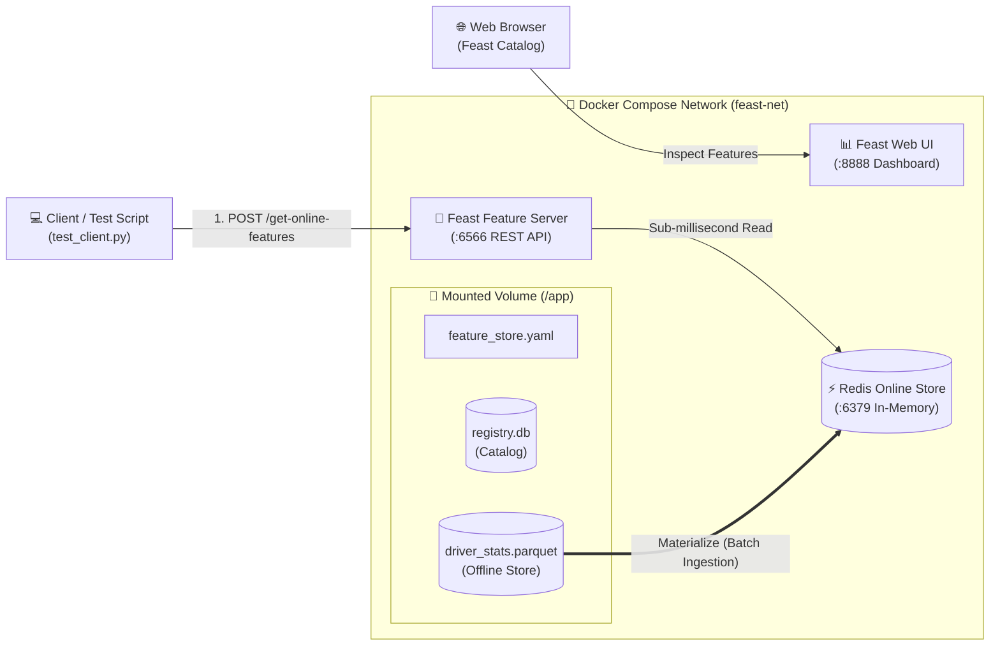

# 🧪 Hands-on Lab: Dockerizing Feast Feature Store (Local Offline + Redis Online)

Welcome to your hands-on coding lab! All the project files have been structured directly inside this directory.

---

## 🏛️ Architecture Overview



---

## 📂 Project Structure

```text
.
├── docker-compose.yml          # Coordinates Redis, Feast Server, and Feast UI
├── Dockerfile                  # Builds Feast image with Python 3.10 and Redis client
├── requirements.txt            # Python dependencies (feast, pandas, pyarrow, fastapi)
├── entrypoint.sh               # Auto-applies registry, materializes features, starts service
├── test_client.py              # Test script to query features via REST API
└── feature_repo/
    ├── feature_store.yaml      # Feast config connecting to Redis and local registry
    ├── features.py             # Feature definitions (Entity, Source, FeatureView)
    ├── generate_data.py        # Generates synthetic driver stats in Parquet
    └── data/                   # Directory where Parquet and registry.db reside
```

---

## 🚀 How to Run the Lab

### Step 0: Ensure Docker Desktop is Running
If you are on Windows, ensure **Docker Desktop** is running. You can check from PowerShell:
```powershell
docker ps
```

---

### Step 1: Build and Launch Containers
In the root directory of this project, execute:
```powershell
docker compose up --build -d
```

Check the status of running containers:
```powershell
docker compose ps
```

You will see:
* `feast-redis` running on port `6379` (Healthy)
* `feast-server` running on port `6566`
* `feast-ui` running on port `8888`

---

### Step 2: Check Logs
Verify that Feast registered features and materialized data into Redis:
```powershell
docker compose logs -f feast-server
```
*(Press `Ctrl + C` to exit logs)*

---

### Step 3: Test Real-Time Feature Retrieval

#### Option A: Using the Python test client
```powershell
python test_client.py
```

#### Option B: Using cURL or PowerShell `Invoke-RestMethod`
```powershell
curl.exe -X POST http://localhost:6566/get-online-features `
  -H "Content-Type: application/json" `
  -d '{
    "features": [
      "driver_hourly_stats:conv_rate",
      "driver_hourly_stats:acc_rate",
      "driver_hourly_stats:avg_daily_trips"
    ],
    "entities": {
      "driver_id": [1001, 1002]
    }
  }'
```

---

### Step 4: Open Feast Web UI
Open your browser and navigate to:
```text
http://localhost:8888
```
Here you can explore all registered entities, feature views, schemas, and data sources.

---

### Step 5: How to Code & Experiment (Live Changes)
Because `./feature_repo` is mounted as a volume into the container:
1. Open `feature_repo/features.py`.
2. Add a new feature or change tags.
3. Open a shell inside the container to apply changes:
   ```powershell
   docker exec -it feast-server feast apply
   docker exec -it feast-server feast materialize-incremental 2026-12-31T23:59:59
   ```

---

### Step 6: Teardown
To stop all containers and remove the volumes:
```powershell
docker compose down -v
```
